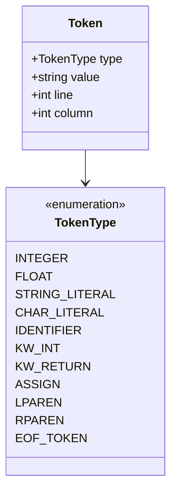
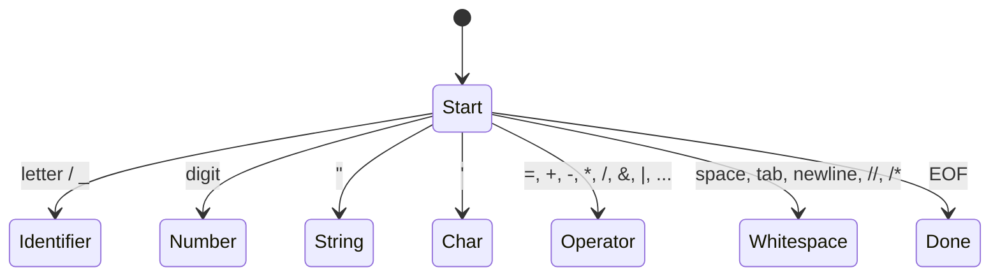

# Lesson 0001: Tokenizer (Lexer)

## Status: ✅ Complete | Phase: Core

## Objective

Implement lexical analysis to convert source code characters into tokens.

## Concepts

### What is a Tokenizer?

A tokenizer (lexer) reads raw source code as a stream of characters and groups them into meaningful units called tokens.

```mermaid
graph LR
    A[Source Code<br>"int x = 42;"] --> B[Tokenizer]
    B --> C[Tokens]
    C --> D[INT]
    C --> E[ID:x]
    C --> F[ASSIGN]
    C --> G[NUM:42]
    C --> H[SEMICOLON]
```

### Token Types

The full `TokenType` enum lives in `src/token.h:9-111` and covers literals
(`INTEGER`, `FLOAT`, `STRING_LITERAL`, `CHAR_LITERAL`), identifiers
(`IDENTIFIER`), all C keywords (`KW_INT` … `KW_STATIC_ASSERT`, `KW_GENERIC`,
`KW_ALIGNOF`, …, `KW_ATTRIBUTE`), the `ELLIPSIS` token, all arithmetic /
logical / bitwise operators (including the compound-assign forms and `->` /
`++` / `--`), and the structural delimiters plus `EOF_TOKEN` / `NEWLINE`.



### Lexer State Machine



## Implementation

### Files

| File | Purpose |
|------|---------|
| `src/token.h` | `TokenType` enum and `Token` struct |
| `src/lexer.h` | `Lexer` class declaration |
| `src/lexer.cpp` | `Lexer` implementation |

### Token Structure

```cpp
struct Token {
    TokenType type;
    std::string value;
    int line;
    int column;
};
```

### Keyword Recognition

Identifiers are looked up in a `static` keyword map. Anything that matches
becomes the corresponding `KW_*` token; anything else is `IDENTIFIER`.

```cpp
// src/lexer.cpp:101
const std::unordered_map<std::string, TokenType>& Lexer::keywords() {
    static const std::unordered_map<std::string, TokenType> kw = {
        {"int", TokenType::KW_INT},
        {"char", TokenType::KW_CHAR},
        {"void", TokenType::KW_VOID},
        {"return", TokenType::KW_RETURN},
        {"if", TokenType::KW_IF},
        {"else", TokenType::KW_ELSE},
        {"while", TokenType::KW_WHILE},
        {"for", TokenType::KW_FOR},
        {"do", TokenType::KW_DO},
        {"bool", TokenType::KW_BOOL},
        {"const", TokenType::KW_CONST},
        {"extern", TokenType::KW_EXTERN},
        {"struct", TokenType::KW_STRUCT},
        {"sizeof", TokenType::KW_SIZEOF},
        // ... ~40 more keywords ...
        {"__attribute__", TokenType::KW_ATTRIBUTE},
    };
    return kw;
}
```

### Token Dispatch

`next_token()` skips whitespace, then routes the first character of the next
lexeme to the appropriate reader. `tokenize()` is just a loop that calls
`next_token()` until `EOF_TOKEN` is produced or an error is recorded.

```cpp
// src/lexer.cpp:504
Token Lexer::next_token() {
    skip_whitespace();

    if (is_at_end()) {
        return Token(TokenType::EOF_TOKEN, "", line_, column_);
    }

    char c = peek();

    if (std::isdigit(c))              return read_number();
    if (c == '"')                     return read_string();
    if (c == '\'')                    return read_char();
    if (std::isalpha(c) || c == '_')  return read_identifier();

    return read_operator();
}
```

### Operator Recognition

Compound operators (`+=`, `-=`, `*=`, `/=`, `==`, `!=`, `<=`, `>=`, `<<`,
`>>`, `&&`, `||`, `++`, `--`, `->`) and the `...` ellipsis are recognised
by peeking one or two characters ahead inside `read_operator()`.

```cpp
// src/lexer.cpp:419
Token Lexer::read_operator() {
    char c = advance();
    switch (c) {
        case '+':
            if (match('+')) return Token(TokenType::PLUS_PLUS,   "++", ...);
            if (match('=')) return Token(TokenType::PLUS_ASSIGN, "+=", ...);
            return Token(TokenType::PLUS, "+", ...);
        case '-':
            if (match('-')) return Token(TokenType::MINUS_MINUS, "--", ...);
            if (match('=')) return Token(TokenType::MINUS_ASSIGN, "-=", ...);
            return Token(TokenType::MINUS, "-", ...);
        case '=':
            if (match('=')) return Token(TokenType::EQ, "==", ...);
            return Token(TokenType::ASSIGN, "=", ...);
        // ... <, >, &, |, ^, ~, %, *, /, !, ?, :, ;, ,, ., (, ), [, ], {, } ...
    }
}
```

## Example

Input:

```c
int main() { return 42; }
```

Generated tokens:

```text
KW_INT  "int"        line 1
IDENT   "main"       line 1
LPAREN  "("          line 1
RPAREN  ")"          line 1
LBRACE  "{"          line 1
KW_RETURN "return"   line 1
INTEGER "42"         line 1
SEMICOLON ";"        line 1
RBRACE  "}"          line 1
EOF_TOKEN            line 1
```

The lexer's `tokenize()` returns them as a `std::vector<Token>` ready for
the parser.

## Implementation Details

### Source Code References

| Component | File | Lines | Description |
|-----------|------|-------|-------------|
| `TokenType` enum | src/token.h | 9-111 | All token categories: literals, keywords, operators, delimiters, `EOF_TOKEN` |
| `Token` struct | src/token.h | 113-122 | Type, value, line, column |
| `token_type_name()` | src/lexer.cpp | 7-95 | String conversion for diagnostics |
| `Lexer::keywords()` | src/lexer.cpp | 101-158 | Static keyword → `TokenType` map |
| `skip_whitespace()` | src/lexer.cpp | 191-206 | Skips spaces, tabs, newlines, `//` and `/* */` comments |
| `skip_block_comment()` | src/lexer.cpp | 224-238 | Tracks `*` / `/` pair, reports unterminated comments |
| `read_number()` | src/lexer.cpp | 240-325 | Decimal, hex (`0x`), binary (`0b`), octal, floats, suffixes, `'` separators |
| `read_string()` | src/lexer.cpp | 327-365 | String literal with escape sequences; reports unterminated strings |
| `read_char()` | src/lexer.cpp | 367-399 | Character literal with escape sequences |
| `read_identifier()` | src/lexer.cpp | 401-417 | Identifier or keyword lookup |
| `read_operator()` | src/lexer.cpp | 419-491 | All single- and multi-character operators (incl. `+=`, `<<=`, `->`, `...`) |
| `next_token()` | src/lexer.cpp | 504-530 | Main dispatch: skip ws → digit / `"` / `'` / alpha / operator |
| `tokenize()` | src/lexer.cpp | 532-549 | Loop producing `vector<Token>` until `EOF_TOKEN` or error |
