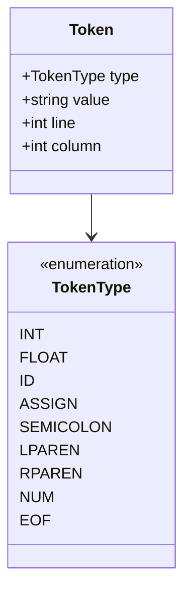
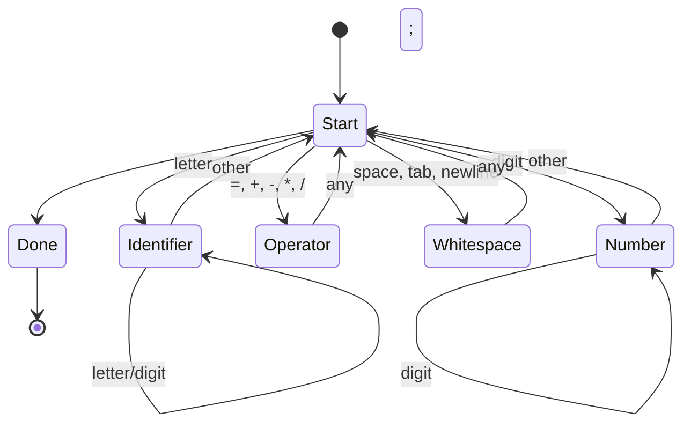
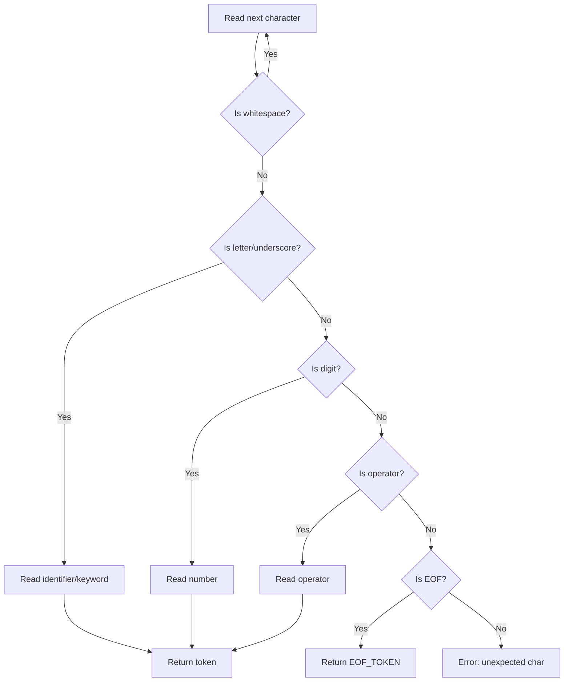

# Lesson 0001: Tokenizer (Lexer)

## Objective

Implement lexical analysis to convert source code characters into tokens.

## Concepts

### What is a Tokenizer?

A tokenizer (lexer) reads raw source code as a stream of characters and groups them into meaningful units called tokens.

```mermaid
graph LR
    A[Source Code<br>"int x = 42;"] --> B[Tokenizer]
    B --> C[Tokens]
    C --> D[INT]
    C --> E[ID:x]
    C --> F[ASSIGN]
    C --> G[NUM:42]
    C --> H[SEMICOLON]
```

### Token Types



### Lexer State Machine



## Implementation

### Files

| File | Purpose |
|------|---------|
| `src/token.h` | Token struct and TokenType enum |
| `src/lexer.h` | Lexer class declaration |
| `src/lexer.cpp` | Lexer implementation |
| `tests/test_lexer.cpp` | Unit tests |

### Token Structure

```cpp
enum class TokenType {
    // Literals
    INTEGER, FLOAT, STRING,
    
    // Identifiers
    IDENTIFIER,
    
    // Keywords
    INT, VOID, RETURN, IF, ELSE, WHILE, FOR,
    
    // Operators
    ASSIGN, PLUS, MINUS, STAR, SLASH,
    EQ, NE, LT, GT, LE, GE,
    
    // Delimiters
    SEMICOLON, COMMA,
    LPAREN, RPAREN, LBRACE, RBRACE,
    
    // Special
    EOF_TOKEN
};

struct Token {
    TokenType type;
    std::string value;
    int line;
    int column;
};
```

### Lexer Algorithm



## Test Cases

1. **Basic tokenization**: `"int x = 42;"` → 5 tokens
2. **Multiple operators**: `"a + b * c"` → 5 tokens
3. **Keywords vs identifiers**: `"int return"` → 2 different token types
4. **Line tracking**: Newlines increment line counter
5. **Error handling**: Invalid characters produce error with position

## Expected Output

```cpp
Lexer lexer("int x = 42;");
auto tokens = lexer.tokenize();
// tokens: [INT, ID("x"), ASSIGN, NUM("42"), SEMICOLON, EOF]
```
