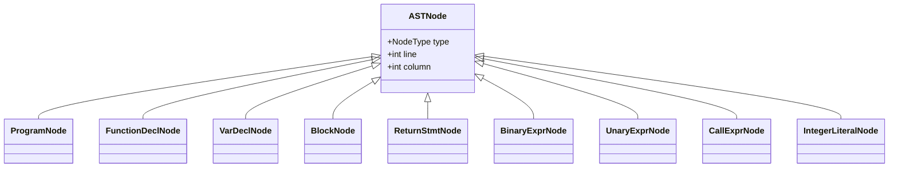

# Lesson 0002: Abstract Syntax Tree (AST)

## Status: ✅ Complete | Phase: Core | Tests: 7

## Objective

Define AST node types for all parsed constructs.

## AST Node Types

## Implemented Features

- All statement types (return, if, while, for, block)
- All expression types (binary, unary, call, assignment)
- All declaration types (function, variable, parameter)
- Visitor pattern for tree traversal

## Implementation Details

### Source Code References
| Component | File | Lines | Description |
|-----------|------|-------|-------------|
| NodeType enum | src/ast.h | 10-61 | Defines all AST node types |
| OpKind enum | src/ast.h | 63-80 | Operator types for expressions |
| Forward declarations | src/ast.h | 83-123 | Forward declarations for all node structs |
| ASTVisitor interface | src/ast.h | 126-170 | Visitor pattern base class with pure virtual methods |
| ASTNode base | src/ast.h | 173-183 | Base struct with line/column info |
| ProgramNode | src/ast.h | 185-191 | Root of AST containing declarations |
| ParamNode | src/ast.h | 193-200 | Function parameter |
| FunctionDeclNode | src/ast.h | 202-211 | Function declaration with params and body |
| VarDeclNode | src/ast.h | 213-222 | Variable declaration with optional initializer |
| StructDeclNode | src/ast.h | 233-240 | Struct declaration |
| EnumDeclNode | src/ast.h | 242-249 | Enum declaration |
| TypedefDeclNode | src/ast.h | 260-267 | Typedef declaration |
| SwitchStmtNode | src/ast.h | 269-276 | Switch statement |
| BlockNode | src/ast.h | 311-316 | Block of statements |
| ReturnStmtNode | src/ast.h | 318-323 | Return statement |
| ExprStmtNode | src/ast.h | 325-330 | Expression statement |
| IfStmtNode | src/ast.h | 332-339 | If statement |
| WhileStmtNode | src/ast.h | 341-347 | While loop |
| DoWhileStmtNode | src/ast.h | 349-355 | Do-while loop |
| ForStmtNode | src/ast.h | 357-365 | For loop |
| BreakStmtNode | src/ast.h | 367-370 | Break statement |
| ContinueStmtNode | src/ast.h | 372-376 | Continue statement |
| BinaryExprNode | src/ast.h | 378-385 | Binary expression with operator |
| UnaryExprNode | src/ast.h | 387-393 | Unary expression |
| AssignExprNode | src/ast.h | 395-401 | Simple assignment expression |
| CompoundAssignExprNode | src/ast.h | 403-411 | Compound assignment (+=, -=, etc.) |
| TernaryExprNode | src/ast.h | 413-421 | Ternary conditional expression |
| CommaExprNode | src/ast.h | 423-430 | Comma expression |
| SizeofExprNode | src/ast.h | 432-442 | Sizeof operator |
| CastExprNode | src/ast.h | 444-451 | Type cast expression |
| CallExprNode | src/ast.h | 453-460 | Function call expression |
| IndexExprNode | src/ast.h | 462-468 | Array indexing |
| MemberExprNode | src/ast.h | 470-478 | Struct member access |
| DerefExprNode | src/ast.h | 480-485 | Pointer dereference |
| AddressOfExprNode | src/ast.h | 487-493 | Address-of operator |
| IntegerLiteralNode | src/ast.h | 495-501 | Integer literal |
| FloatLiteralNode | src/ast.h | 503-509 | Float literal |
| StringLiteralNode | src/ast.h | 511-517 | String literal |
| CharLiteralNode | src/ast.h | 519-525 | Character literal |
| IdentifierExprNode | src/ast.h | 527-533 | Identifier reference |
| Accept methods | src/ast.cpp | 6-46 | Visitor accept implementations for all nodes |
| Node type names | src/ast.cpp | 48-129 | String representation of node types |
