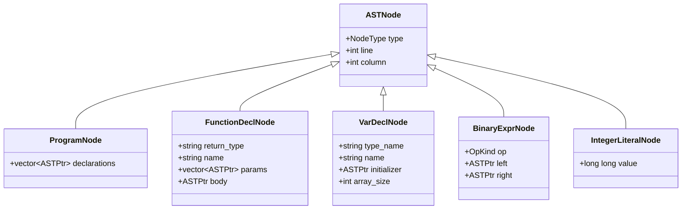

# Lesson 0002: Abstract Syntax Tree (AST)

## Status: ✅ Complete | Phase: Core

## Objective

Define AST node types for all parsed constructs.

## AST Node Types

The AST is a hand-written hierarchy rooted at `ASTNode` (`src/ast.h:191-198`).
Every concrete node derives from `ASTNode` and is visited by the
`ASTVisitor` interface (`src/ast.h:139-189`).



## Implemented Features

- **Declarations**: `ProgramNode`, `FunctionDeclNode`, `VarDeclNode`,
  `ParamNode`, `StructDeclNode`, `StructFieldNode`, `EnumDeclNode`,
  `EnumValueNode`, `TypedefDeclNode`.
- **Statements**: `BlockNode`, `ReturnStmtNode`, `ExprStmtNode`,
  `IfStmtNode`, `WhileStmtNode`, `DoWhileStmtNode`, `ForStmtNode`,
  `BreakStmtNode`, `ContinueStmtNode`, `SwitchStmtNode`, `CaseLabelNode`,
  `DefaultLabelNode`, `GotoStmtNode`, `LabelStmtNode`.
- **Expressions**: `BinaryExprNode`, `UnaryExprNode`, `AssignExprNode`,
  `CompoundAssignExprNode`, `TernaryExprNode`, `CommaExprNode`,
  `SizeofExprNode`, `CastExprNode`, `CallExprNode`, `IndexExprNode`,
  `MemberExprNode`, `DerefExprNode`, `AddressOfExprNode`, `StmtExprNode`,
  `AsmStmtNode`.
- **Literals**: `IntegerLiteralNode`, `FloatLiteralNode`,
  `StringLiteralNode`, `CharLiteralNode`, `IdentifierExprNode`.
- **Initializers**: `InitializerListNode`, `DesignatedInitNode`,
  `CompoundLiteralNode`.
- **Visitor pattern**: every node implements `accept(ASTVisitor&)` which
  simply forwards to the matching `visit(...)` overload
  (`src/ast.cpp:6-51`).

### Operator Enum

`OpKind` (`src/ast.h:71-88`) covers arithmetic (`ADD`, `SUB`, `MUL`, `DIV`,
`MOD`), comparison (`EQ`, `NE`, `LT`, `GT`, `LE`, `GE`), logical
(`AND`, `OR`, `NOT`), bitwise (`BIT_AND`, `BIT_OR`, `BIT_XOR`, `BIT_NOT`,
`LSHIFT`, `RSHIFT`) and unary (`UMINUS`, `UPLUS`, `DEREF`, `ADDRESS_OF`,
`PRE_INC`, `PRE_DEC`, `POST_INC`, `POST_DEC`).

## Example: `int x = 1 + 2;`

For this snippet the parser produces:

```
VarDeclNode{ type_name="int", name="x",
             initializer=AssignExprNode{ ... } }
```

For the expression `1 + 2` alone:

```
BinaryExprNode{ op=OpKind::ADD,
                left=IntegerLiteralNode{ value=1 },
                right=IntegerLiteralNode{ value=2 } }
```

The runtime cost of a `std::unique_ptr`-based tree is acceptable for a
single-pass compiler; every node owns its children through `ASTPtr`
(`src/ast.h:200`).

## Implementation Details

### Source Code References

| Component | File | Lines | Description |
|-----------|------|-------|-------------|
| `NodeType` enum | src/ast.h | 10-69 | All AST node kinds (program, decls, stmts, exprs, literals, init) |
| `OpKind` enum | src/ast.h | 71-88 | Operator categories used by binary/unary nodes |
| Forward declarations | src/ast.h | 91-136 | Forward decls for every node struct |
| `ASTVisitor` interface | src/ast.h | 139-189 | Pure-virtual visitor; one method per node type |
| `ASTNode` base | src/ast.h | 191-198 | Holds `type`, `line`, `column`; virtual dtor |
| `ASTPtr` alias | src/ast.h | 200 | `std::unique_ptr<ASTNode>` |
| `ProgramNode` | src/ast.h | 203-208 | Root: vector of declarations |
| `ParamNode` | src/ast.h | 211-218 | Function parameter |
| `FunctionDeclNode` | src/ast.h | 220-241 | Function decl with params, body, nested-function support |
| `VarDeclNode` | src/ast.h | 243-253 | Variable decl with optional initializer and array size |
| `StructDeclNode` / `StructFieldNode` | src/ast.h | 255-271 | Struct definition |
| `EnumDeclNode` / `EnumValueNode` | src/ast.h | 273-289 | Enum definition |
| `TypedefDeclNode` | src/ast.h | 291-298 | `typedef` alias |
| `SwitchStmtNode` / `CaseLabelNode` / `DefaultLabelNode` | src/ast.h | 300-322 | Switch and case labels |
| `GotoStmtNode` / `LabelStmtNode` | src/ast.h | 324-339 | Goto and labels |
| `BlockNode` | src/ast.h | 342-347 | Sequence of statements |
| `ReturnStmtNode`, `ExprStmtNode` | src/ast.h | 349-361 | Return and expression statement |
| `IfStmtNode` | src/ast.h | 363-370 | If/else |
| `WhileStmtNode`, `DoWhileStmtNode`, `ForStmtNode` | src/ast.h | 372-396 | Loops |
| `BreakStmtNode`, `ContinueStmtNode` | src/ast.h | 398-406 | Loop control |
| `BinaryExprNode` | src/ast.h | 409-416 | `op` + `left` + `right` |
| `UnaryExprNode` | src/ast.h | 418-424 | `op` + `operand` |
| `AssignExprNode` | src/ast.h | 426-432 | `target` + `value` |
| `CompoundAssignExprNode` | src/ast.h | 434-442 | `target` + `op` + `value` |
| `TernaryExprNode` | src/ast.h | 444-452 | `condition` + `then` + `else` |
| `CommaExprNode` | src/ast.h | 454-461 | `left` + `right` |
| `SizeofExprNode` | src/ast.h | 463-473 | `type_name` (or `expr`) + `is_type` flag |
| `CastExprNode` | src/ast.h | 475-482 | `target_type` + `expr` |
| `CallExprNode` | src/ast.h | 484-491 | `function_name` + `arguments` |
| `IndexExprNode` | src/ast.h | 493-499 | `array` + `index` |
| `MemberExprNode` | src/ast.h | 501-509 | `object` + `member` + `is_arrow` |
| `DerefExprNode`, `AddressOfExprNode` | src/ast.h | 511-523 | Unary `*` and `&` |
| `StmtExprNode` | src/ast.h | 525-530 | GCC `({ ... })` |
| `AsmStmtNode` | src/ast.h | 532-541 | Inline assembly |
| `IntegerLiteralNode` | src/ast.h | 544-550 | `long long value` |
| `FloatLiteralNode` | src/ast.h | 552-559 | `double value` + `is_single_precision` |
| `StringLiteralNode` | src/ast.h | 561-567 | `std::string value` |
| `CharLiteralNode` | src/ast.h | 569-575 | `char value` |
| `IdentifierExprNode` | src/ast.h | 577-583 | `std::string name` |
| `InitializerListNode` | src/ast.h | 586-591 | `{ a, b, c }` |
| `DesignatedInitNode` | src/ast.h | 594-604 | `.field = expr` or `[i] = expr` |
| `CompoundLiteralNode` | src/ast.h | 607-614 | `(type){...}` |
| `accept()` implementations | src/ast.cpp | 6-51 | One-line forwarders from node to visitor |
| `node_type_name()` | src/ast.cpp | 53-100 | `NodeType` → string |
| `op_kind_name()` | src/ast.cpp | 102-134 | `OpKind` → symbol (e.g. `ADD` → `"+"`) |
