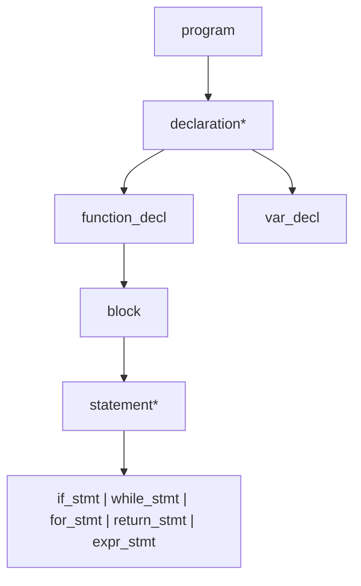

# Lesson 0003: Recursive Descent Parser

## Status: ✅ Complete | Phase: Core | Tests: 20

## Objective

Parse token stream into AST using recursive descent.

## Grammar Rules

## Implemented Features

- Full expression precedence (15 levels)
- Function declarations with parameters
- Variable declarations with initializers
- Control flow: if/else, while, for
- Error reporting with line/column

## Implementation Details

### Source Code References
| Component | File | Lines | Description |
|-----------|------|-------|-------------|
| Parser class | src/parser.h | 12-89 | Parser class declaration with all methods |
| Token management | src/parser.h | 26-31 | peek, advance, check, match, expect |
| Grammar rules | src/parser.h | 34-51 | Declaration of all parse methods |
| Expression precedence | src/parser.h | 53-68 | Precedence climbing expression parsing |
| Constructor | src/parser.cpp | 1-86 | Parser initialization and error handling |
| parse_type_specifier | src/parser.cpp | 87-196 | Type specifier parsing (int, char, struct, etc.) |
| parse_program | src/parser.cpp | 198-216 | Root of AST, parses declarations |
| parse_declaration | src/parser.cpp | 218-431 | Dispatches to function/variable/struct/etc. |
| parse_function_decl | src/parser.cpp | 433-461 | Function declaration parsing |
| parse_var_decl | src/parser.cpp | 463-496 | Variable declaration with initializer |
| parse_struct_decl | src/parser.cpp | 498-530 | Struct declaration parsing |
| parse_enum_decl | src/parser.cpp | 532-571 | Enum declaration parsing |
| parse_typedef_decl | src/parser.cpp | 573-592 | Typedef parsing |
| parse_param | src/parser.cpp | 594-632 | Function parameter parsing |
| parse_block | src/parser.cpp | 634-648 | Block of statements |
| parse_statement | src/parser.cpp | 650-703 | Statement dispatch (if, while, for, etc.) |
| parse_return_stmt | src/parser.cpp | 705-717 | Return statement |
| parse_expr_stmt | src/parser.cpp | 719-728 | Expression statement |
| parse_if_stmt | src/parser.cpp | 730-747 | If statement |
| parse_while_stmt | src/parser.cpp | 749-762 | While loop |
| parse_do_while_stmt | src/parser.cpp | 764-779 | Do-while loop |
| parse_for_stmt | src/parser.cpp | 781-814 | For loop |
| parse_switch_stmt | src/parser.cpp | 816-858 | Switch statement |
| parse_goto_stmt | src/parser.cpp | 860-876 | Goto statement |
| parse_expression | src/parser.cpp | 878-891 | Entry point for expression parsing |
| parse_assignment | src/parser.cpp | 893-933 | Assignment and compound assignment |
| parse_or | src/parser.cpp | 935-946 | Logical OR |
| parse_and | src/parser.cpp | 948-959 | Logical AND |
| parse_bitwise_or | src/parser.cpp | 961-972 | Bitwise OR |
| parse_bitwise_xor | src/parser.cpp | 974-985 | Bitwise XOR |
| parse_bitwise_and | src/parser.cpp | 987-998 | Bitwise AND |
| parse_equality | src/parser.cpp | 1000-1012 | Equality operators (==, !=) |
| parse_comparison | src/parser.cpp | 1014-1032 | Comparison operators (<, >, <=, >=) |
| parse_shift | src/parser.cpp | 1034-1046 | Shift operators (<<, >>) |
| parse_addition | src/parser.cpp | 1048-1066 | Addition/subtraction |
| parse_multiplication | src/parser.cpp | 1068-1084 | Multiplication/division/modulo |
| parse_unary | src/parser.cpp | 1086-1165 | Unary operators (+, -, !, ~, *, &, ++, --) |
| parse_postfix | src/parser.cpp | 1167-1222 | Postfix operators ((), [], ., ->, ++, --) |
| parse_primary | src/parser.cpp | 1224-??? | Primary expressions (literals, identifiers, parenthesized) |
| Error handling | src/parser.cpp | various | Error reporting with line/column info |
