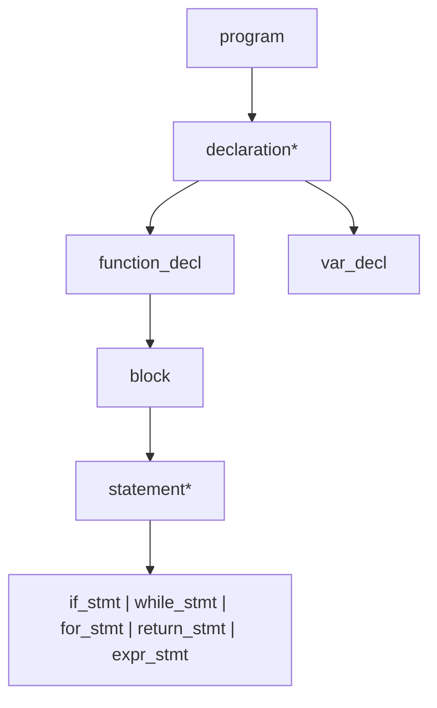

# Lesson 0003: Recursive Descent Parser

## Status: ✅ Complete | Phase: Core

## Objective

Parse token stream into AST using recursive descent.

## Grammar Rules



## Implemented Features

- Full expression precedence (15 levels) via precedence climbing.
- Function declarations with parameters and optional body (forward decls).
- Variable declarations with initializers, arrays, struct/union/typedef
  types, qualifiers (`const`, `volatile`, `static`, `extern`, …) and
  storage classes.
- Control flow: `if`/`else`, `while`, `do`/`while`, `for`, `switch`/`case`
  /`default`, `goto`/labelled statements, `break`, `continue`.
- Top-level statements in any order — `parse_program()` dispatches to
  `parse_declaration()` or `parse_statement()` based on the next token
  (`src/parser.cpp:280-298`).
- Error reporting with line/column, plus several GCC extensions
  (`_Alignas`, `__attribute__`, `_Static_assert`, `_Generic`, nested
  functions, anonymous struct/union, designated initialisers).
- Typedef-aware type recognition via `typedef_names_` set
  (`src/parser.h:91`).

## Implementation

### Files

| File | Purpose |
|------|---------|
| `src/parser.h` | `Parser` class declaration |
| `src/parser.cpp` | `Parser` implementation (precedence climbing) |

## Parsing Theory: Why Recursive Descent?

This project uses **recursive descent parsing**, a top-down approach that
directly implements the grammar as mutually recursive functions. Here's
how it compares to other techniques.

### Parser Classification

```
Parsing Techniques
├── Top-Down (build parse tree from root)
│   ├── Recursive Descent  ←── This project
│   ├── Predictive (LL(1))
│   └── LL(k) with lookahead
├── Bottom-Up (build parse tree from leaves)
│   ├── Shift-Reduce
│   ├── LR(0)
│   ├── SLR(1)
│   ├── LALR(1)  ← yacc/bison default
│   └── LR(1) / CLR(1)
└── Other
    ├── PEG (Parsing Expression Grammar)
    └── Packrat / GLR / Earley
```

### Technique Comparison

| Technique | Direction | Lookahead | Strengths | Weaknesses | Examples |
|-----------|-----------|-----------|-----------|------------|----------|
| **Recursive Descent** | Top-down | Any (manual) | Simple, readable, debuggable, full control | Manual implementation, left recursion tricky | GCC, Clang, Rustc, Go |
| **LL(1)** | Top-down | 1 token | Predictive, no backtracking | Can't handle left recursion or ambiguity | Hand-written compilers |
| **LL(k)** | Top-down | k tokens | Handles more grammar forms | Still no left recursion | Some hand-written parsers |
| **LR(0)** | Bottom-up | 0 tokens (shift/reduce) | Handles left recursion, simple grammars | Very limited — can't resolve conflicts | Educational only |
| **SLR(1)** | Bottom-up | 1 token | Handles most LR(0)+ conflicts | Still limited lookahead | Simple tools |
| **LALR(1)** | Bottom-up | 1 token (merged states) | Compact tables, powerful | Error recovery hard, merge can lose info | Yacc/Bison (default) |
| **LR(1)** | Bottom-up | 1 token (full) | Handles all deterministic CFGs | Large state tables | Bison with %glr-parser |
| **GLR** | Bottom-up | Unlimited | Handles ambiguity, non-deterministic | Complex, slower | Elm, some Haskell parsers |
| **PEG** | Top-down | Ordered choice | No ambiguity by definition, packrat | Not context-free (commutative ops harder) | PEG.js, Treetop, Packrat |

### Why Recursive Descent for This Project

**1. C's grammar is LL(1)-ish, but has edge cases**

C grammar is mostly predictive — when you see `int`, you know a declaration
follows. But some constructs need lookahead:
- Cast `(int)x` vs grouping `(expr)` — both start with `(`; resolved in
  `parse_unary()` by saving the position and peeking for a type
  specifier (`src/parser.cpp:1704-1748`).
- `*` as multiply vs pointer dereference vs multiply-assign.
- `static_assert` / `_Alignas` / `__attribute__` — qualifier soup that has
  to be skipped before seeing the actual type
  (`src/parser.cpp:99-265`).

**2. Error messages are easy**

Each parse function knows what it expects. When parsing fails, we can say
exactly what was expected at that point. Table-driven parsers generate
obscure error states.

**3. No external tools needed**

No yacc/bison dependency. The parser is pure C++ — easy to build, debug,
extend. Good for learning.

**4. Direct mapping to code structure**

```
Grammar Production          →    C++ Function
─────────────────────────────────────────────
program → declaration*      →    parse_program()
declaration → func | var    →    parse_declaration()
statement → if | while | …  →    parse_statement()
expr → assign → or → and …  →    parse_expression() → parse_assignment() → ...
```

### How Our Parser Works

**Token Management (LL(1) core):**
```cpp
// One-token lookahead — the "1" in LL(1)
const Token& peek()       const;  // look ahead without consuming
const Token& advance();          // consume current token
bool         match(TokenType t); // consume if matches, else no-op
bool         expect(TokenType t);// consume or report error
```

**Expression Precedence (Pratt / precedence climbing):**
```
parse_expression()          // comma
  └→ parse_assignment()     // = += -=, ternary, etc.
       └→ parse_or()        // ||
            └→ parse_and()  // &&
                 └→ ...down to...
                       └→ parse_primary()  // literals, identifiers
```

Each level calls the next-higher precedence level for its operands,
creating a natural precedence chain without a giant switch statement.

### Operator Precedence Table

| Precedence | Category | Operators | Associativity | Parse Function |
|------------|----------|-----------|---------------|----------------|
| 1 (lowest) | Comma | `,` | Left → Right | `parse_expression()` |
| 2 | Assignment | `=` `+=` `-=` `*=` `/=` `&=` `\|=` `^=` `<<=` `>>=` | Right ← Left | `parse_assignment()` |
| 3 | Ternary | `? :` | Right ← Left | `parse_assignment()` |
| 4 | Logical OR | `\|\|` | Left → Right | `parse_or()` |
| 5 | Logical AND | `&&` | Left → Right | `parse_and()` |
| 6 | Bitwise OR | `\|` | Left → Right | `parse_bitwise_or()` |
| 7 | Bitwise XOR | `^` | Left → Right | `parse_bitwise_xor()` |
| 8 | Bitwise AND | `&` | Left → Right | `parse_bitwise_and()` |
| 9 | Equality | `==` `!=` | Left → Right | `parse_equality()` |
| 10 | Comparison | `<` `>` `<=` `>=` | Left → Right | `parse_comparison()` |
| 11 | Shift | `<<` `>>` | Left → Right | `parse_shift()` |
| 12 | Additive | `+` `-` | Left → Right | `parse_addition()` |
| 13 | Multiplicative | `*` `/` `%` | Left → Right | `parse_multiplication()` |
| 14 | Unary | `+` `-` `!` `~` `*` (deref) `&` (addr) `++` `--` (prefix), `sizeof`, `_Alignof`, `_Generic`, cast `(type)expr` | Right ← Left | `parse_unary()` |
| 15 (highest) | Postfix | `()` `[]` `.` `->` `++` `--` (suffix) | Left → Right | `parse_postfix()` |
| 15 | Primary | Literals, identifiers, `(expr)`, statement expr `({...})` | — | `parse_primary()` |

### Precedence in Practice

```c
// Example: how precedence determines parsing
a + b * c         // → a + (b * c)        — mul binds tighter than add
a == b && c == d  // → (a == b) && (c == d) — equality binds tighter than logical
a = b + c         // → a = (b + c)        — add binds tighter than assignment
a ? b : c + d     // → a ? b : (c + d)    — add binds tighter than ternary
a, b = c, d       // → (a), (b = c), d    — assignment higher than comma
!a && b           // → (!a) && b          — unary binds tighter than logical
a++ + b           // → (a++) + b          — postfix binds tighter than add
```

### How Each Level Works

**Binary operators** (levels 4-13) follow the same pattern — left-associative
loop:

```cpp
// src/parser.cpp:1590
ASTPtr Parser::parse_addition() {
    auto left = parse_multiplication();        // parse higher-precedence first
    while (check(TokenType::PLUS) || check(TokenType::MINUS)) {
        OpKind op = match(TokenType::PLUS) ? OpKind::ADD : OpKind::SUB;
        auto bin = std::make_unique<BinaryExprNode>(op, left->line, left->column);
        bin->left  = std::move(left);
        bin->right = parse_multiplication();   // parse right operand
        left = std::move(bin);
    }
    return std::move(left);
}
```

**Assignment** (level 2) is right-associative and also handles the ternary
operator (`? :`) and compound assignments (`+=`, `-=`, `*=`, `/=`):

```cpp
// src/parser.cpp:1433
ASTPtr Parser::parse_assignment() {
    auto left = parse_or();

    // Ternary: condition ? then_expr : else_expr
    if (match(TokenType::QUESTION)) {
        auto ternary = std::make_unique<TernaryExprNode>(...);
        ternary->condition = std::move(left);
        ternary->then_expr = parse_expression();
        expect(TokenType::COLON);
        ternary->else_expr = parse_assignment();   // right-assoc
        return std::move(ternary);
    }

    if (match(TokenType::ASSIGN)) { ... }

    if (check(PLUS_ASSIGN) || check(MINUS_ASSIGN) ||
        check(STAR_ASSIGN) || check(SLASH_ASSIGN)) {
        OpKind op = ...;
        auto compound = std::make_unique<CompoundAssignExprNode>(op, ...);
        compound->target = std::move(left);
        compound->value  = parse_assignment();
        return std::move(compound);
    }
    return std::move(left);
}
```

**Unary operators** (level 14) consume one operand and recurse into
`parse_unary()` themselves, so `--x` parses as `-(-x)`. The same function
also recognises `sizeof`, `_Alignof`, `_Generic` and the `(type)expr`
cast.

**Postfix operators** (level 15) loop on trailing operators (`()`, `[]`,
`.`, `->`, `++`, `--`) and, for multi-dimensional array indexing,
statically flatten the index into a single `BinaryExprNode` chain
(`src/parser.cpp:1831-1909`).

### Why This Works

The key insight: **each parse function handles exactly one precedence
level** and calls the next-higher level for its operands. This creates a
natural tree:

```
a + b * c == d && e

parse_expression()
  parse_or()
    parse_and()
      parse_equality()
        parse_comparison()
          parse_shift()
            parse_addition()
              parse_multiplication()
                parse_primary() → a
              op: +
              parse_multiplication()
                parse_primary() → b
              op: *
              parse_primary() → c
          op: ==
          parse_primary() → d
      op: &&
      parse_primary() → e
```

Result: `((a + (b * c)) == d) && e` — correct precedence!

**Handling Left Recursion:**
C expressions are left-recursive (`expr + expr + expr`). Recursive descent
can't handle direct left recursion, so we convert to iteration:

```cpp
// Grammar:  expr → expr + term | term
// Code:     while (match(PLUS)) { ... parse_term() ... }
ASTPtr Parser::parse_addition() {
    auto left = parse_multiplication();
    while (check(TokenType::PLUS) || check(TokenType::MINUS)) {
        OpKind op = match(TokenType::PLUS) ? OpKind::ADD : OpKind::SUB;
        auto bin = std::make_unique<BinaryExprNode>(op, ...);
        bin->left = std::move(left);
        bin->right = parse_multiplication();
        left = std::move(bin);
    }
    return std::move(left);
}
```

### When You'd Choose Other Techniques

| Situation | Better Choice |
|-----------|---------------|
| Grammar generated from specification | LALR(1) via Bison |
| Need to handle all ambiguous grammars | GLR or Earley |
| Performance-critical, repetitive parsing | PEG with packrat (memoization) |
| DSL with simple syntax | PEG or hand-written recursive descent |
| Compiler for real-world language | Recursive descent (like this project) |

### References

- *Compilers: Principles, Techniques, and Tools* (Dragon Book) — Ch. 4.4
  (LL parsers), Ch. 4.7 (LR parsers)
- [Crafting Interpreters](https://craftinginterpreters.com) — Ch. 5 (Types
  of Parsing)
- [LLVM Tutorial](https://llvm.org/docs/tutorial/) — Recursive descent in
  practice
- [Chibicc](https://github.com/rui314/chibicc) — Production recursive
  descent C parser

## Implementation Details

### Source Code References

| Component | File | Lines | Description |
|-----------|------|-------|-------------|
| `Parser` class | src/parser.h | 12-99 | Token state, grammar-rule methods, scope/enum/typedef state |
| Token management | src/parser.cpp | 14-56 | `peek`, `advance`, `check`, `match`, `expect` |
| `is_type_specifier()` | src/parser.cpp | 58-97 | Recognises all C type keywords + `size_t`, `int32_t`, typedefs |
| `parse_type_specifier()` | src/parser.cpp | 99-265 | Qualifiers, signed/unsigned/long/short, struct/union/enum/typedef |
| `error()` | src/parser.cpp | 267-274 | Records first error with line/column |
| `parse_program()` | src/parser.cpp | 280-298 | Loop: type → `parse_declaration()`, else `parse_statement()` |
| `parse_declaration()` | src/parser.cpp | 300-576 | Dispatches `extern`, `struct`, `union`, `enum`, `typedef`, function pointer |
| `parse_function_decl()` | src/parser.cpp | 578-615 | Function decl with optional body; tracks nested functions |
| `parse_var_decl()` | src/parser.cpp | 617-746 | Local/global var decls with initializer and array dimensions |
| `parse_brace_initializer()` | src/parser.cpp | 748-805 | `{ ... }` initializer lists with designated fields |
| `parse_struct_decl()` | src/parser.cpp | 807-839 | Struct/union definition with bitfields, flexible arrays, anon members |
| `parse_enum_decl()` | src/parser.cpp | 841-883 | Named enum definition with optional underlying type |
| `parse_typedef_decl()` | src/parser.cpp | 885-935 | `typedef` and `_Static_assert` |
| `parse_param()` | src/parser.cpp | 937-975 | Function parameter with K&R-style support |
| `parse_block()` | src/parser.cpp | 977-991 | `{ statements }` |
| `parse_statement()` | src/parser.cpp | 993-1174 | Dispatches to all statement kinds |
| `parse_return_stmt()` | src/parser.cpp | 1176-1188 | `return` / `return expr;` |
| `parse_expr_stmt()` | src/parser.cpp | 1190-1205 | Expression statement |
| `parse_if_stmt()` | src/parser.cpp | 1207-1224 | `if (cond) ... [else ...]` |
| `parse_while_stmt()` | src/parser.cpp | 1226-1239 | `while (cond) ...` |
| `parse_do_while_stmt()` | src/parser.cpp | 1241-1256 | `do ... while (cond);` |
| `parse_for_stmt()` | src/parser.cpp | 1258-1296 | `for (init; cond; upd) ...` |
| `parse_switch_stmt()` | src/parser.cpp | 1298-1340 | `switch (cond) { case ... }` |
| `parse_goto_stmt()` | src/parser.cpp | 1342-1364 | `goto label;` and `label: stmt` |
| `parse_static_assert()` | src/parser.cpp | 1366-1416 | `_Static_assert` and GCC `__attribute__` skipping |
| `parse_expression()` | src/parser.cpp | 1418-1431 | Comma operator: `expr , expr , ...` |
| `parse_assignment()` | src/parser.cpp | 1433-1473 | `=`, ternary `?:`, compound assign `+= -= *= /=` |
| `parse_or()` | src/parser.cpp | 1475-1486 | `\|\|` |
| `parse_and()` | src/parser.cpp | 1488-1499 | `&&` |
| `parse_bitwise_or()` | src/parser.cpp | 1501-1512 | `\|` |
| `parse_bitwise_xor()` | src/parser.cpp | 1514-1525 | `^` |
| `parse_bitwise_and()` | src/parser.cpp | 1527-1538 | `&` |
| `parse_equality()` | src/parser.cpp | 1540-1554 | `==`, `!=` |
| `parse_comparison()` | src/parser.cpp | 1556-1574 | `<`, `>`, `<=`, `>=` |
| `parse_shift()` | src/parser.cpp | 1576-1588 | `<<`, `>>` |
| `parse_addition()` | src/parser.cpp | 1590-1608 | `+`, `-` |
| `parse_multiplication()` | src/parser.cpp | 1610-1626 | `*`, `/`, `%` |
| `parse_unary()` | src/parser.cpp | 1628-1795 | `sizeof`, `_Alignof`, `_Generic`, cast, `+ - ! ~ * & ++ --`, `&&label` |
| `parse_postfix()` | src/parser.cpp | 1797-1938 | `(...)` call, `[...]` index (with N-dim flatten), `.`, `->`, `++`, `--` |
| `parse_primary()` | src/parser.cpp | 1940-2009 | Integer/float/string/char/identifier literals, `(expr)`, `({...})`, `{...}` |
