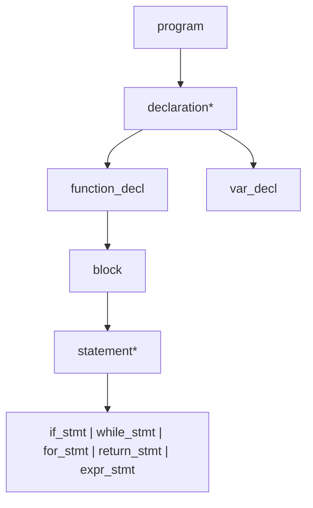

# Lesson 0003: Recursive Descent Parser

## Status: ✅ Complete | Phase: Core | Tests: 20

## Objective

Parse token stream into AST using recursive descent.

## Grammar Rules



## Implemented Features

- Full expression precedence (15 levels)
- Function declarations with parameters
- Variable declarations with initializers
- Control flow: if/else, while, for
- Error reporting with line/column

## Implementation Details

### Source Code References
| Component | File | Lines | Description |
|-----------|------|-------|-------------|
| Parser class | src/parser.h | 12-89 | Parser class declaration with all methods |
| Token management | src/parser.h | 26-31 | peek, advance, check, match, expect |
| Grammar rules | src/parser.h | 34-51 | Declaration of all parse methods |
| Expression precedence | src/parser.h | 53-68 | Precedence climbing expression parsing |
| Constructor | src/parser.cpp | 1-86 | Parser initialization and error handling |
| parse_type_specifier | src/parser.cpp | 87-196 | Type specifier parsing (int, char, struct, etc.) |
| parse_program | src/parser.cpp | 198-216 | Root of AST, parses declarations |
| parse_declaration | src/parser.cpp | 218-431 | Dispatches to function/variable/struct/etc. |
| parse_function_decl | src/parser.cpp | 433-461 | Function declaration parsing |
| parse_var_decl | src/parser.cpp | 463-496 | Variable declaration with initializer |
| parse_struct_decl | src/parser.cpp | 498-530 | Struct declaration parsing |
| parse_enum_decl | src/parser.cpp | 532-571 | Enum declaration parsing |
| parse_typedef_decl | src/parser.cpp | 573-592 | Typedef parsing |
| parse_param | src/parser.cpp | 594-632 | Function parameter parsing |
| parse_block | src/parser.cpp | 634-648 | Block of statements |
| parse_statement | src/parser.cpp | 650-703 | Statement dispatch (if, while, for, etc.) |
| parse_return_stmt | src/parser.cpp | 705-717 | Return statement |
| parse_expr_stmt | src/parser.cpp | 719-728 | Expression statement |
| parse_if_stmt | src/parser.cpp | 730-747 | If statement |
| parse_while_stmt | src/parser.cpp | 749-762 | While loop |
| parse_do_while_stmt | src/parser.cpp | 764-779 | Do-while loop |
| parse_for_stmt | src/parser.cpp | 781-814 | For loop |
| parse_switch_stmt | src/parser.cpp | 816-858 | Switch statement |
| parse_goto_stmt | src/parser.cpp | 860-876 | Goto statement |
| parse_expression | src/parser.cpp | 878-891 | Entry point for expression parsing |
| parse_assignment | src/parser.cpp | 893-933 | Assignment and compound assignment |
| parse_or | src/parser.cpp | 935-946 | Logical OR |
| parse_and | src/parser.cpp | 948-959 | Logical AND |
| parse_bitwise_or | src/parser.cpp | 961-972 | Bitwise OR |
| parse_bitwise_xor | src/parser.cpp | 974-985 | Bitwise XOR |
| parse_bitwise_and | src/parser.cpp | 987-998 | Bitwise AND |
| parse_equality | src/parser.cpp | 1000-1012 | Equality operators (==, !=) |
| parse_comparison | src/parser.cpp | 1014-1032 | Comparison operators (<, >, <=, >=) |
| parse_shift | src/parser.cpp | 1034-1046 | Shift operators (<<, >>) |
| parse_addition | src/parser.cpp | 1048-1066 | Addition/subtraction |
| parse_multiplication | src/parser.cpp | 1068-1084 | Multiplication/division/modulo |
| parse_unary | src/parser.cpp | 1086-1165 | Unary operators (+, -, !, ~, *, &, ++, --) |
| parse_postfix | src/parser.cpp | 1167-1222 | Postfix operators ((), [], ., ->, ++, --) |
| parse_primary | src/parser.cpp | 1224-??? | Primary expressions (literals, identifiers, parenthesized) |
| Error handling | src/parser.cpp | various | Error reporting with line/column info |

## Parsing Theory: Why Recursive Descent?

This project uses **recursive descent parsing**, a top-down approach that directly implements the grammar as mutually recursive functions. Here's how it compares to other techniques.

### Parser Classification

```
Parsing Techniques
├── Top-Down (build parse tree from root)
│   ├── Recursive Descent  ←── This project
│   ├── Predictive (LL(1))
│   └── LL(k) with lookahead
├── Bottom-Up (build parse tree from leaves)
│   ├── Shift-Reduce
│   ├── LR(0)
│   ├── SLR(1)
│   ├── LALR(1)
│   └── LR(1) / CLR(1)
└── Other
    ├── PEG (Parsing Expression Grammar)
    └── Packrat / GLR / Earley
```

### Technique Comparison

| Technique | Direction | Lookahead | Strengths | Weaknesses | Examples |
|-----------|-----------|-----------|-----------|------------|----------|
| **Recursive Descent** | Top-down | Any (manual) | Simple, readable, debuggable, full control | Manual implementation, left recursion tricky | GCC, Clang, Rustc, Go |
| **LL(1)** | Top-down | 1 token | Predictive, no backtracking | Can't handle left recursion or ambiguity | Hand-written compilers |
| **LL(k)** | Top-down | k tokens | Handles more grammar forms | Still no left recursion | Some hand-written parsers |
| **LR(0)** | Bottom-up | 0 tokens (shift/reduce) | Handles left recursion, simple grammars | Very limited — can't resolve conflicts | Educational only |
| **SLR(1)** | Bottom-up | 1 token | Handles most LR(0)+ conflicts | Still limited lookahead | Simple tools |
| **LALR(1)** | Bottom-up | 1 token (merged states) | Compact tables, powerful | Error recovery hard, merge can lose info | Yacc/Bison (default) |
| **LR(1)** | Bottom-up | 1 token (full) | Handles all deterministic CFGs | Large state tables | Bison with %glr-parser |
| **GLR** | Bottom-up | Unlimited | Handles ambiguity, non-deterministic | Complex, slower | Elm, some Haskell parsers |
| **PEG** | Top-down | Ordered choice | No ambiguity by definition, packrat | Not context-free (commutative ops harder) | PEG.js, Treetop, Packrat |

### Why Recursive Descent for This Project

**1. C's grammar is LL(1)-ish, but has edge cases**

C grammar is mostly predictive — when you see `int`, you know a declaration follows. But some constructs need lookahead:
- Cast `(int)x` vs grouping `(expr)` — both start with `(`
- `*` as multiply vs pointer dereference vs multiply-assign

Recursive descent handles this naturally with manual lookahead (`saved_pos`).

**2. Error messages are easy**

Each parse function knows what it expects. When parsing fails, we can say exactly what was expected at that point. Table-driven parsers generate obscure error states.

**3. No external tools needed**

No yacc/bison dependency. The parser is pure C++ — easy to build, debug, extend. Good for learning.

**4. Direct mapping to code structure**

```
Grammar Production          →    C++ Function
─────────────────────────────────────────────
program → declaration*      →    parse_program()
declaration → func | var    →    parse_declaration()
statement → if | while | …  →    parse_statement()
expr → assign → or → and …  →    parse_expression() → parse_assignment() → ...
```

### How Our Parser Works

**Token Management (LL(1) core):**
```cpp
// One-token lookahead — the "1" in LL(1)
const Token& peek() const;     // look ahead without consuming
const Token& advance();        // consume current token
bool match(TokenType t);       // consume if matches, else no-op
bool expect(TokenType t);      // consume or report error
```

**Expression Precedence (Pratt / precedence climbing):**
```
parse_expression()          // comma
  └→ parse_assignment()     // = += -= (right-assoc)
       └→ parse_or()        // ||
            └→ parse_and()  // &&
                 └→ ...down to...
                      └→ parse_primary()  // literals, identifiers
```

Each level calls the next-higher precedence level, creating a natural precedence chain without a giant switch statement.

**Handling Left Recursion:**
C expressions are left-recursive (`expr + expr + expr`). Recursive descent can't handle direct left recursion, so we convert to iteration:

```cpp
// Grammar:  expr → expr + term | term
// Code:     while (match(PLUS)) { ... parse_term() ... }
ASTPtr Parser::parse_addition() {
    auto left = parse_multiplication();
    while (check(TokenType::PLUS) || check(TokenType::MINUS)) {
        OpKind op = match(TokenType::PLUS) ? OpKind::ADD : OpKind::SUB;
        auto bin = std::make_unique<BinaryExprNode>(op, ...);
        bin->left = std::move(left);
        bin->right = parse_multiplication();
        left = std::move(bin);
    }
    return std::move(left);
}
```

### When You'd Choose Other Techniques

| Situation | Better Choice |
|-----------|---------------|
| Grammar generated from specification | LALR(1) via Bison |
| Need to handle all ambiguous grammars | GLR or Earley |
| Performance-critical, repetitive parsing | PEG with packrat (memoization) |
| DSL with simple syntax | PEG or hand-written recursive descent |
| Compiler for real-world language | Recursive descent (like this project) |

### References

- *Compilers: Principles, Techniques, and Tools* (Dragon Book) — Ch. 4.4 (LL parsers), Ch. 4.7 (LR parsers)
- [Crafting Interpreters](https://craftinginterpreters.com) — Ch. 5 (Types of Parsing)
- [LLVM Tutorial](https://llvm.org/docs/tutorial/) — Recursive descent in practice
- [Chibicc](https://github.com/rui314/chibicc) — Production recursive descent C parser
