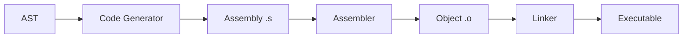
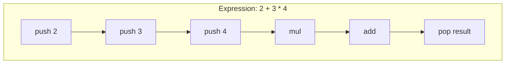
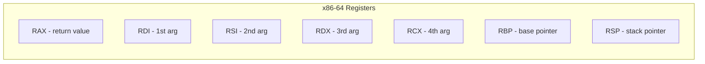
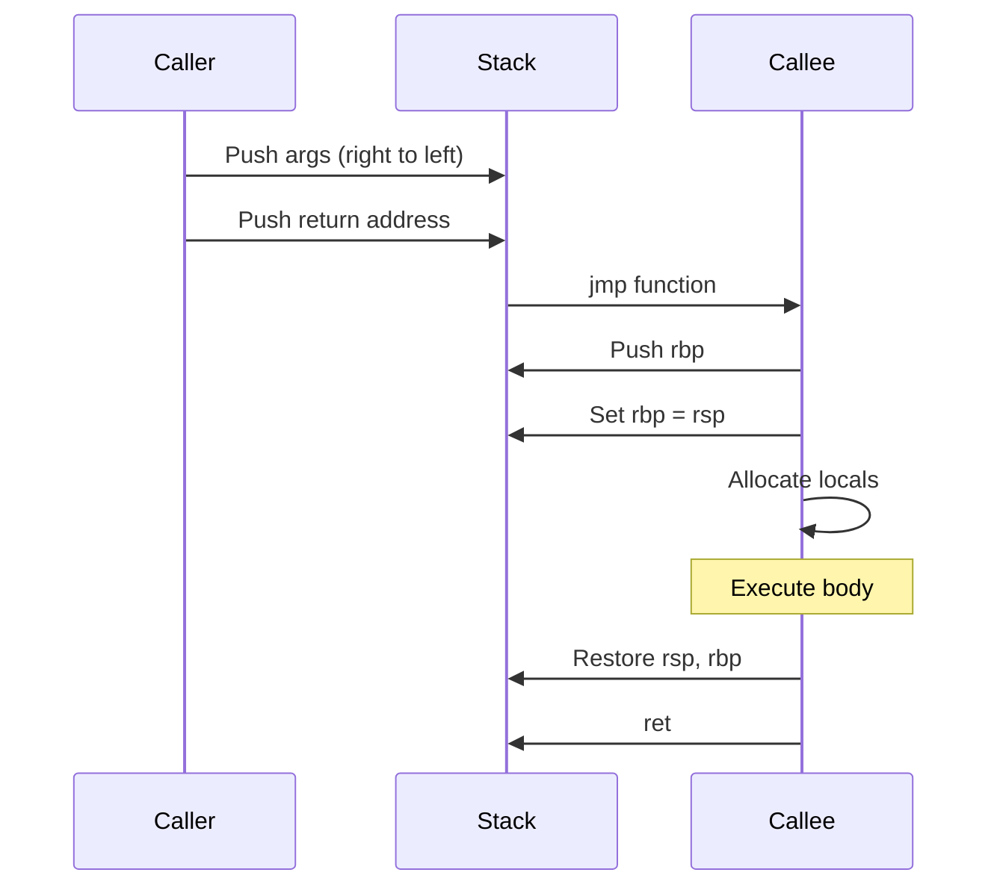
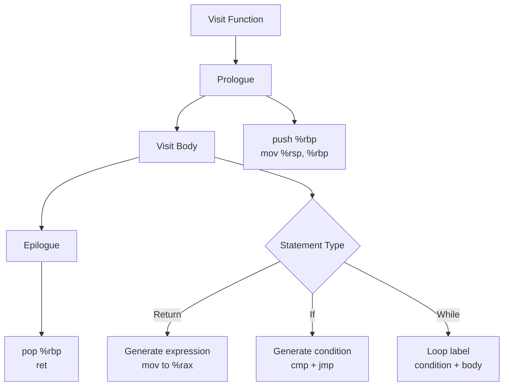

# Lesson 0004: Code Generator

## Objective

Generate x86-64 assembly from the AST.

## Concepts

### Compilation Pipeline



### Stack-Based Code Generation



### Register Allocation (Simplified)



### Function Call Convention



## Implementation

### Files

| File | Purpose |
|------|---------|
| `src/codegen.h` | CodeGenerator class |
| `src/codegen.cpp` | Assembly generation logic |
| `src/assembly.h` | Assembly instruction helpers |
| `tests/test_codegen.cpp` | Unit tests |

### Generated Assembly Example

For `int main() { return 42; }`:

```asm
    .globl main
main:
    push %rbp
    mov %rsp, %rbp
    mov $42, %rax
    pop %rbp
    ret
```

### Code Generation Rules



## Test Cases

1. **Simple return**: `return 42;` → generates `mov $42, %rax`
2. **Arithmetic**: `return 2 + 3;` → correct stack operations
3. **Variable access**: `int x = 5; return x;` → stack frame offsets
4. **Function call**: `foo();` → argument passing
5. **Control flow**: `if (x) { ... }` → conditional jumps

## Expected Output

```bash
$ echo 'int main() { return 42; }' > test.c
$ ./compiler test.c
$ cat test.s
    .globl main
main:
    push %rbp
    mov %rsp, %rbp
    mov $42, %rax
    pop %rbp
    ret
$ gcc -o test test.s && ./test; echo $?
42
```
