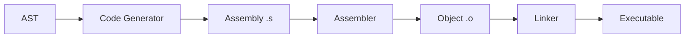
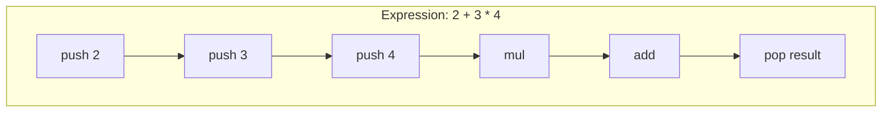
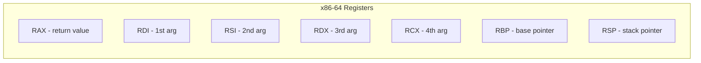
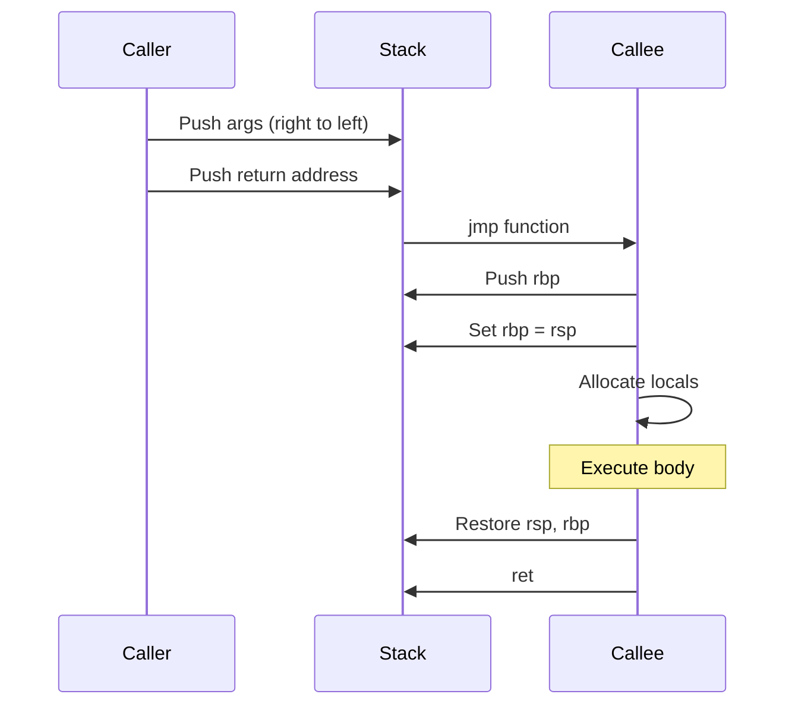
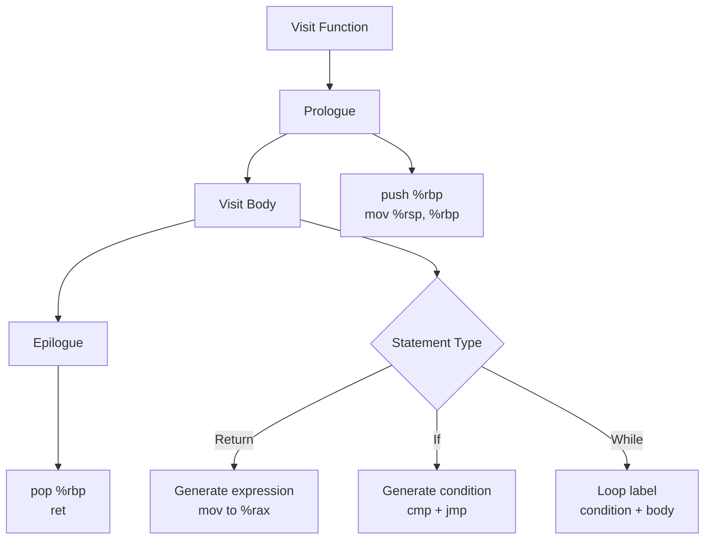

# Lesson 0004: Code Generator

## Objective

Generate x86-64 assembly from the AST.

## Concepts

### Compilation Pipeline



### Stack-Based Code Generation



### Register Allocation (Simplified)



### Function Call Convention



## Implementation

### Files

| File | Purpose |
|------|---------|
| `src/codegen.h` | CodeGenerator class |
| `src/codegen.cpp` | Assembly generation logic |
| `src/assembly.h` | Assembly instruction helpers |
| `tests/test_codegen.cpp` | Unit tests |

### Generated Assembly Example

For `int main() { return 42; }`:

```asm
    .globl main
main:
    push %rbp
    mov %rsp, %rbp
    mov $42, %rax
    pop %rbp
    ret
```

### Code Generation Rules



## Test Cases

1. **Simple return**: `return 42;` → generates `mov $42, %rax`
2. **Arithmetic**: `return 2 + 3;` → correct stack operations
3. **Variable access**: `int x = 5; return x;` → stack frame offsets
4. **Function call**: `foo();` → argument passing
5. **Control flow**: `if (x) { ... }` → conditional jumps

## Expected Output

```bash
$ echo 'int main() { return 42; }' > test.c
$ ./compiler test.c
$ cat test.s
    .globl main
main:
    push %rbp
    mov %rsp, %rbp
    mov $42, %rax
    pop %rbp
    ret
$ gcc -o test test.s && ./test; echo $?
42
```

## Implementation Details

### Source Code References
| Component | File | Lines | Description |
|-----------|------|-------|-------------|
| CodeGenerator class | src/codegen.h | 10-152 | Class declaration with visitor overrides |
| Constructor | src/codegen.cpp | 7-9 | Initializes code generator |
| generate() | src/codegen.cpp | 10-63 | Main entry: generates assembly for program |
| emit() | src/codegen.cpp | 65-67 | Writes assembly line to output |
| emit_label() | src/codegen.cpp | 69-71 | Writes label to output |
| emit_function_prologue() | src/codegen.cpp | 73-82 | Generates function prologue (push %rbp, mov %rsp, %rbp) |
| emit_function_epilogue() | src/codegen.cpp | 84-89 | Generates function epilogue (pop %rbp, ret) |
| push()/pop() | src/codegen.cpp | 91-97 | Stack manipulation helpers |
| new_label() | src/codegen.cpp | 99-101 | Generates unique labels |
| dispatch() | src/codegen.cpp | 103-233 | Routes AST nodes to appropriate visitor |
| visit(ProgramNode) | src/codegen.cpp | 235-255 | Generates code for all declarations |
| visit(FunctionDeclNode) | src/codegen.cpp | 257-302 | Function code generation with prologue/epilogue |
| visit(VarDeclNode) | src/codegen.cpp | 304-336 | Variable allocation and initialization |
| visit(ReturnStmtNode) | src/codegen.cpp | 495-505 | Return statement code generation |
| visit(IfStmtNode) | src/codegen.cpp | 513-536 | If statement with conditional jumps |
| visit(WhileStmtNode) | src/codegen.cpp | 538-562 | While loop code generation |
| visit(ForStmtNode) | src/codegen.cpp | 589-628 | For loop code generation |
| visit(BinaryExprNode) | src/codegen.cpp | 644-646 | Binary expression (delegates to generate_binary) |
| visit(AssignExprNode) | src/codegen.cpp | 652-706 | Assignment expression code generation |
| visit(CompoundAssignExprNode) | src/codegen.cpp | 708-783 | Compound assignment code generation |
| visit(TernaryExprNode) | src/codegen.cpp | 785-803 | Ternary operator code generation |
| visit(CallExprNode) | src/codegen.cpp | 838-854 | Function call code generation |
| visit(IndexExprNode) | src/codegen.cpp | 856-897 | Array indexing code generation |
| visit(MemberExprNode) | src/codegen.cpp | 899-905 | Struct member access |
| visit(IdentifierExprNode) | src/codegen.cpp | 942-968 | Identifier loading (local/global) |
| generate_expression() | src/codegen.cpp | 970-974 | Expression code generation dispatcher |
| generate_binary() | src/codegen.cpp | 976-1086 | Binary operation code generation |
| generate_unary() | src/codegen.cpp | 1088-1195 | Unary operation code generation |
| get_type_size() | src/codegen.cpp | 1197-1214 | Type size calculation |
