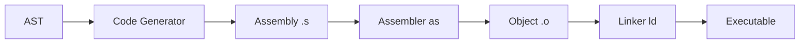
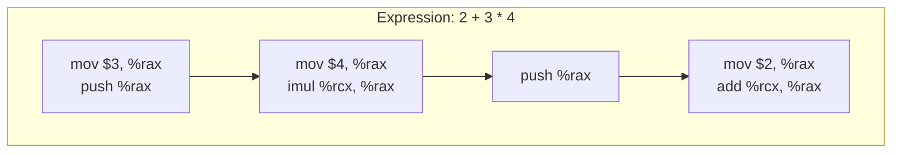
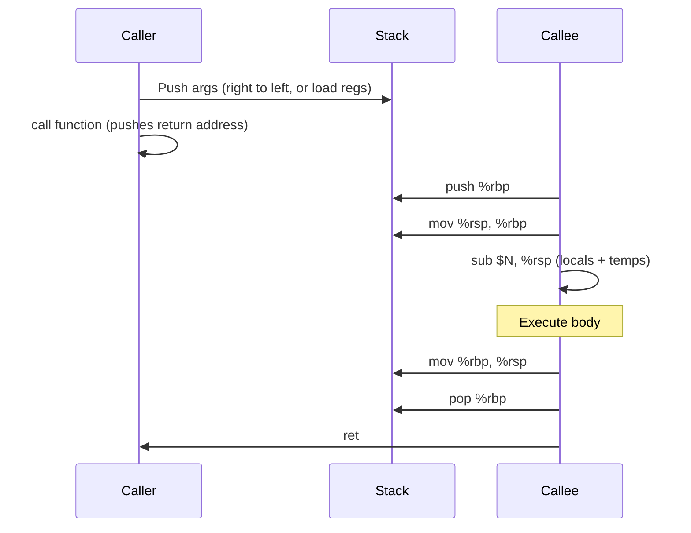

# Lesson 0004: Code Generator

## Status: ✅ Complete | Phase: Core

## Objective

Generate x86-64 System V assembly from the AST.

## Concepts

### Compilation Pipeline



### Stack-Based Code Generation

Each subexpression leaves its result in `%rax` (integers/pointers) or
`%xmm0` (floats/doubles). Binary operators push the right operand before
evaluating the left, then pop into `%rcx` to apply the instruction.



### Register Allocation (Simplified)

| Register | Role |
|----------|------|
| `%rax`   | Integer return value; subexpression scratch |
| `%xmm0`  | Float/double return value; subexpression scratch |
| `%rdi` `%rsi` `%rdx` `%rcx` `%r8` `%r9` | Integer/pointer args 1-6 (System V ABI) |
| `%xmm0`..`%xmm7` | Float/double args 1-8 (System V ABI) |
| `%rbp`   | Frame base |
| `%rsp`   | Stack pointer |

### Function Call Convention



## Implementation

### Files

| File | Purpose |
|------|---------|
| `src/codegen.h` | `CodeGenerator` class declaration and per-function state |
| `src/codegen.cpp` | x86-64 assembly emission via the visitor pattern |

### Function Prologue / Epilogue

Every top-level function (and every nested function) is bracketed by the
same prologue / epilogue pair. The prologue pushes `%rbp`, sets up the
frame, then pre-allocates a fixed-size stack frame sized to
`num_params + num_locals + 16` extra slots for expression temporaries.

```cpp
// src/codegen.cpp:98
void CodeGenerator::emit_function_prologue(const std::string& name) {
    emit(".globl " + name);
    emit_label(name);
    emit("push %rbp");
    emit("mov %rsp, %rbp");

    stack_offset_ = 0;
    local_variables_.clear();
    current_function_ = name;
}

void CodeGenerator::emit_function_epilogue() {
    emit("mov %rbp, %rsp");
    emit("pop %rbp");
    emit("ret");
    current_function_.clear();
}
```

### Dispatch via the Visitor Pattern

`dispatch()` is a giant `switch` on `NodeType` that calls the matching
`visit(NodeType&)` method. The first pass of `generate()` collects global
variables and function signatures (so calls can know the return type of a
function) before the second pass emits any code.

```cpp
// src/codegen.cpp:128
void CodeGenerator::dispatch(ASTNode* node) {
    if (!node) return;
    switch (node->type) {
        case NodeType::BINARY_EXPR:
            visit(static_cast<BinaryExprNode&>(*node)); break;
        case NodeType::IF_STMT:
            visit(static_cast<IfStmtNode&>(*node)); break;
        case NodeType::CALL_EXPR:
            visit(static_cast<CallExprNode&>(*node)); break;
        // ... ~40 more cases ...
        case NodeType::COMPOUND_LITERAL:
            visit(static_cast<CompoundLiteralNode&>(*node)); break;
    }
}
```

### Stack Frame Setup

Local variables are allocated one slot at a time, and `local_variables_`
maps each name to its negative offset from `%rbp`. Parameter registers
are spilled into their slots on entry.

```cpp
// src/codegen.cpp:382  (inside visit(FunctionDeclNode))
emit_function_prologue(node.name);

int num_params  = (int)node.params.size();
int local_count = /* count of VAR_DECL stmts in body */;
int total_slots = num_params + local_count + 16;  // +16 for expr temps
if (total_slots > 0) {
    emit("sub $" + std::to_string(total_slots * 8) + ", %rsp");
}
// Spill %rdi, %rsi, %rdx, %rcx, %r8, %r9 into stack slots...
// (float params spill from %xmm0..%xmm7 with movss/movsd)
```

### Generated Assembly Example

For `int main() { return 42; }`:

```asm
    .text
    .globl main
main:
    push %rbp
    mov %rsp, %rbp
    sub $128, %rsp
    mov $42, %rax
    mov %rbp, %rsp
    pop %rbp
    ret
```

The `sub $128, %rsp` comes from the `+16` expression-temp slots reserved
in every function frame (16 × 8 = 128 bytes).

## Example

C source:

```c
int add(int a, int b) { return a + b; }
int main() { return add(2, 3); }
```

Generated assembly (excerpt — the `add` function body is straightforward
integer arithmetic; the `call add` in `main` uses the System V register
ABI):

```asm
    .text
    .globl add
add:
    push %rbp
    mov %rsp, %rbp
    sub $128, %rsp
    mov %rdi, -8(%rbp)          ; spill arg 'a'
    mov %rsi, -16(%rbp)         ; spill arg 'b'
    mov -8(%rbp), %rax
    push %rax
    mov -16(%rbp), %rax
    pop %rcx
    add %rcx, %rax
    mov %rbp, %rsp
    pop %rbp
    ret

    .globl main
main:
    push %rbp
    mov %rsp, %rbp
    sub $128, %rsp
    mov $2, %rax
    push %rax
    mov $3, %rax
    pop %rdi
    mov %rax, %rsi
    call add
    mov %rbp, %rsp
    pop %rbp
    ret
```

`./a.out; echo $?` → `5`.

## Implementation Details

### Source Code References

| Component | File | Lines | Description |
|-----------|------|-------|-------------|
| `CodeGenerator` class | src/codegen.h | 11-233 | Visitor impls, per-function state, struct/global caches |
| `CodeGenerator` ctor | src/codegen.cpp | 10-11 | Initialises `stack_offset_`, `label_counter_`, `returned_` |
| `generate()` (program) | src/codegen.cpp | 13-88 | First pass: collect globals/signatures, emit `.data`, `.text`, `.rodata` |
| `emit()` | src/codegen.cpp | 90-92 | Writes `"    " + line` to the output stream |
| `emit_label()` | src/codegen.cpp | 94-96 | Writes `name:\n` |
| `emit_function_prologue()` | src/codegen.cpp | 98-107 | `push %rbp`; `mov %rsp, %rbp`; reset frame |
| `emit_function_epilogue()` | src/codegen.cpp | 109-114 | `mov %rbp, %rsp`; `pop %rbp`; `ret` |
| `push()` / `pop()` | src/codegen.cpp | 116-122 | Register-named `push`/`pop` helpers |
| `new_label()` | src/codegen.cpp | 124-126 | `"." + prefix + "_" + counter` |
| `dispatch()` | src/codegen.cpp | 128-268 | `NodeType` switch → matching `visit(...)` |
| `visit(ProgramNode&)` | src/codegen.cpp | 272-303 | Collects globals + function signatures, then dispatches each decl |
| `visit(FunctionDeclNode&)` | src/codegen.cpp | 305-457 | Frame setup, parameter spilling, body, nested-function emission |
| `visit(VarDeclNode&)` | src/codegen.cpp | 459-552 | Stack-slot allocation; init from expression or `{ ... }` list |
| `compute_member_address()` | src/codegen.cpp | 555-594 | `lea` for local struct base + `lea` for field offset |
| `visit(StructDeclNode&)` | src/codegen.cpp | 600-616 | Builds `struct_layouts_` table for member offsets |
| `visit(ReturnStmtNode&)` | src/codegen.cpp | 712-745 | Evaluates value, sets `%rax` (or `%xmm0` for float), epilogue |
| `visit(IfStmtNode&)` | src/codegen.cpp | 753-776 | `cmp $0` + `je` to else/end labels |
| `visit(WhileStmtNode&)` | src/codegen.cpp | 778-802 | `start:` … `cmp $0` / `je end` / body / `jmp start` |
| `visit(DoWhileStmtNode&)` | src/codegen.cpp | 804-827 | body first, then condition, `jne start` |
| `visit(ForStmtNode&)` | src/codegen.cpp | 829-868 | init → `jmp cond` → body → update → cond → `jne start` |
| `visit(SwitchStmtNode&)` | src/codegen.cpp | 631-681 | First pass: chain of `cmp`/`je`; then case bodies at labels |
| `visit(AssignExprNode&)` | src/codegen.cpp | 892-989 | Handles identifier, global, member, indexed, captured-var lvalues |
| `visit(CompoundAssignExprNode&)` | src/codegen.cpp | 991-1093 | Load-modify-store with op table (incl. `BIT_AND` … `RSHIFT`) |
| `visit(TernaryExprNode&)` | src/codegen.cpp | 1095-1113 | Condition, then/else via two labels |
| `visit(CommaExprNode&)` | src/codegen.cpp | 1115-1118 | Evaluate both; right value remains in `%rax` |
| `visit(SizeofExprNode&)` | src/codegen.cpp | 1120-1146 | `mov $N, %rax` from `get_type_size` / `get_struct_size` |
| `visit(CastExprNode&)` | src/codegen.cpp | 1148-1199 | `cvtsi2sd/ss`, `cvttsd2si/ss`, `cvtsd2ss`, `cvtss2sd` conversions |
| `visit(CallExprNode&)` | src/codegen.cpp | 1201-1365 | System V ABI arg placement; indirect calls via function pointers |
| `visit(IndexExprNode&)` | src/codegen.cpp | 1367-1425 | `base + index*elem_size`; size-aware `movzbl`/`movzwl`/`movl`/`mov` |
| `visit(MemberExprNode&)` | src/codegen.cpp | 1427-1433 | `compute_member_address` then `mov (%rax), %rax` |
| `visit(DerefExprNode&)` | src/codegen.cpp | 1435-1464 | `*p` with size derived from pointee type |
| `visit(AddressOfExprNode&)` | src/codegen.cpp | 1466-1481 | `lea offset(%rbp), %rax` for locals |
| `visit(StmtExprNode&)` | src/ast.h | 525-530 / codegen 1483-1490 | GCC `({...})`: dispatch each stmt in the block |
| `visit(AsmStmtNode&)` | src/codegen.cpp | 1492-1496 | Emits raw asm verbatim |
| `visit(IntegerLiteralNode&)` | src/codegen.cpp | 1498-1507 | `mov $v, %rax` (or `movabsq` for > 32-bit) |
| `visit(FloatLiteralNode&)` | src/codegen.cpp | 1509-1532 | IEEE bit pattern → `%xmm0` via `movd`/`movq` |
| `visit(StringLiteralNode&)` | src/codegen.cpp | 1534-1541 | Append to `string_literals_`; emit `lea .Lstr_N(%rip), %rax` |
| `visit(CharLiteralNode&)` | src/codegen.cpp | 1543-1545 | `mov $N, %rax` |
| `visit(IdentifierExprNode&)` | src/codegen.cpp | 1547-1615 | Local/global/captured/array/function lookup, size-aware load |
| `generate_expression()` | src/codegen.cpp | 1619-1623 | Thin wrapper around `dispatch()` |
| `generate_binary()` | src/codegen.cpp | 1625-1869 | Integer (push/pop) and SSE (xmm0/xmm1) paths; `setCC` for comparisons |
| `generate_unary()` | src/codegen.cpp | 1871-2062 | `-x`, `!x`, `~x`, `*p`, `&x`, `++x`/`--x` (incl. members) |
| `get_type_size()` | src/codegen.cpp | 2065-2091 | Returns 1/2/4/8/struct-size for every C type |
| `get_struct_size()` | src/codegen.cpp | 2093-2099 | Sum of field sizes from `struct_layouts_` |
| `get_field_offset()` | src/codegen.cpp | 2101-2107 | Lookup in `struct_layouts_` |
| `infer_expr_type()` | src/codegen.cpp | 2296-2400 | Statically walks an expression to determine its result type |
