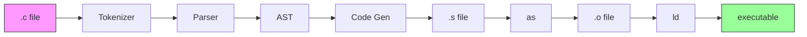
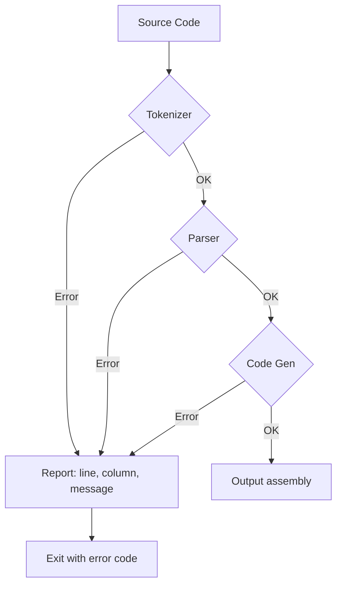
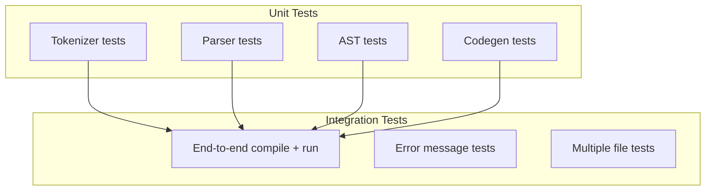

# Lesson 0005: Integration

## Objective

Combine all components into a working compiler with end-to-end testing.

## Concepts

### Full Pipeline



### Error Handling Flow



### Test Strategy



## Implementation

### Files

| File | Purpose |
|------|---------|
| `src/main.cpp` | CLI entry point |
| `src/compiler.h` | Orchestrator class |
| `src/compiler.cpp` | Pipeline management |
| `tests/test_integration.cpp` | End-to-end tests |
| `tests/test_files/*.c` | Test C programs |

### Compiler CLI

```bash
Usage: simplecc [options] <file.c>

Options:
    -o <file>     Output file (default: a.out)
    -S            Output assembly only
    -t            Print tokens
    -a            Print AST
    -h            Show help
```

### Integration Test Cases

| Test | Input | Expected Output |
|------|-------|-----------------|
| Echo return | `int main() { return 42; }` | Exit code 42 |
| Arithmetic | `return 2 + 3 * 4;` | Exit code 14 |
| Variables | `int x = 10; return x;` | Exit code 10 |
| If/else | `if (1) return 1; else return 2;` | Exit code 1 |
| While | `int i = 0; while(i < 5) i++; return i;` | Exit code 5 |
| Function | `int add(int a, int b) { return a + b; } int main() { return add(2, 3); }` | Exit code 5 |

## Running Full Test Suite

```bash
cd build
cmake ..
make
ctest --output-on-failure --verbose
```

## Example End-to-End Test

```cpp
TEST_CASE("Complete program", "[integration]") {
    const char* source = R"(
        int main() {
            int x = 10;
            int y = 20;
            return x + y;
        }
    )";
    
    Compiler compiler;
    auto result = compiler.compile(source);
    REQUIRE(result.exit_code == 30);
}
```
