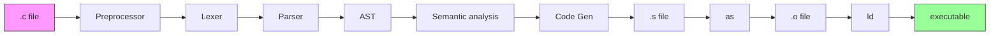
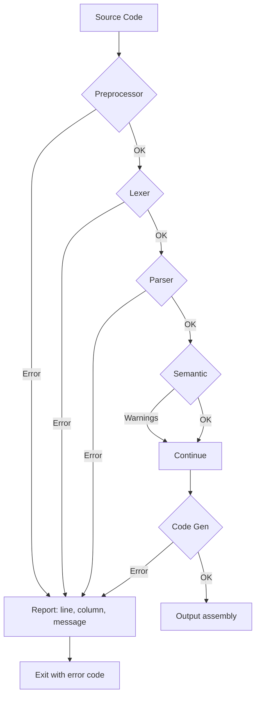
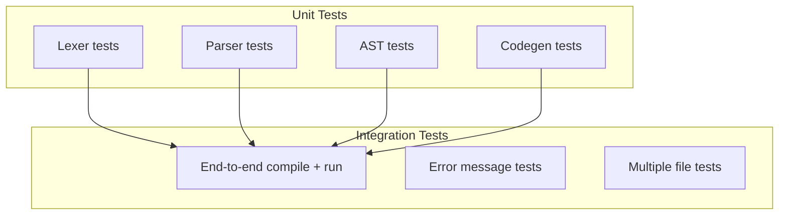

# Lesson 0005: Integration

## Status: ✅ Complete | Phase: Core

## Objective

Combine all components into a working compiler with end-to-end testing.

## Concepts

### Full Pipeline



### Error Handling Flow



### Test Strategy



## Implementation

### Files

| File | Purpose |
|------|---------|
| `src/main.cpp` | CLI entry point |
| `src/compiler.h` | `Compiler` orchestrator + `CompileResult` struct |
| `src/compiler.cpp` | Pipeline: preprocess → tokenize → parse → semantic → codegen |
| `src/preprocessor.h` / `src/preprocessor.cpp` | Macro expansion and `#include` handling |

### `compile()` Orchestration

Each phase is run in sequence; the first error halts the pipeline and is
returned in `CompileResult`. Semantic analysis never aborts the
compilation (only warnings are produced).

```cpp
// src/compiler.cpp:21
CompileResult Compiler::compile(const std::string& source) {
    CompileResult result;

    // 1. Reset preprocessor + semantic state, redefine built-in macros
    preprocessor_.reset();
    semantic_.reset();
    preprocessor_.define_macro("__STDC__", "1");
    preprocessor_.define_macro("__STDC_VERSION__", "202311L");
    preprocessor_.define_macro("__x86_64__", "1");
    preprocessor_.define_macro("__linux__", "1");
    // ... true, false, __bool_true_false_are_defined ...

    // 2. Preprocess
    std::string preprocessed = preprocessor_.process(source);
    if (preprocessor_.has_error()) { /* report preprocessor error */ return result; }

    // 3. Tokenize
    Lexer lexer(preprocessed);
    auto tokens = lexer.tokenize();
    if (lexer.has_error()) { /* report lexer error */ return result; }

    // 4. Parse
    Parser parser(tokens);
    auto ast = parser.parse();
    if (parser.has_error()) { /* report parser error */ return result; }

    // 5. Semantic analysis (warnings only, does not fail)
    semantic_.analyze(static_cast<ProgramNode&>(*ast));

    // 6. Generate code
    CodeGenerator codegen;
    result.assembly = codegen.generate(static_cast<ProgramNode&>(*ast));
    if (codegen.has_error()) { /* report codegen error */ return result; }

    result.success = true;
    return result;
}
```

### Compiler CLI

The CLI is in `src/main.cpp`. It supports `-o` for output name, `-S` to
keep the `.s` file, `-t` to dump tokens, `-a` to dump the AST, and `-h`
for help.

```bash
Usage: simplecc [options] <file.c>

Options:
    -o <file>     Output file (default: a.out)
    -S            Output assembly only
    -t            Print tokens
    -a            Print AST
    -h            Show help
```

### Multi-File Support

`compile_files()` (in `src/compiler.cpp:97-122`) compiles each file in
isolation, then concatenates their assembly. Globals and `extern`
declarations can therefore span translation units.

## Integration Test Cases

| Test | Input | Expected Output |
|------|-------|-----------------|
| Echo return | `int main() { return 42; }` | Exit code 42 |
| Arithmetic | `return 2 + 3 * 4;` | Exit code 14 |
| Variables | `int x = 10; return x;` | Exit code 10 |
| If/else | `if (1) return 1; else return 2;` | Exit code 1 |
| While | `int i = 0; while(i < 5) i++; return i;` | Exit code 5 |
| Function | `int add(int a, int b) { return a + b; } int main() { return add(2, 3); }` | Exit code 5 |

## Running Full Test Suite

```bash
cd build
cmake ..
make
ctest --output-on-failure --verbose
```

## Example End-to-End Test

```cpp
TEST_CASE("Complete program", "[integration]") {
    const char* source = R"(
        int main() {
            int x = 10;
            int y = 20;
            return x + y;
        }
    )";

    Compiler compiler;
    auto result = compiler.compile(source);
    REQUIRE(result.success);
    REQUIRE(result.error_message.empty());

    // Assemble + run via system() to verify behaviour
    // ...
    REQUIRE(exit_code == 30);
}
```

## Implementation Details

### Source Code References

| Component | File | Lines | Description |
|-----------|------|-------|-------------|
| `CompileResult` struct | src/compiler.h | 11-19 | `success`, `assembly`, `error_message`, `error_line/column` |
| `MultiFileCompileResult` struct | src/compiler.h | 22-30 | Same fields for `compile_files()` |
| `Compiler` class | src/compiler.h | 32-53 | Owns `Preprocessor` and `SemanticAnalyzer` |
| Built-in macros | src/compiler.cpp | 10-19, 28-34 | `__STDC__`, `__STDC_VERSION__`, `__x86_64__`, `__linux__`, `true`, `false` |
| `compile()` pipeline | src/compiler.cpp | 21-81 | Preprocess → tokenize → parse → semantic → codegen |
| `compile_file()` | src/compiler.cpp | 83-95 | Read file contents and delegate to `compile()` |
| `compile_files()` | src/compiler.cpp | 97-122 | Per-file compile + concatenate assembly output |
| CLI entry point | src/main.cpp | — | `main()` parses flags and invokes the compiler |
