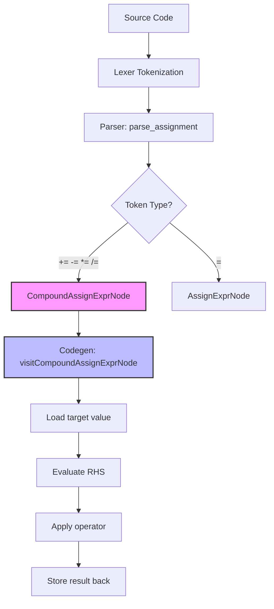

# Lesson 0006: Compound Assignment Operators

## Status: 📋 Planned | Phase: Quick Wins | Effort: Easy (3-4h)

## Objective

Implement `+=`, `-=`, `*=`, `/=`, `%=`, `&=`, `|=`, `^=`, `<<=`, `>>=`.

## Why It's First

- Tokens already exist in the lexer (PLUS_ASSIGN, MINUS_ASSIGN, etc.)
- Parser change only: extend `parse_assignment()` to match these tokens
- Enables idiomatic C: `i += 1`, `count -= n`, `ptr += offset`

## Implementation Checklist

- [ ] Extend `parse_assignment()` to match compound operators
- [ ] Add `CompoundAssignExprNode`: `{ target, op, value }`
- [ ] Codegen: load target value, compute, store back
- [ ] Handle complex lvalues: `a[i] += 1`, `p->x *= 2`
- [ ] Test: `int x = 10; x += 5; return x;` → 15
- [ ] Test: `int a[3] = {1,2,3}; a[1] *= 10; return a[1];` → 20

## C Code Examples

```c
int x = 10;
x += 5;     // x = 15
x -= 3;     // x = 12
x *= 2;     // x = 24
x /= 4;     // x = 6
x %= 4;     // x = 2

int a = 0b1010;
a &= 0b1100;  // a = 0b1000
a |= 0b0011;  // a = 0b1011
a <<= 1;      // a = 0b10000
```

## Test Strategy

- Compile test: verify assembly contains correct instruction sequence
- Execute test: run compiled program, verify exit code

## Implementation Flow


