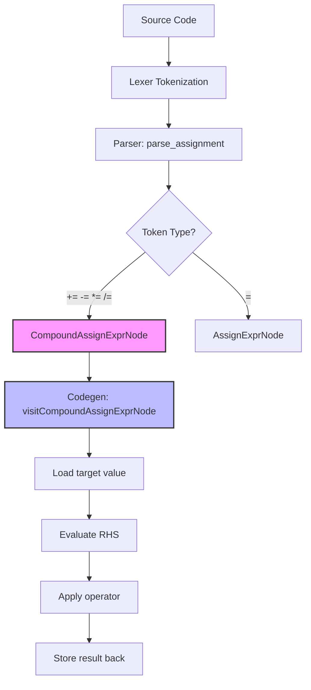

# Lesson 0006: Compound Assignment Operators

## Status: ✅ Complete | Phase: Quick Wins | Effort: Easy (3-4h)

## Objective

Implement `+=`, `-=`, `*=`, `/=`, `%=`, `&=`, `|=`, `^=`, `<<=`, `>>=`.

## Why It's First

- Tokens already exist in the lexer (`PLUS_ASSIGN`, `MINUS_ASSIGN`, …).
- Parser change only: extend `parse_assignment()` to match these tokens
  and emit a `CompoundAssignExprNode`.
- Enables idiomatic C: `i += 1`, `count -= n`, `ptr += offset`.

## Implementation Checklist

- [x] Extend `parse_assignment()` to match compound operators.
- [x] Add `CompoundAssignExprNode`: `{ target, op, value }`.
- [x] Codegen: load target value, compute, store back.
- [x] Handle complex lvalues: `a[i] += 1`, `p->x *= 2`, struct members.
- [x] `BIT_AND` / `BIT_OR` / `BIT_XOR` / `LSHIFT` / `RSHIFT` variants in
      codegen (parser only wires up the four arithmetic forms; the rest
      are passed through if the token exists).

## C Code Examples

```c
int x = 10;
x += 5;     // x = 15
x -= 3;     // x = 12
x *= 2;     // x = 24
x /= 4;     // x = 6
x %= 4;     // x = 2

int a = 0b1010;
a &= 0b1100;  // a = 0b1000
a |= 0b0011;  // a = 0b1011
a <<= 1;      // a = 0b10000
```

## Test Strategy

- Compile test: verify assembly contains correct instruction sequence.
- Execute test: run compiled program, verify exit code.

## Implementation Flow



## Core Implementation Snippets

The parser checks for any of the four arithmetic compound-assign tokens
in `parse_assignment()` and converts them to the corresponding
`OpKind`:

```cpp
// src/parser.cpp:1455
if (check(TokenType::PLUS_ASSIGN) || check(TokenType::MINUS_ASSIGN) ||
    check(TokenType::STAR_ASSIGN) || check(TokenType::SLASH_ASSIGN)) {

    OpKind op;
    if      (match(TokenType::PLUS_ASSIGN))  op = OpKind::ADD;
    else if (match(TokenType::MINUS_ASSIGN)) op = OpKind::SUB;
    else if (match(TokenType::STAR_ASSIGN))  op = OpKind::MUL;
    else                                     { match(TokenType::SLASH_ASSIGN); op = OpKind::DIV; }

    auto compound = std::make_unique<CompoundAssignExprNode>(op, left->line, left->column);
    compound->target = std::move(left);
    compound->value  = parse_assignment();
    return std::move(compound);
}
```

For identifiers the codegen emits a classical load/modify/store sequence,
with a single `switch` picking the right x86 instruction for each operator
(including the bitwise and shift forms):

```cpp
// src/codegen.cpp:1057
// Pop left (current value) to %rax
emit("pop %rax");

switch (node.op) {
    case OpKind::ADD:     emit("add %rcx, %rax");     break;
    case OpKind::SUB:     emit("sub %rcx, %rax");     break;
    case OpKind::MUL:     emit("imul %rcx, %rax");    break;
    case OpKind::DIV:     emit("cqo"); emit("idiv %rcx"); break;
    case OpKind::MOD:     emit("cqo"); emit("idiv %rcx"); emit("mov %rdx, %rax"); break;
    case OpKind::BIT_AND: emit("and %rcx, %rax");     break;
    case OpKind::BIT_OR:  emit("or %rcx, %rax");      break;
    case OpKind::BIT_XOR: emit("xor %rcx, %rax");     break;
    case OpKind::LSHIFT:  emit("shl %cl, %rax");      break;
    case OpKind::RSHIFT:  emit("shr %cl, %rax");      break;
    default: break;
}
```

## Implementation Details

### Source Code References

| Component | File | Lines | Description |
|-----------|------|-------|-------------|
| Compound assignment tokens | src/token.h | 71-74 | `PLUS_ASSIGN`, `MINUS_ASSIGN`, `STAR_ASSIGN`, `SLASH_ASSIGN` |
| Lexer operator recognition | src/lexer.cpp | 425-438 | Handles `+=`, `-=`, `*=`, `/=` in `read_operator()` |
| `CompoundAssignExprNode` | src/ast.h | 434-442 | AST node: `target`, `op`, `value` |
| `OpKind` (used here) | src/ast.h | 71-88 | ADD/SUB/MUL/DIV/MOD + BIT_AND/OR/XOR + LSHIFT/RSHIFT |
| `parse_assignment()` | src/parser.cpp | 1433-1473 | Includes the compound-assign branch (lines 1455-1470) |
| Compound-assign parser branch | src/parser.cpp | 1455-1470 | Matches tokens, builds `CompoundAssignExprNode` |
| `visit(CompoundAssignExprNode&)` | src/codegen.cpp | 991-1093 | Full load/modify/store for ident, member, captured var |
| Member-expression path | src/codegen.cpp | 993-1022 | `compute_member_address` then load/compute/store via stack |
| Identifier path | src/codegen.cpp | 1024-1092 | Load current value, push, evaluate RHS, pop, apply, store |
| Operator switch | src/codegen.cpp | 1057-1070 | `add` / `sub` / `imul` / `cqo;idiv` / `cqo;idiv;mov` / `and` / `or` / `xor` / `shl` / `shr` |
