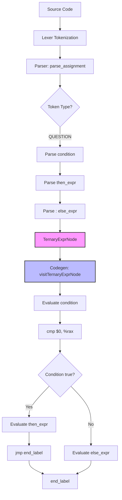

# Lesson 0007: Ternary Operator

## Status: 📋 Planned | Phase: Quick Wins | Effort: Easy (3-4h)

## Objective

Implement `cond ? then_expr : else_expr`.

## Implementation Checklist

- [ ] Add `ConditionalExprNode` to AST: `{ condition, then_expr, else_expr }`
- [ ] Parse `? :` in `parse_assignment()` after `||`
- [ ] Codegen: short-circuit evaluation with labels
- [ ] Test: `int max = (a > b) ? a : b;`
- [ ] Test: nested ternary

## Generated Assembly Pattern

```asm
    # condition
    mov -8(%rbp), %rax
    cmp $0, %rax
    je .Lelse_0
    # then_expr
    mov -8(%rbp), %rax
    jmp .Lend_0
.Lelse_0:
    # else_expr
    mov -16(%rbp), %rax
.Lend_0:
```

## Implementation Flow



## Implementation Details

### Source Code References
| Component | File | Lines | Description |
|-----------|------|-------|-------------|
| QUESTION token | src/token.h | 83 | Token type for ternary operator '?' |
| TernaryExprNode | src/ast.h | 413-421 | AST node for ternary conditional expression |
| parse_assignment() | src/parser.cpp | 893-933 | Parses ternary operator after logical OR |
| Ternary parsing | src/parser.cpp | 896-905 | Matches QUESTION token, parses condition, then_expr, else_expr |
| visit(TernaryExprNode) | src/codegen.cpp | 785-803 | Code generation for ternary operator with short-circuit evaluation |
| Label generation | src/codegen.cpp | 786-787 | Creates else_label and end_label for branching |
| Condition evaluation | src/codegen.cpp | 789-791 | Evaluates condition and compares with 0 |
| Then expression | src/codegen.cpp | 793-796 | Generates then_expr and jumps to end |
| Else expression | src/codegen.cpp | 798-801 | Generates else_expr at else_label |
