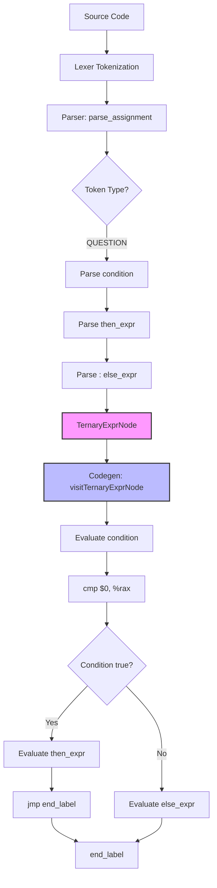

# Lesson 0007: Ternary Operator

## Status: 📋 Planned | Phase: Quick Wins | Effort: Easy (3-4h)

## Objective

Implement `cond ? then_expr : else_expr`.

## Implementation Checklist

- [ ] Add `ConditionalExprNode` to AST: `{ condition, then_expr, else_expr }`
- [ ] Parse `? :` in `parse_assignment()` after `||`
- [ ] Codegen: short-circuit evaluation with labels
- [ ] Test: `int max = (a > b) ? a : b;`
- [ ] Test: nested ternary

## Generated Assembly Pattern

```asm
    # condition
    mov -8(%rbp), %rax
    cmp $0, %rax
    je .Lelse_0
    # then_expr
    mov -8(%rbp), %rax
    jmp .Lend_0
.Lelse_0:
    # else_expr
    mov -16(%rbp), %rax
.Lend_0:
```

## Implementation Flow


