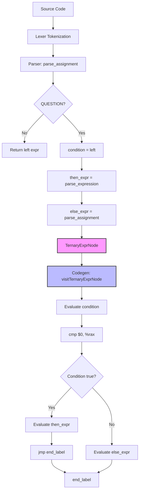

# Lesson 0007: Ternary Operator

## Status: ✅ Complete | Phase: Quick Wins | Effort: Easy (3-4h)

## Objective

Implement `cond ? then_expr : else_expr`.

## Implementation Checklist

- [x] Add `TernaryExprNode` to AST: `{ condition, then_expr, else_expr }`.
- [x] Parse `? :` in `parse_assignment()` after `||`.
- [x] Codegen: short-circuit evaluation with two labels.
- [x] Nested ternary (right-associative).
- [x] Integration with type inference (`infer_expr_type` returns the
      common type of the two branches).

## Generated Assembly Pattern

```asm
    # condition
    mov -8(%rbp), %rax
    cmp $0, %rax
    je .Lternary_else_0
    # then_expr
    mov -8(%rbp), %rax
    jmp .Lternary_end_0
.Lternary_else_0:
    # else_expr
    mov -16(%rbp), %rax
.Lternary_end_0:
```

## Implementation Flow



## Core Implementation Snippets

The parser recognises `?` immediately after parsing a sub-expression.
The right-hand side recurses through `parse_assignment()` so that nested
ternaries and assignments are right-associative.

```cpp
// src/parser.cpp:1437
if (match(TokenType::QUESTION)) {
    auto ternary = std::make_unique<TernaryExprNode>(left->line, left->column);
    ternary->condition = std::move(left);
    ternary->then_expr = parse_expression();
    expect(TokenType::COLON);
    ternary->else_expr = parse_assignment();  // right-assoc
    return std::move(ternary);
}
```

The codegen visits each branch and stitches them together with two
fresh labels. Whichever branch runs leaves its result in `%rax`.

```cpp
// src/codegen.cpp:1095
void CodeGenerator::visit(TernaryExprNode& node) {
    std::string else_label = new_label("ternary_else");
    std::string end_label  = new_label("ternary_end");

    dispatch(node.condition.get());
    emit("cmp $0, %rax");
    emit("je " + else_label);

    dispatch(node.then_expr.get());
    emit("jmp " + end_label);

    emit_label(else_label);
    dispatch(node.else_expr.get());

    emit_label(end_label);
}
```

## Implementation Details

### Source Code References

| Component | File | Lines | Description |
|-----------|------|-------|-------------|
| `QUESTION` token | src/token.h | 94 | Token type for ternary operator `?` |
| `TernaryExprNode` | src/ast.h | 444-452 | AST node: `condition`, `then_expr`, `else_expr` |
| `parse_assignment()` | src/parser.cpp | 1433-1473 | Includes the ternary branch (lines 1437-1445) |
| Ternary parsing | src/parser.cpp | 1437-1445 | Matches `?`, parses `then_expr` and `else_expr` |
| `visit(TernaryExprNode&)` | src/codegen.cpp | 1095-1113 | Two-label short-circuit codegen |
| Label generation | src/codegen.cpp | 1096-1097 | Creates `ternary_else` and `ternary_end` |
| Condition evaluation | src/codegen.cpp | 1100-1102 | `cmp $0, %rax` + `je else_label` |
| Then branch | src/codegen.cpp | 1105-1106 | Emits then_expr then `jmp end_label` |
| Else branch | src/codegen.cpp | 1109-1110 | Emits else_expr at `else_label` |
| `infer_expr_type` for ternary | src/codegen.cpp | 2359-2366 | Widens to `double`/`float` when both branches are float |
