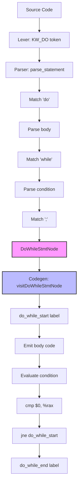

# Lesson 0008: Do-While Loops

## Status: 📋 Planned | Phase: Quick Wins | Effort: Easy (3-4h)

## Objective

Implement `do { ... } while (cond);` with proper break/continue support.

## Implementation Checklist

- [ ] Add `KW_DO` token to lexer
- [ ] Parse `do stmt while (expr);`
- [ ] Add `DoWhileStmtNode` to AST
- [ ] Codegen: body first, then condition check
- [ ] Test: do-while executes at least once
- [ ] Test: break exits loop, continue jumps to condition

## Implementation Flow

