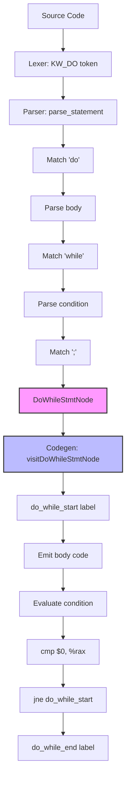

# Lesson 0008: Do-While Loops

## Status: ✅ Complete | Phase: Quick Wins | Effort: Easy (3-4h)

## Objective

Implement `do { ... } while (cond);` with proper `break`/`continue`
support.

## Implementation Checklist

- [x] Add `KW_DO` token to lexer (already present from the keyword
      table).
- [x] Parse `do stmt while ( expr );` via `parse_do_while_stmt()`.
- [x] Add `DoWhileStmtNode` to AST.
- [x] Codegen: body first, then condition check, with `break` /
      `continue` rewired to this loop's labels.
- [x] Test: do-while executes at least once.
- [x] Test: `break` exits loop, `continue` jumps to condition.

## Implementation Flow



## Core Implementation Snippets

The codegen installs the loop's start/end labels so that `break` and
`continue` inside the body resolve correctly.

```cpp
// src/codegen.cpp:804
void CodeGenerator::visit(DoWhileStmtNode& node) {
    std::string start_label = new_label("do_while_start");
    std::string end_label   = new_label("do_while_end");

    std::string saved_loop_start = current_loop_start_;
    std::string saved_loop_end   = current_loop_end_;
    current_loop_start_ = start_label;
    current_loop_end_   = end_label;

    emit_label(start_label);
    if (node.body) dispatch(node.body.get());

    dispatch(node.condition.get());
    emit("cmp $0, %rax");
    emit("jne " + start_label);

    emit_label(end_label);

    current_loop_start_ = saved_loop_start;
    current_loop_end_   = saved_loop_end;
}
```

The parser's `parse_do_while_stmt()` is the only new grammar
production:

```cpp
// src/parser.cpp:1241  (parse_do_while_stmt)
auto node  = std::make_unique<DoWhileStmtNode>(...);
node->body = parse_statement();
expect(TokenType::KW_WHILE);
expect(TokenType::LPAREN);
node->condition = parse_expression();
expect(TokenType::RPAREN);
expect(TokenType::SEMICOLON);
return std::move(node);
```

## Implementation Details

### Source Code References

| Component | File | Lines | Description |
|-----------|------|-------|-------------|
| Token definition | src/token.h | 30 | `KW_DO` token type |
| `DO_WHILE_STMT` node type | src/ast.h | 35 | Enum value |
| `DoWhileStmtNode` struct | src/ast.h | 380-386 | `body` + `condition` |
| `visit(DoWhileStmtNode&)` declaration | src/ast.h | 163 | Pure virtual in `ASTVisitor` |
| `parse_do_while_stmt()` | src/parser.cpp | 1241-1256 | Parses `do stmt while ( expr );` |
| `visit(DoWhileStmtNode&)` impl | src/codegen.cpp | 804-827 | Body first, then condition, with break/continue labels |
| `dispatch` case for `DO_WHILE_STMT` | src/codegen.cpp | 189-191 | NodeType → visit switch |
