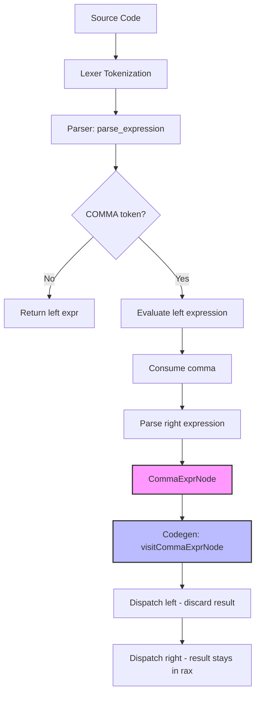

# Lesson 0009: Comma Operator

## Status: 📋 Planned | Phase: Quick Wins | Effort: Easy (1-2h)

## Objective

Implement `expr1, expr2` for sequential evaluation.

## Implementation Checklist

- [ ] Add `CommaExprNode` to AST: `{ left, right }`
- [ ] Parse comma in `parse_expression()`
- [ ] Codegen: evaluate left, discard, evaluate right
- [ ] Test: `int a = (1, 2, 3);` → a = 3
- [ ] Test: `for (i = 0, j = 10; i < j; i++, j--) {}`

## Implementation Flow

## Implementation Details

### Source Code References
| Component | File | Lines | Description |
|-----------|------|-------|-------------|
| AST Node | src/ast.h | 111, 423-430 | `COMMA_EXPR` node type and `CommaExprNode` struct |
| Parser | src/parser.cpp | 881-888 | Comma operator parsing in `parse_expression()` |
| Code Generator | src/codegen.cpp | 191-192, 805-808 | `visit(CommaExprNode&)` implementation |
| Visitor Interface | src/ast.h | 158 | `visit(CommaExprNode&)` pure virtual method |
