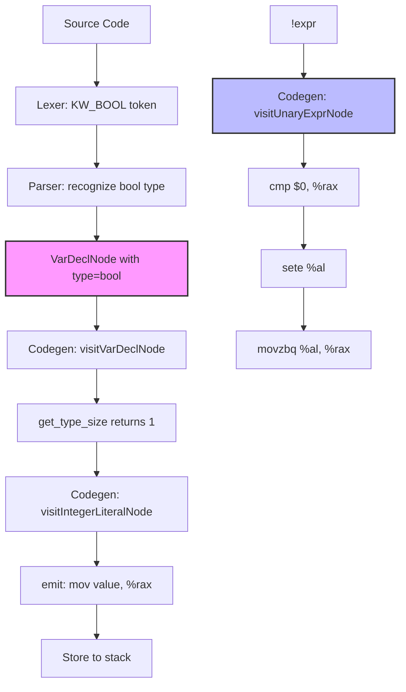

# Lesson 0010: _Bool / bool Type

## Status: 📋 Planned | Phase: Quick Wins | Effort: Easy (1-2h)

## Objective

Implement `bool` type (non-zero → 1, zero → 0).

## Implementation Checklist

- [ ] Add `bool` keyword (or `#define bool _Bool`)
- [ ] Add `_Bool` type (size = 1 byte)
- [ ] Codegen: non-zero → 1, zero → 0
- [ ] `!expr` codegen
- [ ] Test: `bool b = 42; return b;` → 1
- [ ] Test: `return !0;` → 1, `return !1;` → 0

## Implementation Flow

