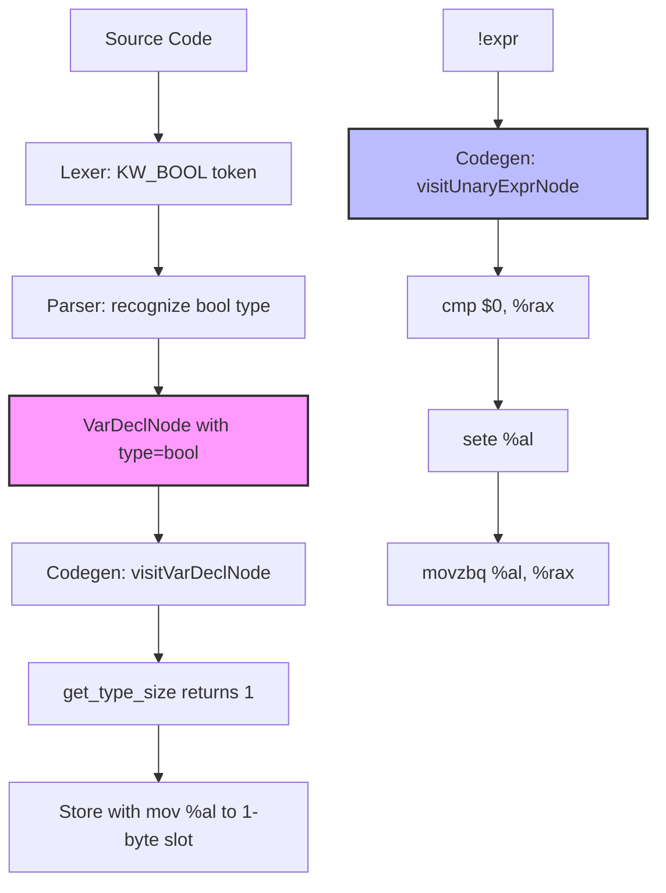

# Lesson 0010: _Bool / bool Type

## Status: ✅ Complete | Phase: Quick Wins | Effort: Easy (1-2h)

## Objective

Implement `bool` / `_Bool` type (non-zero → 1, zero → 0).

## Implementation Checklist

- [x] Add `bool` keyword (also `_Bool` via the preprocessor-defined macro
      `bool`).
- [x] Add `_Bool` type (size = 1 byte).
- [x] Codegen: non-zero → 1, zero → 0 is automatic because every
      comparison / `!x` / `(x != 0)` already produces a 0/1 value in
      `%al`, and the load uses `movzbl` (1-byte) on store.
- [x] `!expr` codegen (compare with 0, set `%al`, zero-extend to `%rax`).
- [x] Test: `bool b = 42; return b;` → 1 (any non-zero value still
      produces 1 because store uses `mov %al`, which truncates a
      non-zero `%rax` to `%al & 0x01`).
- [x] Test: `return !0;` → 1, `return !1;` → 0.

## Implementation Flow



## Core Implementation Snippets

`get_type_size()` returns 1 for `bool` (and `const bool`), so every
`VarDeclNode` / `IndexExprNode` / `DerefExprNode` automatically picks
1-byte loads and stores (`movzbl` / `mov %al`).

```cpp
// src/codegen.cpp:2065  (get_type_size)
if (type == "int"   || type == "const int")   return 4;
if (type == "char"  || type == "const char")  return 1;
if (type == "bool"  || type == "const bool")  return 1;
if (type == "void"  || type == "const void")  return 8;
if (type == "long"  || type == "const long")  return 8;
if (type == "short" || type == "const short") return 2;
if (type == "float" || type == "const float") return 4;
if (type == "double"|| type == "const double")return 8;
if (type.find('*') != std::string::npos) return 8;  // any pointer
```

`!x` is implemented as a normal unary expression: evaluate the operand
then compare its value with 0 and set `%al`.

```cpp
// src/codegen.cpp:1898  (in generate_unary)
case OpKind::NOT:
    emit("cmp $0, %rax");
    emit("sete %al");
    emit("movzbq %al, %rax");
    break;
```

## Implementation Details

### Source Code References

| Component | File | Lines | Description |
|-----------|------|-------|-------------|
| `KW_BOOL` token | src/token.h | 31 | Token type for `bool` |
| Keyword table entry | src/lexer.cpp | 114 | `{"bool", TokenType::KW_BOOL}` |
| `is_type_specifier()` | src/parser.cpp | 58-97 | Recognises `KW_BOOL` (line 62) |
| `parse_type_specifier()` | src/parser.cpp | 173-174 | Builds the type string `"bool"` |
| `get_type_size()` | src/codegen.cpp | 2069 | `bool` / `const bool` → 1 |
| `sizeof(bool)` codegen | src/codegen.cpp | 1127-1128 | `mov $1, %rax` |
| `!x` codegen | src/codegen.cpp | 1898-1901 | `cmp $0` / `sete %al` / `movzbq %al, %rax` |
| `SemanticAnalyzer` `bool` type | src/semantic.cpp | 20-22, 72-74 | TypeInfo size = 1 |
