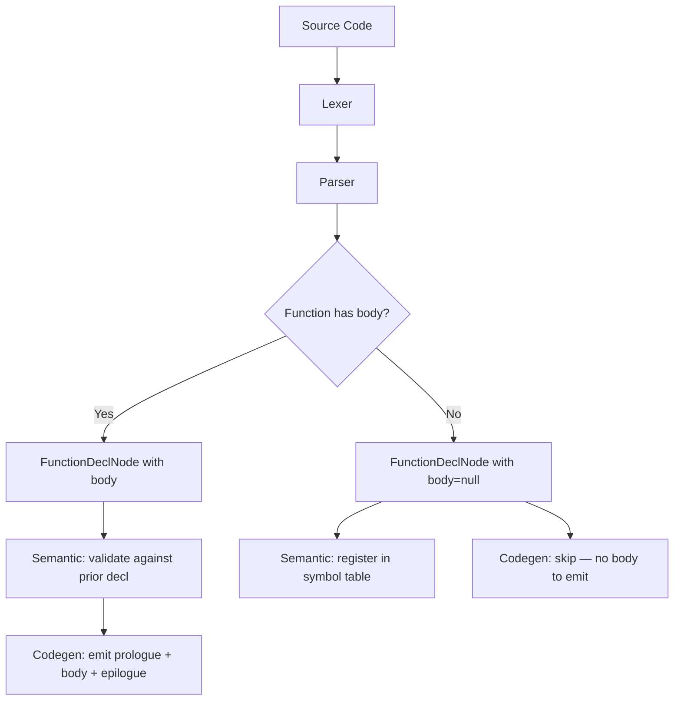

# Lesson 0011: Forward Declarations

## Status: ✅ Complete | Phase: Quick Wins | Effort: Easy (2-3h)

## Objective

Support function declarations without body (prototypes).

## How Forward Declarations Work



## Implementation Checklist

- [x] Parse function declarations without body
  (`parse_function_decl()` returns a `FunctionDeclNode` with
  `body = nullptr` when it sees `;` instead of `{`).
- [x] Store declarations in symbol table (via the
  `SemanticAnalyzer`).
- [x] Validate declaration matches definition (signature is recorded
  in `CodeGenerator::function_return_type_` / `function_param_types_`).
- [x] Support `extern` variable declarations (also stored with
  `body == nullptr`).
- [x] Test: forward declare and use function before definition.

## Core Implementation Snippet

The key insight: a `FunctionDeclNode` is just a function declaration
where `body` is `nullptr`. The codegen skips any such node, but still
records the function's signature in the first pass so calls to it
before its definition are still valid.

```cpp
// src/codegen.cpp:305  (visit(FunctionDeclNode))
// Skip forward declarations (no body)
if (!node.body) {
    return;
}
```

```cpp
// src/codegen.cpp:22  (first pass inside generate())
for (auto& decl : program.declarations) {
    if (decl->type == NodeType::VAR_DECL) {
        // collect globals ...
    } else if (decl->type == NodeType::FUNCTION_DECL) {
        auto* fn = static_cast<FunctionDeclNode*>(decl.get());
        function_return_type_[fn->name] = fn->return_type;
        // ... collect parameter types ...
    }
}
```

The parser builds the forward decl when the declaration is followed by
`;` rather than `{`:

```cpp
// src/parser.cpp:578  (parse_function_decl)
auto func = std::make_unique<FunctionDeclNode>(type_name, name_token.value, ...);
func->is_nested = !function_stack_.empty();
if (func->is_nested) func->parent_function = function_stack_.back();

expect(TokenType::LPAREN);
// ... parse params ...
expect(TokenType::RPAREN);

if (check(TokenType::LBRACE)) {
    function_stack_.push_back(func->name);
    func->body = parse_block();
    function_stack_.pop_back();
} else {
    expect(TokenType::SEMICOLON);
    func->body = nullptr;  // forward declaration
}
return std::move(func);
```

## Implementation Details

### Source Code References

| Component | File | Lines | Description |
|-----------|------|-------|-------------|
| `FunctionDeclNode` (body field) | src/ast.h | 220-241 | `ASTPtr body;` — null for forward decl |
| `parse_function_decl()` | src/parser.cpp | 578-615 | Builds function decl, body is null when `;` follows |
| `parse_declaration()` extern path | src/parser.cpp | 302-336 | `extern int foo;` / `extern int foo(int);` |
| First-pass signature collection | src/codegen.cpp | 22-45 | Stores `function_return_type_` / `function_param_types_` |
| Codegen skip for forward decl | src/codegen.cpp | 305-309 | `if (!node.body) return;` |
| `SemanticAnalyzer::visit(FunctionDeclNode&)` | src/semantic.cpp | 180-219 | Records function in symbol table |
