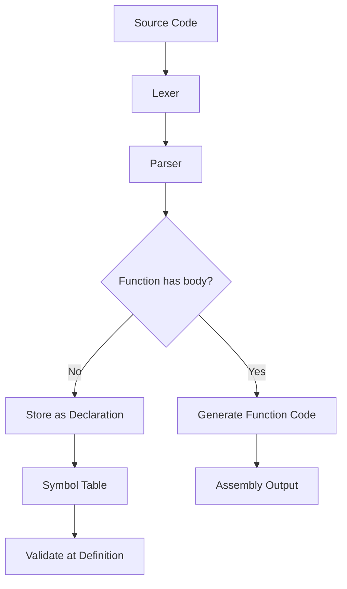

# Lesson 0011: Forward Declarations

## Status: ✅ Complete | Phase: Quick Wins | Effort: Easy (2-3h)

## Objective

Support function declarations without body (prototypes).

## How Forward Declarations Work

## Implementation Checklist

- [ ] Parse function declarations without body
- [ ] Store declarations in symbol table
- [ ] Validate declaration matches definition
- [ ] Support `extern` variable declarations
- [ ] Test: forward declare and use function before definition

## Implementation Details

### Source Code References
| Component | File | Lines | Description |
|-----------|------|-------|-------------|
| AST Node | src/ast.h | 82-85, 202-211 | `FunctionDeclNode` struct with body field |
| Parser | src/parser.cpp | 433-461 | `parse_function_decl()` handles forward declarations |
| Parser | src/parser.cpp | 452-458 | Forward declaration detection (no body) |
| Code Generator | src/codegen.cpp | 257-261 | `visit(FunctionDeclNode&)` skips forward declarations |
| Symbol Table | src/parser.cpp | 221 | extern declarations stored as forward declarations |
