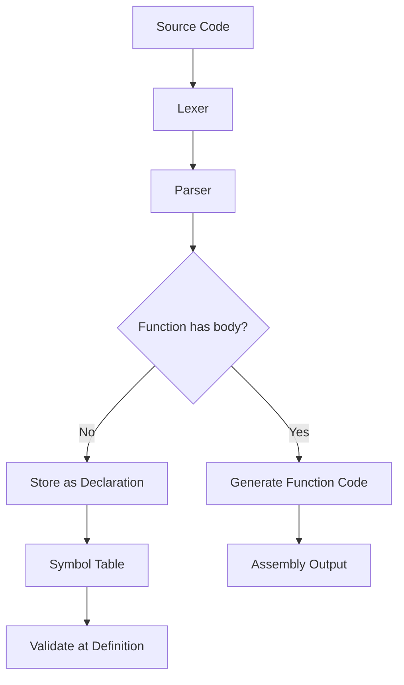

# Lesson 0011: Forward Declarations

## Status: 📋 Planned | Phase: Quick Wins | Effort: Easy (2-3h)

## Objective

Support function declarations without body (prototypes).

## How Forward Declarations Work

## Implementation Checklist

- [ ] Parse function declarations without body
- [ ] Store declarations in symbol table
- [ ] Validate declaration matches definition
- [ ] Support `extern` variable declarations
- [ ] Test: forward declare and use function before definition
