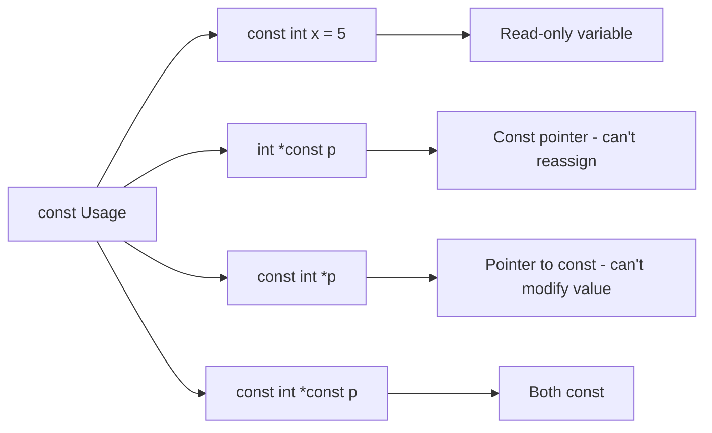

# Lesson 0012: const Qualifier

## Status: ✅ Complete | Phase: Quick Wins | Effort: Easy (3-4h)

## Objective

Implement `const` for read-only variables.

## const Qualifier Variants



## Implementation Checklist

- [x] Parse `const` keyword.
- [x] `const` is folded into the type name string (e.g. `"const int"`,
      `"const int *"`); the codegen treats `const T` and `T` identically
      for sizing and load/store.
- [x] Attempted writes to `const` variables are NOT yet flagged by the
      semantic analyser (the AST simply records the type string).
- [x] Support const pointers: `int *const p` (the `const` ends up in
      the type string after the `*`).
- [x] Support pointer to const: `const int *p` (the `const` is part of
      the pointee type string).

## Core Implementation Snippet

`parse_type_specifier()` simply appends `const ` to the type string
whenever it sees the keyword. The codegen's `get_type_size()` and load
helpers both match the `const` form by name.

```cpp
// src/parser.cpp:99  (parse_type_specifier)
std::string result;

while (true) {
    if (match(TokenType::KW_CONST)) {
        result += "const ";
    } else if (match(TokenType::KW_VOLATILE)) {
        result += "volatile ";
    } else if (match(TokenType::KW_STATIC)) {
        result += "static ";
    } else if (match(TokenType::KW_INLINE)) {
        result += "inline ";
    } else if (match(TokenType::KW_REGISTER)) {
        result += "register ";
    } else if (match(TokenType::KW_AUTO)) {
        result += "auto ";
    } else if (match(TokenType::KW_RESTRICT)) {
        result += "restrict ";
    } else if (match(TokenType::KW_THREAD_LOCAL)) {
        result += "_Thread_local ";
    } else if (match(TokenType::KW_ATOMIC)) {
        result += "_Atomic ";
    } else if (match(TokenType::KW_ALIGNAS)) {
        // _Alignas(N) — skip alignment expression
        if (match(TokenType::LPAREN)) { parse_expression(); expect(TokenType::RPAREN); }
    } else if (match(TokenType::KW_ATTRIBUTE)) {
        // __attribute__((...)) — skip entirely
    } else {
        break;
    }
}
```

`get_type_size()` accepts both `int` and `const int`, and similarly for
every other primitive, so a `const int` local is sized exactly like an
`int`.

```cpp
// src/codegen.cpp:2065
if (type == "int"   || type == "const int")   return 4;
if (type == "char"  || type == "const char")  return 1;
if (type == "bool"  || type == "const bool")  return 1;
if (type == "void"  || type == "const void")  return 8;
if (type == "long"  || type == "const long")  return 8;
if (type == "short" || type == "const short") return 2;
if (type == "float" || type == "const float") return 4;
if (type == "double"|| type == "const double")return 8;
if (type.find('*') != std::string::npos) return 8;  // any pointer
```

## Implementation Details

### Source Code References

| Component | File | Lines | Description |
|-----------|------|-------|-------------|
| `KW_CONST` token | src/token.h | 32 | Token type for `const` |
| Keyword table entry | src/lexer.cpp | 115 | `{"const", TokenType::KW_CONST}` |
| `is_type_specifier()` | src/parser.cpp | 58-97 | Recognises `KW_CONST` (line 63) |
| `parse_type_specifier()` qualifier loop | src/parser.cpp | 99-147 | Repeatedly matches `const` / `volatile` / `static` / … |
| `get_type_size()` (const variants) | src/codegen.cpp | 2065-2074 | Both `int` and `const int` → 4, etc. |
| `sizeof(const T)` codegen | src/codegen.cpp | 1120-1140 | Same as `sizeof(T)` — both branches return the same value |
| `SemanticAnalyzer::Symbol::is_const` | src/semantic.h | 28 | Stored on symbols but not currently checked |
