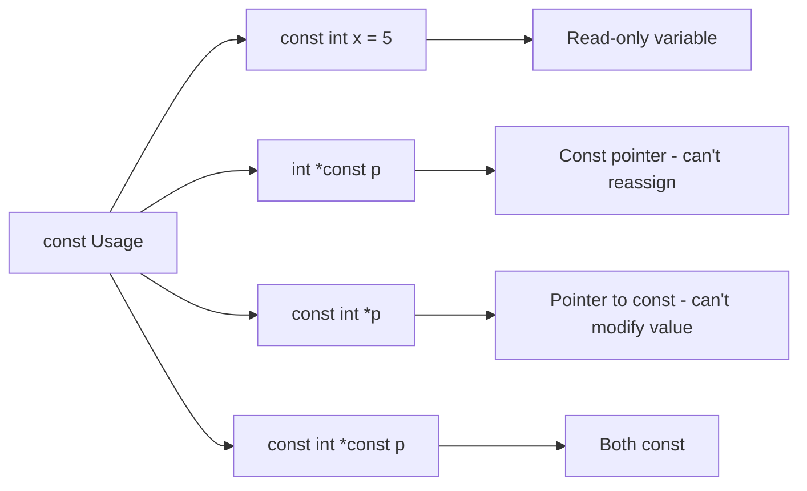

# Lesson 0012: const Qualifier

## Status: 📋 Planned | Phase: Quick Wins | Effort: Easy (3-4h)

## Objective

Implement `const` for read-only variables.

## const Qualifier Variants

## Implementation Checklist

- [ ] Parse `const` keyword
- [ ] Add `is_const` flag to type/variable info
- [ ] Error on modification of const variables
- [ ] Support const pointers: `int *const p`
- [ ] Support pointer to const: `const int *p`
- [ ] Test: `const int x = 5; x = 10;` → compile error

## Implementation Details

### Source Code References
| Component | File | Lines | Description |
|-----------|------|-------|-------------|
| Token Definition | src/token.h | 32 | `KW_CONST` token type |
| Parser | src/parser.cpp | 63, 92-93 | `is_type_specifier()` and type parsing for const |
| Parser | src/parser.cpp | 88-102 | Type qualifier handling in `parse_type_specifier()` |
| Code Generator | src/codegen.cpp | 814-817, 1199-1201 | const type handling in sizeof and type size |
