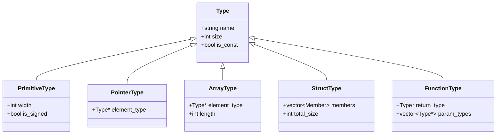

# Lesson 0013: Type System Core

## Status: 📋 Planned | Phase: Type System | Effort: Hard (20-30h)

## Objective

Build the foundation type system with Type IR, type checking, and semantic analysis.

## Why This Is Critical

Without a type system, the compiler cannot:
- Size variables correctly (char=1, int=4, pointer=8)
- Compute struct offsets
- Generate correct memory access instructions
- Validate operations

## Type IR Design

## Implementation Checklist

- [ ] Design Type IR class hierarchy
- [ ] Primitive types: void, char, int, long, long long, float, double
- [ ] Pointer type: wraps another type
- [ ] Array type: element type + length
- [ ] Struct type: named members with offsets
- [ ] Function type: return type + param types
- [ ] Type comparison (structural equality)
- [ ] Type printing (for error messages)
- [ ] Attach type info to all AST nodes
- [ ] Semantic analysis pass (type checking)
- [ ] Test: verify type sizes on x86-64
- [ ] Test: type mismatch errors
