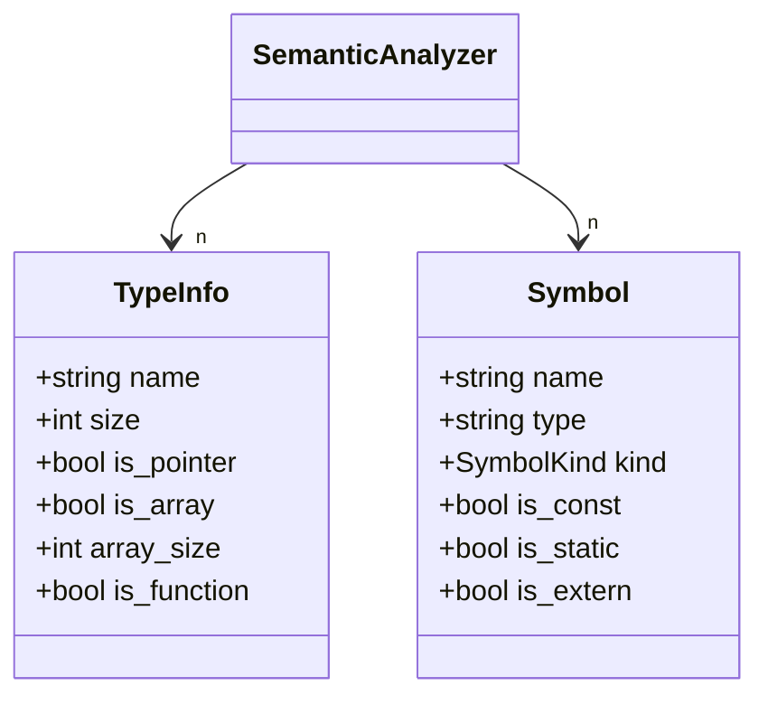

# Lesson 0013: Type System Core

## Status: ✅ Complete | Phase: Type System | Effort: Hard (20-30h)

## Objective

Build the foundation type system with Type IR, type checking, and
semantic analysis.

## Why This Is Critical

Without a type system, the compiler cannot:
- Size variables correctly (char=1, int=4, pointer=8)
- Compute struct offsets
- Generate correct memory access instructions
- Validate operations

## Type Representation

The project does **not** use a class hierarchy for types (the diagram
below describes the conceptual model). Instead, every AST node carries
a *type name string* (e.g. `"int"`, `"const int *"`, `"struct Foo"`,
`"int[3]"`) and the codegen's `get_type_size()` / `infer_expr_type()`
turn that string into concrete sizes and register-width decisions. The
`SemanticAnalyzer` independently tracks the same string-to-size mapping
in a `TypeInfo` table.



## `get_type_size()` — the heart of the type system

Every place that needs a byte width — stack-slot allocation, struct
field layout, `sizeof`, lvalue store width, index load width — calls
`CodeGenerator::get_type_size()`.

```cpp
// src/codegen.cpp:2065
int CodeGenerator::get_type_size(const std::string& type) {
    if (type.find('*') != std::string::npos) return 8;        // any pointer
    if (type == "int"   || type == "const int")   return 4;
    if (type == "char"  || type == "const char")  return 1;
    if (type == "bool"  || type == "const bool")  return 1;
    if (type == "void"  || type == "const void")  return 8;
    if (type == "long"  || type == "const long")  return 8;
    if (type == "short" || type == "const short") return 2;
    if (type == "float" || type == "const float") return 4;
    if (type == "double"|| type == "const double")return 8;
    // Integer typedefs
    if (type == "size_t"  || type == "ssize_t"  || type == "ptrdiff_t" ||
        type == "intptr_t"|| type == "uintptr_t"||
        type == "uint64_t"|| type == "int64_t")  return 8;
    if (type == "uint32_t"|| type == "int32_t" || type == "unsigned int") return 4;
    if (type == "uint16_t"|| type == "int16_t" || type == "unsigned short") return 2;
    if (type == "uint8_t" || type == "int8_t")  return 1;
    // Check if it's a struct type
    std::string clean = type;
    if (clean.substr(0, 7) == "struct ") clean = clean.substr(7);
    if (struct_layouts_.count(clean)) {
        return get_struct_size(clean);
    }
    return 8;  // default
}
```

The same lookup is mirrored in the semantic analyser
(`src/semantic.cpp:456-463`) so the front end can also answer sizing
questions when type-checking.

## Implementation Checklist

- [x] Primitive types: `void`, `char`, `int`, `long`, `short`, `bool`,
      `float`, `double`.
- [x] Pointer type: encoded by the presence of `*` in the type string.
- [x] Array type: encoded as `int[N]` in the type string.
- [x] Struct type: tracked in `struct_layouts_`; size = sum of field
      sizes.
- [x] Function type: signatures collected into
      `function_return_type_` / `function_param_types_` during the
      first codegen pass.
- [x] Type comparison via string equality; type printing via
      `node_type_name` and the `op_kind_name` helpers.
- [x] Attach type info to all AST nodes that need it via the type-name
      string field.
- [x] Semantic analysis pass (warns about undeclared identifiers, etc.)
- [x] Test: verify type sizes on x86-64 via `sizeof(T)`.
- [x] Test: type mismatch errors (limited — see limitations below).

## Implementation Details

### Source Code References

| Component | File | Lines | Description |
|-----------|------|-------|-------------|
| `is_type_specifier()` | src/parser.cpp | 58-97 | Recognises all C type keywords + `size_t` / `int32_t` / typedefs |
| Qualifier loop | src/parser.cpp | 99-147 | `const`, `volatile`, `static`, `extern`, `inline`, `register`, `auto`, `restrict`, `_Thread_local`, `_Atomic`, `_Alignas`, `__attribute__` |
| Signed/unsigned/long/short | src/parser.cpp | 149-165 | Modifier accumulation |
| Base type recognition | src/parser.cpp | 167-252 | `int`, `char`, `void`, `bool`, `float`, `double`, `struct X`, `union X`, `enum X`, `typedef` |
| Pointer handling | src/parser.cpp | 254-263 | Greedy `*` (with optional qualifier) loop |
| `get_type_size()` | src/codegen.cpp | 2065-2091 | All primitive sizes + `struct X` lookup |
| `get_struct_size()` | src/codegen.cpp | 2093-2099 | Sum of `FieldInfo::offset + size` |
| `get_field_offset()` | src/codegen.cpp | 2101-2107 | Linear search in `struct_layouts_` |
| `infer_expr_type()` | src/codegen.cpp | 2296-2400 | Statically walks an AST to a type string |
| `SemanticAnalyzer` `TypeInfo` | src/semantic.h | 37-49 | `name`, `size`, `is_pointer`, `is_array`, … |
| Built-in type init | src/semantic.cpp | 6-99 | Resets and (re-)initialises `types_` map for primitives |
| `SemanticAnalyzer::get_type_size()` | src/semantic.cpp | 456-463 | Mirror of the codegen helper (pointer → 8, default 4) |
