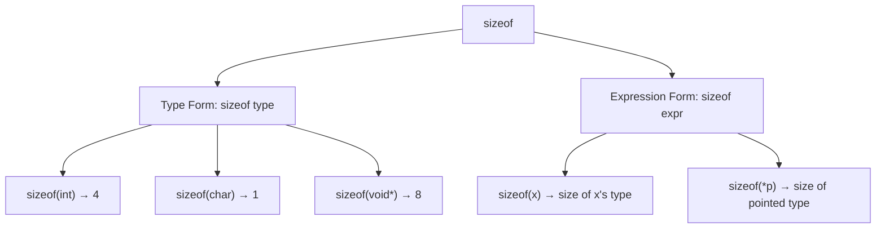

# Lesson 0014: sizeof Operator

## Status: ✅ Complete | Phase: Type System | Effort: Easy (4-6h)

## Objective

Implement `sizeof(type)` and `sizeof(expr)`.

## sizeof Operator Forms

## Implementation Checklist

- [ ] Parse `sizeof(type)` - type form
- [ ] Parse `sizeof(expr)` - expression form
- [ ] Return `IntegerLiteralNode` with computed size
- [ ] Handle: `sizeof(char)` → 1, `sizeof(int)` → 4, `sizeof(void*)` → 8
- [ ] Support pointer types: `sizeof(int*)` → 8
- [ ] Support struct types: `sizeof(struct Point)` → computed
- [ ] Test: `return sizeof(int);` → 4
- [ ] Test: `return sizeof(void*);` → 8

## Implementation Details

### Source Code References
| Component | File | Lines | Description |
|-----------|------|-------|-------------|
| Token Definition | src/token.h | 35 | `KW_SIZEOF` token type |
| AST Node | src/ast.h | 432-442 | `SizeofExprNode` struct with type_name and expr fields |
| Parser | src/parser.cpp | 1087-1108 | `parse_unary()` sizeof handling (type and expression forms) |
| Code Generator | src/codegen.cpp | 810-830 | `visit(SizeofExprNode&)` implementation |
| Type Size Helper | src/codegen.cpp | 1197-1209 | `get_type_size()` used for sizeof calculations |
