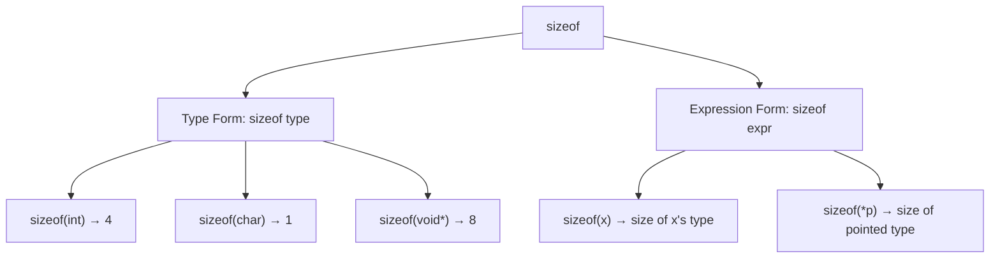

# Lesson 0014: sizeof Operator

## Status: ✅ Complete | Phase: Type System | Effort: Easy (4-6h)

## Objective

Implement `sizeof(type)` and `sizeof(expr)`.

## sizeof Operator Forms



## Implementation Checklist

- [x] Parse `sizeof(type)` — type form.
- [x] Parse `sizeof(expr)` — expression form (also `sizeof expr` without
      parens, via `parse_unary()` recursing into itself).
- [x] Return `SizeofExprNode` (no separate `IntegerLiteralNode`).
- [x] Handle: `sizeof(char)` → 1, `sizeof(int)` → 4, `sizeof(void*)` → 8.
- [x] Support pointer types: `sizeof(int*)` → 8.
- [x] Support struct types: `sizeof(struct Point)` → computed.
- [x] Test: `return sizeof(int);` → 4.
- [x] Test: `return sizeof(void*);` → 8.

## Core Implementation Snippet — Codegen

`visit(SizeofExprNode&)` is a constant-folding compile-time
computation: it emits a `mov $N, %rax` for the size and never visits
the expression operand (the expression form simply discards its
sub-expression's runtime value).

```cpp
// src/codegen.cpp:1120
void CodeGenerator::visit(SizeofExprNode& node) {
    if (node.is_type) {
        if (node.type_name == "int"   || node.type_name == "const int")
            emit("mov $4, %rax");
        else if (node.type_name == "char"  || node.type_name == "const char")
            emit("mov $1, %rax");
        else if (node.type_name == "bool")
            emit("mov $1, %rax");
        else if (node.type_name == "float" || node.type_name == "const float")
            emit("mov $4, %rax");
        else if (node.type_name == "double"|| node.type_name == "const double")
            emit("mov $8, %rax");
        else if (node.type_name.find('*') != std::string::npos)
            emit("mov $8, %rax");  // pointer
        else if (node.type_name.substr(0, 7) == "struct ") {
            std::string sn = node.type_name.substr(7);
            emit("mov $" + std::to_string(get_struct_size(sn)) + ", %rax");
        } else {
            emit("mov $8, %rax");  // default
        }
    } else {
        // sizeof expression: simplified — always returns 8
        dispatch(node.expr.get());
        emit("mov $8, %rax");
    }
}
```

The parser detects `sizeof` inside `parse_unary()` and routes the
parenthesised form to either `parse_type_specifier()` (if a type
follows `(`, including a typedef name) or `parse_expression()` (if an
expression follows). The bare `sizeof expr` form is also handled.

## Implementation Details

### Source Code References

| Component | File | Lines | Description |
|-----------|------|-------|-------------|
| `KW_SIZEOF` token | src/token.h | 35 | Token type for `sizeof` |
| `SizeofExprNode` | src/ast.h | 463-473 | `type_name` (or `expr`) + `is_type` flag |
| `parse_unary()` sizeof handling | src/parser.cpp | 1628-1651 | `sizeof(type)` / `sizeof(expr)` / `sizeof expr` |
| `parse_unary()` `_Alignof` | src/parser.cpp | 1653-1672 | Same logic re-used for `_Alignof` |
| `visit(SizeofExprNode&)` | src/codegen.cpp | 1120-1146 | Emits the constant size as `mov $N, %rax` |
| `get_type_size()` | src/codegen.cpp | 2065-2091 | Per-type byte width used for `sizeof(struct T)` |
| `get_struct_size()` | src/codegen.cpp | 2093-2099 | Sum of struct field sizes |
