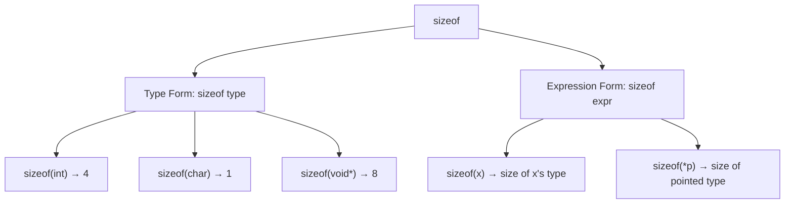

# Lesson 0014: sizeof Operator

## Status: 📋 Planned | Phase: Type System | Effort: Easy (4-6h)

## Objective

Implement `sizeof(type)` and `sizeof(expr)`.

## sizeof Operator Forms

## Implementation Checklist

- [ ] Parse `sizeof(type)` - type form
- [ ] Parse `sizeof(expr)` - expression form
- [ ] Return `IntegerLiteralNode` with computed size
- [ ] Handle: `sizeof(char)` → 1, `sizeof(int)` → 4, `sizeof(void*)` → 8
- [ ] Support pointer types: `sizeof(int*)` → 8
- [ ] Support struct types: `sizeof(struct Point)` → computed
- [ ] Test: `return sizeof(int);` → 4
- [ ] Test: `return sizeof(void*);` → 8
