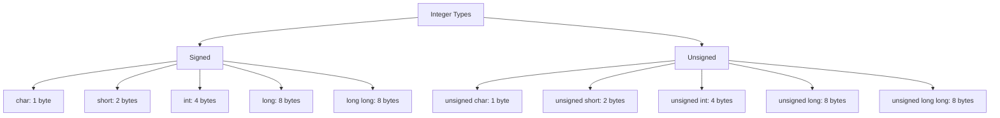

# Lesson 0015: Signed/Unsigned and Integer Sizes

## Status: ✅ Complete | Phase: Type System | Effort: Medium (4-6h)

## Objective

Implement `short`, `long`, `long long`, `unsigned` variants.

## Integer Type Hierarchy

## Integer Type Sizes (x86-64)

| Type | Size | Register |
|------|------|----------|
| char | 1 | al/ax/eax/rax |
| short | 2 | ax/eax/rax |
| int | 4 | eax/rax |
| long | 8 | rax |
| long long | 8 | rax |
| unsigned * | same | zero-extended |

## Implementation Checklist

- [ ] Add types: short, unsigned short, unsigned int, long, unsigned long, long long
- [ ] Update type size calculations
- [ ] Generate proper width instructions (movb/movw/movl/movq)
- [ ] Handle sign extension: `movsbq`, `movzbq`, `movslq`
- [ ] Test: `unsigned int x = -1;` → 4294967295

## Implementation Details

| File | Lines | Description |
|------|-------|-------------|
| `src/token.h` | 42–45 | `KW_UNSIGNED`, `KW_SIGNED`, `KW_LONG`, `KW_SHORT` token definitions |
| `src/lexer.cpp` | 31–34 | `token_name()` maps keywords to string names |
| `src/lexer.cpp` | 115–118 | Keyword table entries for `unsigned`, `signed`, `long`, `short` |
| `src/parser.cpp` | 67–70 | `is_type_specifier()` recognizes `KW_UNSIGNED`, `KW_SIGNED`, `KW_LONG`, `KW_SHORT` |
| `src/parser.cpp` | 107–174 | `parse_type_specifier()` handles signed/unsigned/long/short modifiers and combinations |
| `src/codegen.cpp` | 1197–1213 | `get_type_size()` returns size for `short` (2), `long` (8), `int` (4), `char` (1) |
| `src/codegen.cpp` | 311 | `visit(VarDeclNode&)` uses `get_type_size()` for local variable allocation |
| `src/codegen.cpp` | 389 | `visit(StructDeclNode&)` uses `get_type_size()` for field layout |

## Source Code References

- **Lexer keywords**: `src/lexer.cpp:115-118` — `unsigned`, `signed`, `long`, `short` keyword entries
- **Token types**: `src/token.h:42-45` — `KW_UNSIGNED`, `KW_SIGNED`, `KW_LONG`, `KW_SHORT` enum values
- **Parser type specifier**: `src/parser.cpp:87-174` — `parse_type_specifier()` handles modifier combinations
- **Type size calculation**: `src/codegen.cpp:1197-1213` — `get_type_size()` maps type strings to byte sizes
- **AST node**: `src/ast.h:496-498` — `IntegerLiteralNode` stores `long long` values

## Status

- **Lexer**: ✅ `unsigned`, `signed`, `long`, `short` recognized as keywords
- **Parser**: ✅ Parses signed/unsigned modifiers with base types and combinations
- **Codegen**: 📋 Partial — `get_type_size()` handles `short`/`long` sizing but no sign-aware instruction selection (e.g., `movsbq`/`movzbq` for sign extension)
