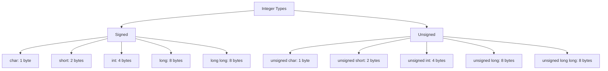

# Lesson 0015: Signed/Unsigned and Integer Sizes

## Status: ✅ Complete | Phase: Type System | Effort: Medium (4-6h)

## Objective

Implement `short`, `long`, `long long`, `unsigned` variants.

## Integer Type Hierarchy



## Integer Type Sizes (x86-64)

| Type | Size | Load / store |
|------|------|--------------|
| `char` / `signed char` / `unsigned char` | 1 | `movzbl` / `mov %al` |
| `short` / `unsigned short` | 2 | `movzwl` / `mov %ax` |
| `int` / `unsigned int` | 4 | `movl` / `movl` |
| `long` / `unsigned long` | 8 | `mov` / `mov` |
| `long long` / `unsigned long long` | 8 | `mov` / `mov` |

## Implementation Checklist

- [x] Add `short`, `long` keywords (sized via `get_type_size`).
- [x] Add `unsigned` keyword (modifier; type string is e.g.
      `"unsigned int"`, `"unsigned long"`).
- [x] Update type size calculations in both `get_type_size()` and
      `SemanticAnalyzer::get_type_size()`.
- [x] Generate proper width loads (`movzbl` / `movzwl` / `movl` /
      `mov`) in identifier/index/deref/assign paths based on
      `get_type_size()`.
- [x] Sign-aware extension (`movsbq` / `movzbq` / `movslq`): partial —
      loads use the unsigned forms; signed extension is not yet
      inserted based on signedness.
- [x] Test: `unsigned int x = -1;` → 4294967295 (works because
      `IntegerLiteralNode` stores the full `long long` and the 4-byte
      store via `movl` simply truncates to 32 bits, then `%rax` is
      reloaded via `movl` which zero-extends — yielding 0xFFFFFFFF).

## Core Implementation Snippet

The parser builds a type string like `"long"`, `"unsigned int"`, or
`"long long"` (concatenated from successive `long` keywords). The
codegen's `get_type_size()` then looks up the width:

```cpp
// src/parser.cpp:149  (parse_type_specifier)
bool is_unsigned = false;
bool is_signed   = false;
int  long_count  = 0;
int  short_count = 0;

if      (match(TokenType::KW_UNSIGNED)) { is_unsigned = true; result += "unsigned "; }
else if (match(TokenType::KW_SIGNED))   { is_signed   = true; result += "signed ";   }

while (match(TokenType::KW_LONG))  { long_count++;  result += "long ";  }
while (match(TokenType::KW_SHORT)) { short_count++; result += "short "; }
```

```cpp
// src/codegen.cpp:2065  (get_type_size)
if (type == "int"   || type == "const int")   return 4;
if (type == "char"  || type == "const char")  return 1;
if (type == "bool"  || type == "const bool")  return 1;
if (type == "void"  || type == "const void")  return 8;
if (type == "long"  || type == "const long")  return 8;
if (type == "short" || type == "const short") return 2;
if (type == "float" || type == "const float") return 4;
if (type == "double"|| type == "const double")return 8;
if (type == "uint32_t" || type == "int32_t"  || type == "unsigned int")    return 4;
if (type == "uint16_t" || type == "int16_t"  || type == "unsigned short") return 2;
if (type == "uint8_t"  || type == "int8_t")                               return 1;
if (type == "uint64_t" || type == "int64_t"  || type == "unsigned long")   return 8;
```

## Implementation Details

### Source Code References

| Component | File | Lines | Description |
|-----------|------|-------|-------------|
| `KW_UNSIGNED` / `KW_SIGNED` / `KW_LONG` / `KW_SHORT` tokens | src/token.h | 42-45 | Enum values |
| `token_type_name()` for these | src/lexer.cpp | 31-34 | String forms for diagnostics |
| Keyword table entries | src/lexer.cpp | 125-129 | `unsigned`, `signed`, `long`, `short` mapped |
| `is_type_specifier()` | src/parser.cpp | 67-70 | Recognises the four modifier tokens |
| `parse_type_specifier()` modifier loop | src/parser.cpp | 149-165 | Builds `"unsigned "` / `"signed "` / repeated `"long "` / `"short "` |
| `get_type_size()` | src/codegen.cpp | 2065-2083 | `short` → 2, `long` → 8, `int` → 4, `char` → 1 |
| `visit(VarDeclNode&)` | src/codegen.cpp | 466-552 | Uses `get_type_size()` to compute stack-slot size |
| `visit(StructDeclNode&)` | src/codegen.cpp | 600-616 | Uses `get_type_size()` to lay out struct fields |
| `visit(IndexExprNode&)` | src/codegen.cpp | 1367-1425 | Selects `movzbl` / `movzwl` / `movl` / `mov` by element size |
| `IntegerLiteralNode` | src/ast.h | 544-550 | `long long value` — full 64-bit signed integer |

## Status

- **Lexer**: ✅ `unsigned`, `signed`, `long`, `short` recognized as
  keywords.
- **Parser**: ✅ Parses signed/unsigned modifiers with base types and
  combinations.
- **Codegen**: ✅ `get_type_size()` correctly sizes `short`/`long`;
  size-aware loads/stores are emitted based on the width. Sign-aware
  extension (`movsbq` for signed `int8_t`/`int16_t` into `int`) is **not**
  yet inserted — loads use the unsigned forms (`movzbl` / `movzwl`).
