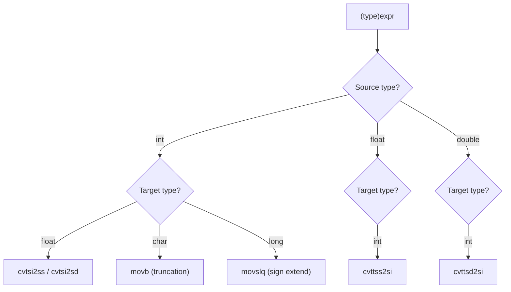

# Lesson 0016: Explicit Type Casts

## Status: 📋 Planned | Phase: Type System | Effort: Medium (4-6h)

## Objective

Implement `(type)expr` syntax for explicit conversions.

## Cast Flow

## Implementation Checklist

- [ ] Parse `(type)expr` in unary position
- [ ] Add `CastExprNode` to AST: `{ target_type, expr }`
- [ ] Generate conversion instructions
- [ ] Handle: int→float (`cvtsi2ss`), float→int (`cvttss2si`)
- [ ] Handle: int→char (truncation), int→long (sign extension)
- [ ] Test: `return (int)3.14;` → 3
- [ ] Test: `return (char)65;` → 65

## Implementation Details

| File | Lines | Description |
|------|-------|-------------|
| `src/ast.h` | 48 | `NodeType::CAST_EXPR` enum value |
| `src/ast.h` | 113 | Forward declaration of `CastExprNode` |
| `src/ast.h` | 160 | `visit(CastExprNode&)` virtual method in `ASTVisitor` |
| `src/ast.h` | 444–451 | `CastExprNode` struct with `target_type` and `expr` fields |
| `src/parser.cpp` | 1111–1126 | `parse_unary()` detects `(type)expr` cast syntax via lookahead |
| `src/ast.cpp` | 36 | `CastExprNode::accept()` dispatches to visitor |
| `src/ast.cpp` | 80 | `node_type_name()` returns `"CastExpr"` for debug output |
| `src/codegen.h` | 52 | `visit(CastExprNode&)` declaration in code generator |
| `src/codegen.cpp` | 832–836 | `visit(CastExprNode&)` — stub: evaluates inner expression without conversion |

## Source Code References

- **AST definition**: `src/ast.h:444-451` — `CastExprNode` with `target_type` (string) and `expr` (child)
- **Parser cast detection**: `src/parser.cpp:1111-1126` — lookahead: if `(` followed by type specifier, parse as cast
- **Codegen visitor**: `src/codegen.cpp:832-836` — currently a pass-through (no type conversion generated)
- **Visitor pattern**: `src/codegen.h:52` — declared in code generator interface

## Status

- **Lexer**: ✅ Parentheses and type keywords already tokenized
- **Parser**: ✅ Recognizes `(type)expr` syntax and creates `CastExprNode`
- **Codegen**: ❌ Stub only — evaluates expression without type conversion; no `cvtsi2ss`/`cvttss2si`/truncation instructions
