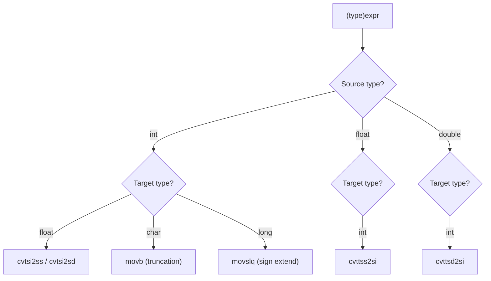

# Lesson 0016: Explicit Type Casts

## Status: 📋 Planned | Phase: Type System | Effort: Medium (4-6h)

## Objective

Implement `(type)expr` syntax for explicit conversions.

## Cast Flow

## Implementation Checklist

- [ ] Parse `(type)expr` in unary position
- [ ] Add `CastExprNode` to AST: `{ target_type, expr }`
- [ ] Generate conversion instructions
- [ ] Handle: int→float (`cvtsi2ss`), float→int (`cvttss2si`)
- [ ] Handle: int→char (truncation), int→long (sign extension)
- [ ] Test: `return (int)3.14;` → 3
- [ ] Test: `return (char)65;` → 65
