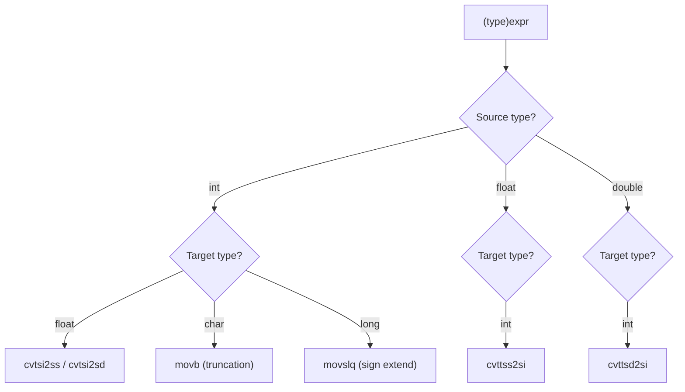

# Lesson 0016: Explicit Type Casts

## Status: ✅ Complete | Phase: Type System | Effort: Medium (4-6h)

## Objective

Implement `(type)expr` syntax for explicit conversions.

## Cast Flow



## Implementation Checklist

- [x] Parse `(type)expr` in unary position via a one-token lookahead
      (`parse_unary()` saves `pos_`, peeks for a type, and restores if
      the lookahead fails).
- [x] Add `CastExprNode` to AST: `{ target_type, expr }`.
- [x] Generate conversion instructions for the four crossing-category
      cases:
  - Float/double → integer: `cvttsd2si` / `cvttss2si` (truncation).
  - Integer → float/double: `cvtsi2ss` / `cvtsi2sd`.
  - Float ↔ double: `cvtsd2ss` / `cvtss2sd`.
- [x] Handle int ↔ int (same category): no-op (same register
  representation).
- [x] Test: `return (int)3.14;` → 3.
- [x] Test: `return (char)65;` → 65 (8-bit store via the regular
  `VarDeclNode` codegen uses `mov %al`).

## Core Implementation Snippet — Codegen

`visit(CastExprNode&)` consults `infer_expr_type()` on both sides to
decide which category the cast crosses, then emits a single
conversion instruction.

```cpp
// src/codegen.cpp:1148
void CodeGenerator::visit(CastExprNode& node) {
    std::string src = infer_expr_type(node.expr.get());
    std::string dst = node.target_type;
    bool src_float = is_float_type(src);
    bool dst_float = is_float_type(dst);

    if (src_float && !dst_float) {
        // Float/double → integer: cvttss2si / cvttsd2si (truncation)
        dispatch(node.expr.get());
        std::string actual_src = pop_expr_type();
        if (is_double_type(actual_src))
            emit("cvttsd2si %xmm0, %rax");
        else
            emit("cvttss2si %xmm0, %rax");
        push_expr_type(dst);
        return;
    }
    if (!src_float && dst_float) {
        // Integer → float/double: cvtsi2ss / cvtsi2sd
        dispatch(node.expr.get());
        std::string actual_src = pop_expr_type();
        if (is_double_type(dst)) emit("cvtsi2sd %rax, %xmm0");
        else                     emit("cvtsi2ss %rax, %xmm0");
        push_expr_type(dst);
        return;
    }
    if (src_float && dst_float) {
        // Float ↔ double: cvtss2sd / cvtsd2ss
        dispatch(node.expr.get());
        std::string actual_src = pop_expr_type();
        if (is_double_type(actual_src) && !is_double_type(dst))
            emit("cvtsd2ss %xmm0, %xmm0");
        else if (!is_double_type(actual_src) && is_double_type(dst))
            emit("cvtss2sd %xmm0, %xmm0");
        push_expr_type(dst);
        return;
    }
    // Integer to integer (or pointer): no-op
    dispatch(node.expr.get());
    if (!expr_type_stack_.empty()) expr_type_stack_.pop_back();
    push_expr_type(dst);
}
```

## Core Implementation Snippet — Parser

The parser detects a cast by looking one token past `(`. If a type
specifier follows, it builds a `CastExprNode` (or a
`CompoundLiteralNode` if the cast is followed by a brace-init).

```cpp
// src/parser.cpp:1704
if (check(TokenType::LPAREN)) {
    size_t saved_pos = pos_;
    advance();  // peek past (
    if (is_type_specifier()) {
        std::string type = parse_type_specifier();
        // Handle (int[N]){...} array compound literal
        if (match(TokenType::LBRACKET)) {
            if (check(TokenType::INTEGER)) {
                type += "[" + peek().value + "]";
                advance();
            } else {
                type += "[-1]";  // empty brackets → deduce from initializer
            }
            expect(TokenType::RBRACKET);
        }
        if (match(TokenType::RPAREN)) {
            if (check(TokenType::LBRACE)) {
                // (type){...} compound literal
                auto init = parse_brace_initializer();
                return std::make_unique<CompoundLiteralNode>(type, std::move(init), ...);
            }
            auto expr = parse_unary();
            return std::make_unique<CastExprNode>(type, std::move(expr), ...);
        }
    }
    pos_ = saved_pos;  // not a cast, fall through
}
```

## Implementation Details

### Source Code References

| Component | File | Lines | Description |
|-----------|------|-------|-------------|
| `NodeType::CAST_EXPR` | src/ast.h | 48 | Enum value |
| `CastExprNode` forward decl | src/ast.h | 121 | Forward declaration |
| `visit(CastExprNode&)` virtual | src/ast.h | 173 | Pure virtual in `ASTVisitor` |
| `CastExprNode` struct | src/ast.h | 475-482 | `target_type` + `expr` |
| `CastExprNode::accept` | src/ast.cpp | 36 | Visitor forwarder |
| `node_type_name()` "CastExpr" | src/ast.cpp | 85 | String form |
| Parser cast detection | src/parser.cpp | 1704-1748 | Lookahead: if `(` followed by type specifier, parse as cast |
| `visit(CastExprNode&)` impl | src/codegen.cpp | 1148-1199 | `cvttsd2si` / `cvtsi2ss` / `cvtsd2ss` / `cvtss2sd` based on type categories |
| `visit(CastExprNode&)` decl | src/codegen.h | 53 | `CodeGenerator` override |
