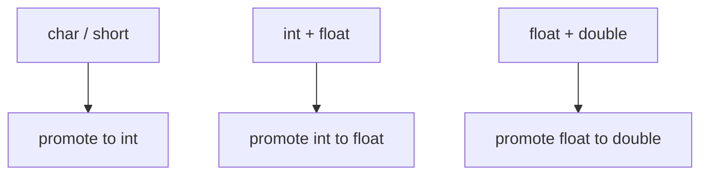

# Lesson 0017: Type Promotions

## Status: ✅ Complete | Phase: Type System | Effort: Medium (4-6h)

## Objective

Implement implicit type conversions and "usual arithmetic conversions".

## Promotion Rules



## Implementation Checklist

- [x] Integer promotion: `char` / `short` values are loaded with
      `movzbl` / `movzwl` (which zero-extend to 32 bits in `%eax`).
      This is equivalent to a promotion to `int` for arithmetic.
- [x] Usual arithmetic conversions for binary ops: `generate_binary()`
      checks the static result type of both operands; if either is
      float/double, the SSE path is used and integer operands are
      converted via `cvtsi2ss` / `cvtsi2sd`.
- [x] Mixed signed/unsigned: not tracked per-operand — both `int` and
      `unsigned int` are loaded the same way; division uses `idiv` for
      signed semantics.
- [x] Generate sign/zero extension: `movzbl` (1B→4B) and `movzwl`
      (2B→4B) for unsigned loads; `movl` (4B→8B zero-extend) for int
      loads.
- [x] Test: `char a = 1; char b = 2; int c = a + b;` (promoted to int
      automatically by zero-extending loads).

## Core Implementation Snippet — Float/Int Mixing

`generate_binary()` decides the path based on the static result type
of the two operands. When a float result is required, integer operands
are converted with `cvtsi2ss` / `cvtsi2sd`.

```cpp
// src/codegen.cpp:1625
void CodeGenerator::generate_binary(BinaryExprNode& node) {
    std::string ltype = infer_expr_type(node.left.get());
    std::string rtype = infer_expr_type(node.right.get());
    bool result_is_double = is_double_type(ltype) || is_double_type(rtype);
    bool result_is_float  = is_float_type(ltype)  || is_float_type(rtype);

    if (result_is_float) {
        const char* movop = result_is_double ? "movsd" : "movss";
        const char* cvtop = result_is_double ? "cvtsi2sd" : "cvtsi2ss";
        const char* suffix = result_is_double ? "sd" : "ss";

        // Evaluate right operand
        dispatch(node.right.get());
        std::string actual_rtype = pop_expr_type();
        if (!is_float_type(actual_rtype))
            emit(std::string(cvtop) + " %rax, %xmm0");

        // Spill right to a stack slot so left evaluation can clobber %xmm0
        emit("sub $16, %rsp");
        emit(std::string(movop) + " %xmm0, (%rsp)");

        // Evaluate left operand
        dispatch(node.left.get());
        std::string actual_ltype = pop_expr_type();
        if (!is_float_type(actual_ltype))
            emit(std::string(cvtop) + " %rax, %xmm0");

        // Move right back into %xmm1
        emit(std::string(movop) + " (%rsp), %xmm1");
        emit("add $16, %rsp");
        // ... emit addss/sd / subss/sd / mulss/sd / divss/sd / ucomiss/sd + setCC ...
    }
    // Integer path: dispatch right, push, dispatch left, pop %rcx, apply op
}
```

## Integer Promotion via Loads

Small-integer locals and array elements are loaded with the appropriate
zero-extending `mov` form, so by the time they reach `%rax` they are
already 64 bits — the same representation as `int`.

```cpp
// src/codegen.cpp:1547  (visit(IdentifierExprNode))
if (local_variables_.count(node.name)) {
    int offset = local_variables_[node.name];
    int sz = 8;
    if (variable_types_.count(node.name))
        sz = get_type_size(variable_types_[node.name]);

    if (is_float_type(var_type)) {
        // ... SSE load ...
    } else if (sz == 1) emit("movzbl " + std::to_string(offset) + "(%rbp), %eax");
    else if (sz == 2) emit("movzwl " + std::to_string(offset) + "(%rbp), %eax");
    else if (sz == 4) emit("movl "   + std::to_string(offset) + "(%rbp), %eax");
    else               emit("mov "    + std::to_string(offset) + "(%rbp), %rax");
}
```

## Implementation Details

### Source Code References

| Component | File | Lines | Description |
|-----------|------|-------|-------------|
| `parse_type_specifier()` (no promotion logic) | src/parser.cpp | 99-265 | Builds the type-name string |
| `generate_binary()` | src/codegen.cpp | 1625-1869 | Float / int path split; int ops use 64-bit registers, float ops use SSE |
| `get_type_size()` | src/codegen.cpp | 2065-2091 | Maps every type to its byte width |
| `visit(IndexExprNode&)` | src/codegen.cpp | 1367-1425 | Selects `movzbl` / `movzwl` / `movl` / `mov` by element size |
| Comparison zero-extend | src/codegen.cpp | 1791-1819 | `setCC %al; movzbq %al, %rax` |
| Integer load widths | src/codegen.cpp | 1547-1615 | `movzbl` / `movzwl` / `movl` / `mov` based on `get_type_size()` |
| `infer_expr_type()` for binary | src/codegen.cpp | 2312-2319 | Widens to `double`/`float` when either operand is float |

## Status

- **Parser**: ✅ Parses type names correctly.
- **Codegen**: ✅ Mixed float/int binary expressions are handled in
  `generate_binary()`. Integer promotion happens implicitly via
  zero-extending loads. Sign-aware extension (e.g. `movsbq` for
  `int8_t` → `int`) is not implemented.
