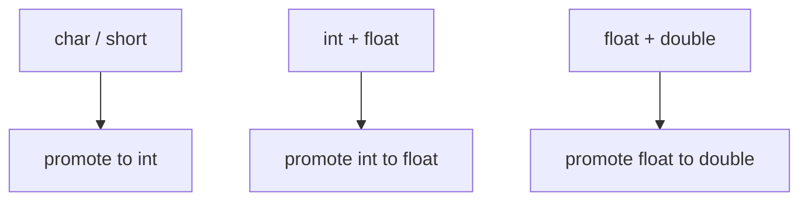

# Lesson 0017: Type Promotions

## Status: 📋 Planned | Phase: Type System | Effort: Medium (4-6h)

## Objective

Implement implicit type conversions and "usual arithmetic conversions".

## Promotion Rules

## Implementation Checklist

- [ ] Integer promotion: char/short → int
- [ ] Usual arithmetic conversions for binary ops
- [ ] Mixed signed/unsigned handling
- [ ] Generate sign/zero extension as needed
- [ ] Test: `char a = 1; char b = 2; int c = a + b;` (promoted to int)
