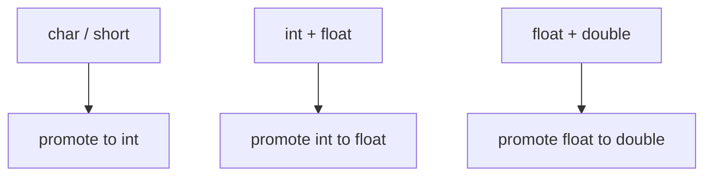

# Lesson 0017: Type Promotions

## Status: ✅ Complete | Phase: Type System | Effort: Medium (4-6h)

## Objective

Implement implicit type conversions and "usual arithmetic conversions".

## Promotion Rules

## Implementation Checklist

- [ ] Integer promotion: char/short → int
- [ ] Usual arithmetic conversions for binary ops
- [ ] Mixed signed/unsigned handling
- [ ] Generate sign/zero extension as needed
- [ ] Test: `char a = 1; char b = 2; int c = a + b;` (promoted to int)

## Implementation Details

| File | Lines | Description |
|------|-------|-------------|
| `src/parser.cpp` | 87–174 | `parse_type_specifier()` builds type name strings (no promotion logic) |
| `src/codegen.cpp` | 980–1050 | `generate_binary()` emits arithmetic ops — all operate on `%rax`/`%rcx` (64-bit) with no type-size awareness |
| `src/codegen.cpp` | 1197–1213 | `get_type_size()` — maps types to sizes but unused in binary expression codegen |
| `src/codegen.cpp` | 886–896 | `visit(IndexExprNode&)` selects `movzbl`/`movl`/`movzwl`/`movq` by element size — only size-aware load in codegen |
| `src/codegen.cpp` | 1012–1037 | Comparison results use `movzbq %al, %rax` (zero-extend byte to qword) |

## Source Code References

- **Binary expression codegen**: `src/codegen.cpp:980-1050` — `generate_binary()` always uses 64-bit registers, no implicit promotion logic
- **Type size lookup**: `src/codegen.cpp:1197-1213` — `get_type_size()` exists but is not called for binary ops
- **Type-aware index loads**: `src/codegen.cpp:886-896` — only place where element size affects instruction selection

## Status

- **Parser**: ✅ Parses type names correctly but does not track or propagate types through expressions
- **Codegen**: ❌ No implicit type promotion — all arithmetic uses 64-bit registers regardless of operand types
