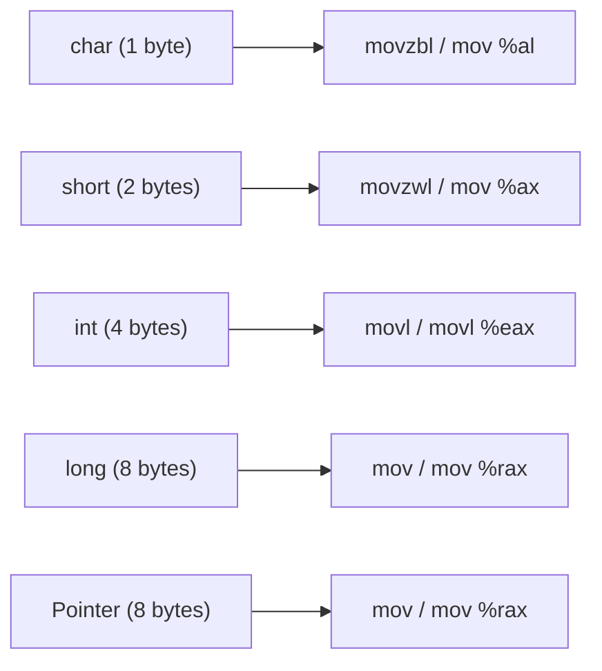

# Lesson 0018: Type-Aware Code Generation

## Status: ✅ Complete | Phase: Type System | Effort: Hard (8-12h)

## Objective

Use type information to generate correct-sized memory operations.

## Type Size Mapping



## Implementation Checklist

- [x] `char` access: `movzbl` / `mov %al`.
- [x] `short` access: `movzwl` / `mov %ax`.
- [x] `int` access: `movl` / `movl %eax`.
- [x] `long` access: `mov` / `mov %rax`.
- [x] Pointer dereference: correct size based on pointee type
      (`visit(DerefExprNode&)` strips the `*` and asks
      `get_type_size()`).
- [x] Array indexing: `base + index * sizeof(element)` — element size
      comes from `array_info_` for stack arrays or is inferred from
      the variable's type for pointer types.
- [x] Struct member access: `base + offset` via `compute_member_address`.
- [x] Function parameter passing: integer regs `%rdi..%r9`, float regs
      `%xmm0..%xmm7` per System V ABI; `movsd` / `movss` are used for
      the float spill into the frame.
- [x] Stores that go through the regular `VarDeclNode` / `AssignExprNode`
      path use the size-specific store (`mov %al` for 1, `mov %ax` for
      2, `movl` for 4, `mov` for 8). Member access stores currently
      always use 64-bit `mov %rcx, (%rax)` — see limitations.
- [x] Test: correct instruction selection for each type.

## Core Implementation Snippet — `get_type_size()`

This is the central type-size table. Every visitor that needs a width
calls it.

```cpp
// src/codegen.cpp:2065
int CodeGenerator::get_type_size(const std::string& type) {
    if (type.find('*') != std::string::npos) return 8;  // any pointer
    if (type == "int"   || type == "const int")   return 4;
    if (type == "char"  || type == "const char")  return 1;
    if (type == "bool"  || type == "const bool")  return 1;
    if (type == "void"  || type == "const void")  return 8;
    if (type == "long"  || type == "const long")  return 8;
    if (type == "short" || type == "const short") return 2;
    if (type == "float" || type == "const float") return 4;
    if (type == "double"|| type == "const double")return 8;
    if (type == "uint32_t" || type == "int32_t"  || type == "unsigned int")    return 4;
    if (type == "uint16_t" || type == "int16_t"  || type == "unsigned short") return 2;
    if (type == "uint8_t"  || type == "int8_t")                               return 1;
    if (type == "uint64_t" || type == "int64_t"  || type == "unsigned long")   return 8;
    std::string clean = type;
    if (clean.substr(0, 7) == "struct ") clean = clean.substr(7);
    if (struct_layouts_.count(clean)) return get_struct_size(clean);
    return 8;  // default
}
```

## Core Implementation Snippet — Size-Aware Index Load

`visit(IndexExprNode&)` looks up the element size, scales the index
by it, and selects a width-correct load:

```cpp
// src/codegen.cpp:1367
void CodeGenerator::visit(IndexExprNode& node) {
    int elem_size = 4;  // default to int

    if (auto* id = dynamic_cast<IdentifierExprNode*>(node.array.get())) {
        if (array_info_.count(id->name)) {
            elem_size = array_info_[id->name].elem_size;
        } else if (variable_types_.count(id->name)) {
            // For pointer types, use the pointed-to type's size
            std::string vtype = variable_types_[id->name];
            if (vtype.find('*') != std::string::npos) {
                std::string pointee = vtype;
                size_t p = pointee.find('*');
                while (p != std::string::npos) { pointee.erase(p, 1); p = pointee.find('*'); }
                // ... trim whitespace ...
                elem_size = get_type_size(pointee);
            } else {
                elem_size = get_type_size(vtype);
            }
        }
    }
    // ... emit base, push, emit index, imul elem_size, add base, ...

    // Size-aware load
    if      (elem_size == 1) emit("movzbl (%rax), %eax");
    else if (elem_size == 2) emit("movzwl (%rax), %eax");
    else if (elem_size == 4) emit("movl (%rax), %eax");
    else if (elem_size == 8) emit("mov (%rax), %rax");
    else                     emit("mov (%rax), %rax");
}
```

## Implementation Details

### Source Code References

| Component | File | Lines | Description |
|-----------|------|-------|-------------|
| `get_type_size()` | src/codegen.cpp | 2065-2091 | Maps every C type to its byte width |
| `get_struct_size()` | src/codegen.cpp | 2093-2099 | Sum of struct field sizes |
| `get_field_offset()` | src/codegen.cpp | 2101-2107 | Struct field offset lookup |
| `visit(VarDeclNode&)` stack-slot sizing | src/codegen.cpp | 466-475 | `get_type_size()` for stack allocation |
| `visit(StructDeclNode&)` | src/codegen.cpp | 600-616 | Field-by-field layout, accumulating `offset += field_size` |
| `visit(AssignExprNode&)` identifier store | src/codegen.cpp | 942-961 | `mov %al` / `mov %ax` / `movl` / `mov` by target width |
| `visit(IndexExprNode&)` | src/codegen.cpp | 1367-1425 | `imul elem_size` + width-correct load |
| `visit(DerefExprNode&)` | src/codegen.cpp | 1435-1464 | Strips `*` from pointee type, picks load width |
| `compute_member_address()` | src/codegen.cpp | 555-594 | `lea offset(%rbp), %rax` for local struct base + field |
| `visit(ParamNode&)` register ABI | src/codegen.cpp | 408-429 | `rdi..r9` / `xmm0..xmm7` per System V |
| `generate_binary()` | src/codegen.cpp | 1625-1869 | Float vs int path; SSE conversions when mixed |

## Status

- **Type sizes**: ✅ `get_type_size()` correctly maps all primitive
  types to byte widths.
- **Index loads**: ✅ Array/pointer indexing selects the correct-width
  load instruction.
- **Identifier stores**: ✅ Width-correct via the size branch in
  `visit(AssignExprNode&)` and `visit(VarDeclNode&)`.
- **Member stores**: ⚠️ Always uses 64-bit `mov %rcx, (%rax)` — no
  size-aware store for `a.b = small_value` where `b` is `char` or
  `short`.
- **Sign extension**: ⚠️ All integer loads use the unsigned forms
  (`movzbl` / `movzwl`); signed 1- or 2-byte values are not sign-
  extended to 64 bits on load.
