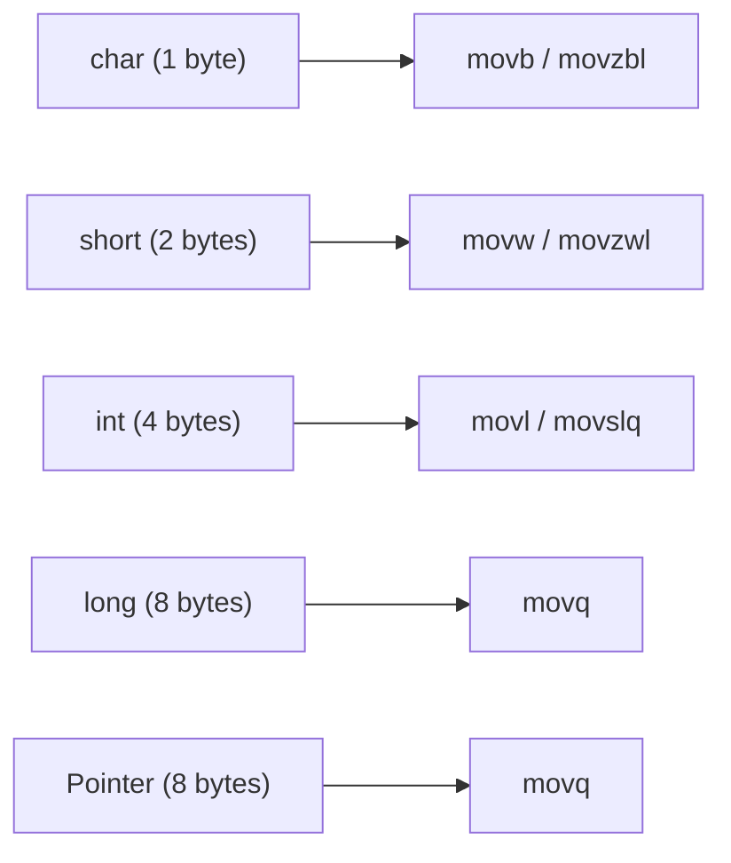

# Lesson 0018: Type-Aware Code Generation

## Status: ✅ Complete | Phase: Type System | Effort: Hard (8-12h)

## Objective

Use type information to generate correct-sized memory operations.

## Type Size Mapping

## Implementation Checklist

- [ ] `char` access: `movb` / `movzbl`
- [ ] `short` access: `movw` / `movzwl`
- [ ] `int` access: `movl` / `movslq`
- [ ] `long` access: `movq`
- [ ] Pointer dereference: correct size based on pointee type
- [ ] Array indexing: `base + index * sizeof(element)`
- [ ] Struct member access: `base + offset`
- [ ] Function parameter passing: correct register/size
- [ ] Test: verify correct instruction selection for each type

## Implementation Details

| File | Lines | Description |
|------|-------|-------------|
| `src/codegen.cpp` | 1197–1213 | `get_type_size()` — maps `char`→1, `short`→2, `int`→4, `long`/`double`/`void*`→8 |
| `src/codegen.cpp` | 311 | `visit(VarDeclNode&)` calls `get_type_size()` for stack allocation |
| `src/codegen.cpp` | 389 | `visit(StructDeclNode&)` calls `get_type_size()` for field layout |
| `src/codegen.cpp` | 856–896 | `visit(IndexExprNode&)` selects load instruction by element size: `movzbl` (1B), `movzwl` (2B), `movl` (4B), `movq` (8B) |
| `src/codegen.cpp` | 652–665 | `visit(AssignExprNode&)` — member assignment stores via `mov %rcx, (%rax)` (always 64-bit) |
| `src/codegen.cpp` | 1012–1037 | Comparison results: `movzbq %al, %rax` zero-extends byte result to qword |
| `src/codegen.cpp` | 865 | `visit(IndexExprNode&)` falls back to `get_type_size()` when no `array_info_` entry |

## Source Code References

- **Type size function**: `src/codegen.cpp:1197-1213` — `get_type_size()` returns byte widths for all primitive types
- **Type-aware loads**: `src/codegen.cpp:886-896` — index expression selects `movzbl`/`movzwl`/`movl`/`movq` by element size
- **Stack allocation**: `src/codegen.cpp:311` — variable declaration sizes stack frame using `get_type_size()`
- **Struct layout**: `src/codegen.cpp:383-398` — struct fields sized via `get_type_size()` for offset calculation
- **Array element size**: `src/codegen.cpp:856-867` — array indexing uses `array_info_` or `variable_types_` for element size

## Status

- **Type sizes**: ✅ `get_type_size()` correctly maps all primitive types to byte widths
- **Index loads**: ✅ Array/pointer indexing selects correct-width load instruction
- **Assignments**: ❌ Always uses 64-bit `mov` — no type-sized store instructions
- **Arithmetic**: ❌ All binary ops use 64-bit registers — no type-aware operation selection
