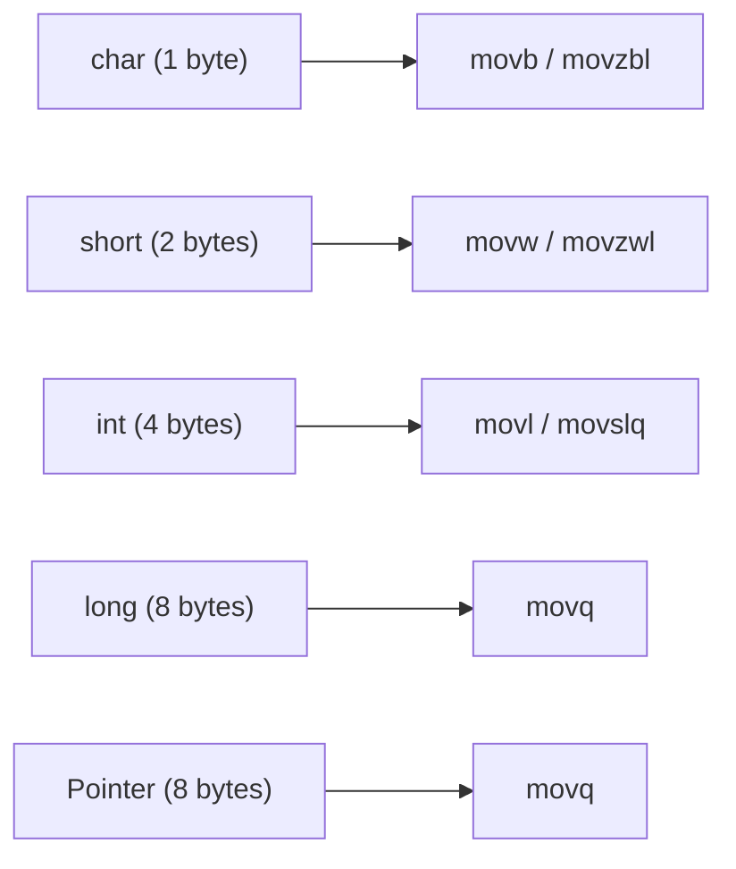

# Lesson 0018: Type-Aware Code Generation

## Status: 📋 Planned | Phase: Type System | Effort: Hard (8-12h)

## Objective

Use type information to generate correct-sized memory operations.

## Type Size Mapping

## Implementation Checklist

- [ ] `char` access: `movb` / `movzbl`
- [ ] `short` access: `movw` / `movzwl`
- [ ] `int` access: `movl` / `movslq`
- [ ] `long` access: `movq`
- [ ] Pointer dereference: correct size based on pointee type
- [ ] Array indexing: `base + index * sizeof(element)`
- [ ] Struct member access: `base + offset`
- [ ] Function parameter passing: correct register/size
- [ ] Test: verify correct instruction selection for each type
