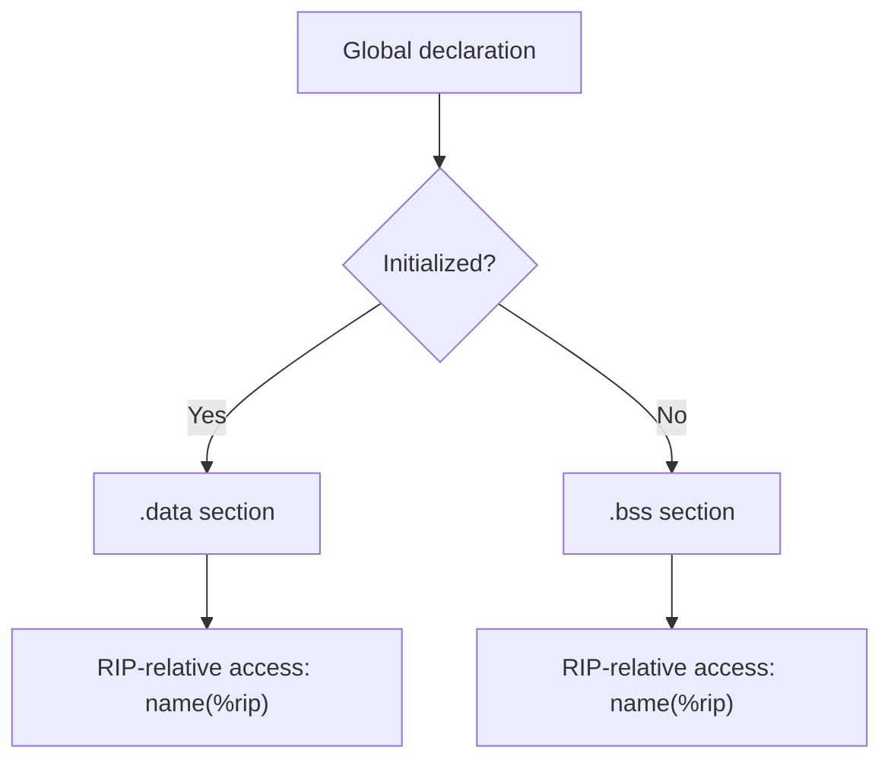

# Lesson 0020: Global Variables

## Status: ✅ Complete | Phase: String & Memory | Effort: Medium (6-10h)

## Objective

Implement global variables with `.data`/`.bss` sections.

## Global Variable Codegen Flow

## Implementation Checklist

- [ ] Parse global variable declarations (outside functions)
- [ ] Emit `.data` section for initialized globals
- [ ] Emit `.bss` section for uninitialized globals
- [ ] Access globals via RIP-relative addressing
- [ ] Support `static` globals (file-local)
- [ ] Test: `int g = 42; int main() { return g; }` → 42

## Implementation Details

| File | Lines | Description |
|------|-------|-------------|
| `src/codegen.h` | 111–118 | `GlobalVar` struct (`name`, `type`, `initialized`, `init_value`) and `global_variables_` vector |
| `src/codegen.cpp` | 14 | `generate()` clears `global_variables_` at start |
| `src/codegen.cpp` | 16–29 | First pass: collects `VarDeclNode`s at program scope into `global_variables_` |
| `src/codegen.cpp` | 31–43 | `.data` section emission — `.globl name`, label, `.long init_value` or `.zero 4` |
| `src/codegen.cpp` | 236–248 | `visit(ProgramNode&)` — duplicate first-pass collection of global variables |
| `src/codegen.cpp` | 304–308 | `visit(VarDeclNode&)` — skips globals (`current_function_.empty()` check) |
| `src/codegen.cpp` | 952–961 | `visit(IdentifierExprNode&)` — resolves global variable access via `name(%rip)` |
| `src/parser.cpp` | 218–249 | `parse_declaration()` — parses top-level declarations including globals |

## Source Code References

- **Global variable struct**: `src/codegen.h:111-118` — `GlobalVar` tracks name, type, initialization state
- **Collection pass**: `src/codegen.cpp:16-29` — first pass identifies `VAR_DECL` nodes at program scope
- **Data section output**: `src/codegen.cpp:31-43` — `.data`, `.globl`, label, `.long`/`.zero` directives
- **Global access**: `src/codegen.cpp:952-961` — `mov name(%rip), %rax` for scalar globals
- **Parser declarations**: `src/parser.cpp:218-249` — `parse_declaration()` handles top-level var and function declarations

## Status

- **Parser**: ✅ Parses global variable declarations at program scope
- **Codegen**: ✅ Collects globals in first pass, emits `.data` section, accesses via RIP-relative addressing
- **Limitations**: ❌ Only handles `int`-sized globals (`.long`/`.zero 4`), no `.bss` for uninitialized, no `static` support
