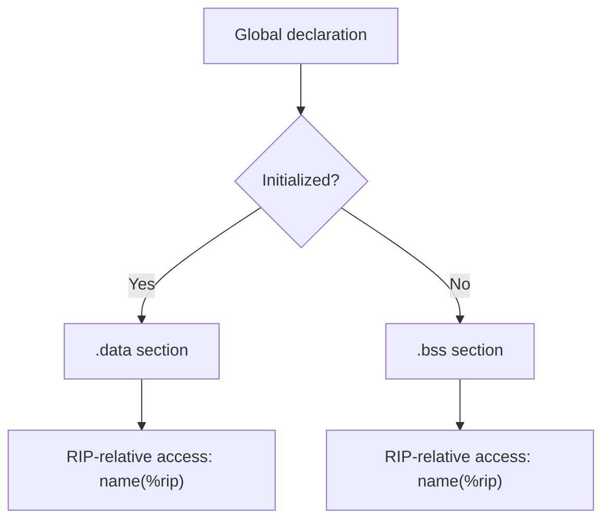

# Lesson 0020: Global Variables

## Status: 📋 Planned | Phase: String & Memory | Effort: Medium (6-10h)

## Objective

Implement global variables with `.data`/`.bss` sections.

## Global Variable Codegen Flow

## Implementation Checklist

- [ ] Parse global variable declarations (outside functions)
- [ ] Emit `.data` section for initialized globals
- [ ] Emit `.bss` section for uninitialized globals
- [ ] Access globals via RIP-relative addressing
- [ ] Support `static` globals (file-local)
- [ ] Test: `int g = 42; int main() { return g; }` → 42
