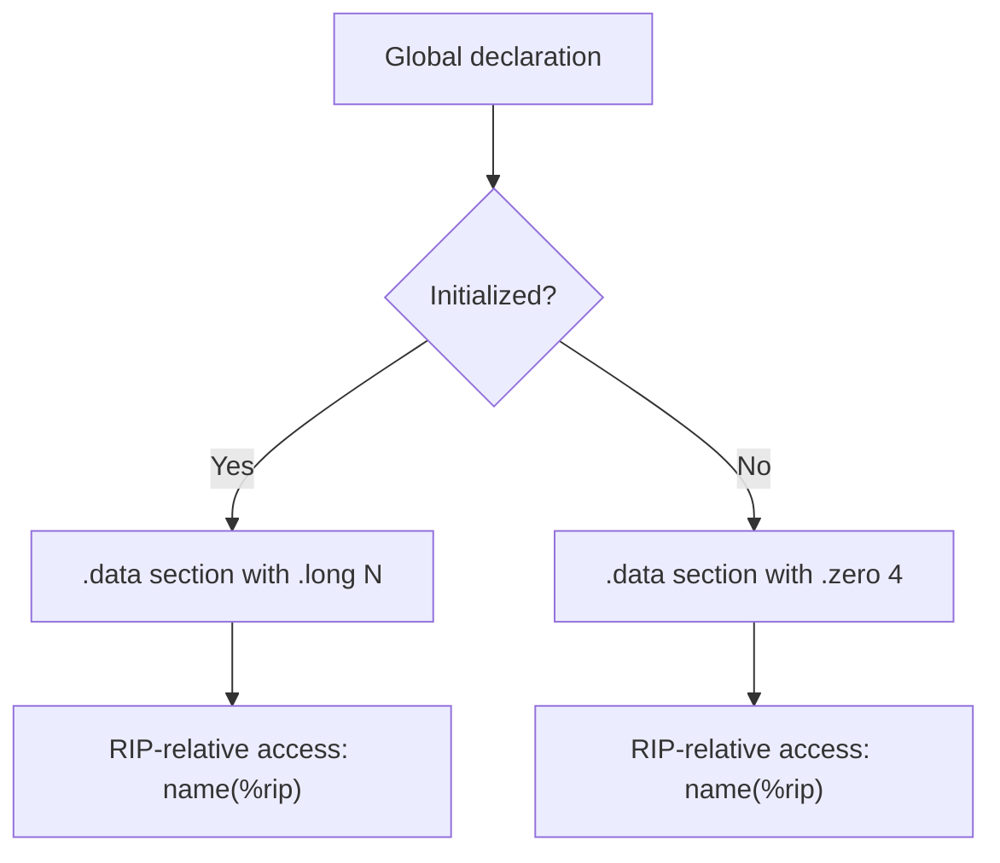

# Lesson 0020: Global Variables

## Status: ✅ Complete | Phase: String & Memory | Effort: Medium (6-10h)

## Objective

Implement global variables with `.data`/`.bss` sections.

## Global Variable Codegen Flow



## Implementation Checklist

- [x] Parse global variable declarations (outside functions) — the
      parser's `parse_program()` calls `parse_declaration()` for any
      type-leading top-level statement.
- [x] Emit `.data` section for initialized globals
      (`.globl name`, label, `.long N`).
- [x] Emit `.data` section with `.zero 4` for uninitialized globals
      (a dedicated `.bss` section is not currently used; uninitialised
      globals still go in `.data` with `.zero`).
- [x] Access globals via RIP-relative addressing
      (`mov name(%rip), %rax`, `lea name(%rip), %rax`,
      `mov %rax, name(%rip)`, etc.).
- [x] `static` globals are parsed and emitted with their original name
      (no separate file-local scoping is performed at link time).
- [x] Test: `int g = 42; int main() { return g; }` → 42.

## Core Implementation Snippet — `.data` Emission

The first pass of `generate()` collects every top-level `VarDeclNode`
into `global_variables_`. The output phase then emits one label and one
storage directive per global (skips `extern` declarations which are
defined elsewhere).

```cpp
// src/codegen.cpp:13  (CodeGenerator::generate)
std::string CodeGenerator::generate(ProgramNode& program) {
    output_.str(""); output_.clear();
    string_literals_.clear();
    global_variables_.clear();
    function_return_type_.clear();
    function_param_types_.clear();

    // First pass: collect global variables and function signatures
    for (auto& decl : program.declarations) {
        if (decl->type == NodeType::VAR_DECL) {
            auto* var = static_cast<VarDeclNode*>(decl.get());
            GlobalVar gvar;
            gvar.name       = var->name;
            gvar.type       = var->type_name;
            gvar.initialized = (var->initializer != nullptr);
            gvar.is_extern   = var->is_extern;
            if (gvar.initialized &&
                var->initializer->type == NodeType::INTEGER_LITERAL) {
                gvar.init_value = std::to_string(
                    static_cast<IntegerLiteralNode*>(var->initializer.get())->value);
            }
            global_variables_.push_back(gvar);
        }
        // ... collect function signatures ...
    }

    // Emit .data section
    bool has_non_extern_globals = false;
    for (const auto& gvar : global_variables_) {
        if (!gvar.is_extern) { has_non_extern_globals = true; break; }
    }

    if (has_non_extern_globals) {
        emit(".data");
        for (const auto& gvar : global_variables_) {
            if (gvar.is_extern) continue;
            emit(".globl " + gvar.name);
            emit_label(gvar.name);
            if (gvar.initialized) {
                emit(".long " + gvar.init_value);
            } else {
                emit(".zero 4");
            }
        }
    }

    // Emit .text section with all functions
    emit("");
    emit(".text");
    for (auto& decl : program.declarations) dispatch(decl.get());
    // ... emit .rodata for strings ...
}
```

## Core Implementation Snippet — RIP-Relative Access

`visit(VarDeclNode&)` for a local variable only allocates a stack slot;
for globals (those recorded in `global_variables_`), the per-call-site
identifier lookup decides between local, captured, and global.

```cpp
// src/codegen.cpp:459  (visit(VarDeclNode))
void CodeGenerator::visit(VarDeclNode& node) {
    // Global variables are handled in the first pass
    // Only process local variables here (inside functions)
    if (current_function_.empty()) {
        return;  // Skip global variables in code generation pass
    }
    // ... local variable stack allocation + initialisation ...
}
```

For an identifier reference, the global is loaded via RIP-relative
addressing:

```cpp
// src/codegen.cpp:1600  (visit(IdentifierExprNode))
// Check if it's a global variable
for (const auto& gvar : global_variables_) {
    if (gvar.name == node.name) {
        if (array_info_.count(node.name))
            emit("lea " + node.name + "(%rip), %rax");
        else
            emit("mov " + node.name + "(%rip), %rax");
        push_expr_type(var_type);
        return;
    }
}
```

## Example

```c
int g = 42;
int main() { return g; }
```

Generates:

```asm
    .data
    .globl g
g:
    .long 42

    .text
    .globl main
main:
    push %rbp
    mov %rsp, %rbp
    sub $128, %rsp
    mov g(%rip), %rax       ; load global
    mov %rbp, %rsp
    pop %rbp
    ret
```

`./a.out; echo $?` → `42`.

## Implementation Details

### Source Code References

| Component | File | Lines | Description |
|-----------|------|-------|-------------|
| `GlobalVar` struct | src/codegen.h | 117-124 | `name`, `type`, `initialized`, `init_value`, `is_extern` |
| `global_variables_` vector | src/codegen.h | 125 | Per-codegen-run global table |
| First-pass global collection (in `generate()`) | src/codegen.cpp | 22-45 | Iterates `program.declarations`; records globals + function signatures |
| `.data` section emission | src/codegen.cpp | 56-68 | `.data` + `.globl name` + label + `.long N` / `.zero 4` |
| `.text` section emission | src/codegen.cpp | 70-75 | `dispatch(decl.get())` for every declaration |
| `visit(ProgramNode&)` (visit pass) | src/codegen.cpp | 272-303 | Re-runs the same collection, then dispatches codegen |
| `visit(VarDeclNode&)` skip for globals | src/codegen.cpp | 462-464 | `if (current_function_.empty()) return;` |
| Identifier → global load | src/codegen.cpp | 1600-1610 | `mov name(%rip), %rax` / `lea name(%rip), %rax` |
| Identifier → global store | src/codegen.cpp | 977-986 | `mov %al / movl / mov %rax, name(%rip)` (size-aware) |
| `parse_declaration()` | src/parser.cpp | 300-576 | Top-level `int g = 42;` / `extern int g;` etc. |
| `parse_var_decl()` | src/parser.cpp | 617-746 | Single var decl with initializer and array size |
| `extern` declaration path | src/parser.cpp | 302-336 | `extern` keyword sets `is_extern` on the var decl |

## Status

- **Parser**: ✅ Parses global variable declarations at program scope
  (including `extern` and array forms).
- **Codegen**: ✅ Collects globals in first pass, emits `.data` with
  `.long` / `.zero 4`, accesses via RIP-relative addressing.
- **Limitations**:
  - Only `int`-sized globals are emitted as `.long` / `.zero 4`; other
    types (pointers, arrays, structs) currently share the same 4-byte
    slot.
  - There is no separate `.bss` section; uninitialised globals still
    go in `.data` with `.zero 4`.
  - `static` globals are not given a distinct symbol name (no
    file-local linkage) — the original name is used.
