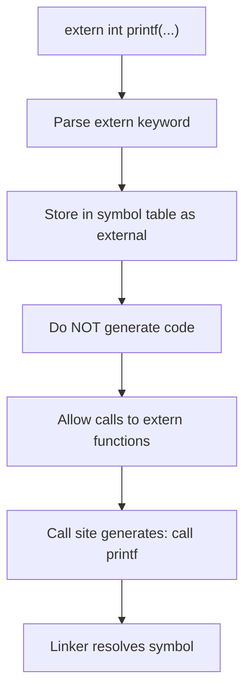

# Lesson 0021: Extern Declarations

## Status: ✅ Complete | Phase: String & Memory | Effort: Easy (2-3h)

## Objective

Allow calling external library functions (and referencing external variables)
without generating their bodies — the system linker resolves the symbols at
link time against libc/libm/user objects.

## Extern Declaration Flow



## Implementation Checklist

- [x] Parse `extern int printf(const char *, ...);`
- [x] Store extern declarations in symbol table
- [x] Do NOT generate code for extern declarations
- [x] Allow calls to extern functions
- [x] Test: declare extern, call, link with gcc

## Implementation Details

The trick: an `extern` declaration is a forward declaration of a function (no
body), and the codegen already short-circuits on `body == nullptr`. The
parser is the only piece that needs to know about `extern` specifically —
it sets `is_extern` on the resulting `VarDeclNode` and (for function
declarations) leaves the body null so codegen skips it.

### Parser — extern dispatch

The first thing `parse_declaration()` checks for is the `extern` keyword
(`src/parser.cpp:300-336`). If present, it parses the type, the identifier,
and dispatches based on whether the next token is `(` (function) or
anything else (variable, which is delegated to `parse_var_decl` with
`is_extern = true`):

```cpp
// src/parser.cpp:300-336
ASTPtr Parser::parse_declaration() {
    // Handle extern keyword
    if (match(TokenType::KW_EXTERN)) {
        std::string type_name = parse_type_specifier();
        if (!check(TokenType::IDENTIFIER)) {
            error("Expected identifier after extern");
            return nullptr;
        }
        const Token& name_token = peek();
        std::string name = name_token.value;

        // Check if function or variable before advancing
        size_t saved_pos = pos_;
        advance(); // consume name

        if (check(TokenType::LPAREN)) {
            // Function declaration
            auto func = std::make_unique<FunctionDeclNode>(
                type_name, name, name_token.line, name_token.column);
            advance(); // consume (
            if (!check(TokenType::RPAREN)) {
                do {
                    auto param = parse_param();
                    if (param) func->params.push_back(std::move(param));
                } while (match(TokenType::COMMA));
            }
            expect(TokenType::RPAREN);
            expect(TokenType::SEMICOLON);
            func->body = nullptr;
            return std::move(func);
        } else {
            // Variable declaration — delegate to parse_var_decl for multi-declarator support
            pos_ = saved_pos;
            advance();
            return parse_var_decl(type_name, true);
        }
    }
    ...
}
```

### Codegen — skip the body

Because `func->body == nullptr` for an extern function, the very first
check in `visit(FunctionDeclNode&)` short-circuits without emitting
anything (`src/codegen.cpp:305-309`):

```cpp
// src/codegen.cpp:305-309
void CodeGenerator::visit(FunctionDeclNode& node) {
    // Skip forward declarations (no body)
    if (!node.body) {
        return;
    }
    ...
}
```

The same `is_extern` flag is honoured for global variables: the first pass
in `generate()` records `gvar.is_extern = var->is_extern` and the `.data`
emission loop skips any record with that flag set (`src/codegen.cpp:29, 47-60`).

## Example

```c
// src/example.c
extern int ext_var;
int main() { return 0; }
```

Compilation produces an assembly file with **no symbol for `ext_var`** —
the linker is expected to resolve it. Function externs behave the same
way: a `call printf` is emitted in the call site, but no body for
`printf` is emitted in the translation unit.

## Source Code References

| Component | File | Lines | Description |
|-----------|------|-------|-------------|
| Token definition | `src/token.h:33` | `KW_EXTERN` enum value |
| Lexer keyword | `src/lexer.cpp:116` | `"extern"` maps to `KW_EXTERN` |
| Parser extern dispatch | `src/parser.cpp:300-336` | Routes `extern` to function or variable path |
| Parser var-decl flag | `src/parser.cpp:617-621` | `parse_var_decl()` propagates `is_extern` |
| Codegen skip | `src/codegen.cpp:305-309` | Forward declarations emit no code |
| Codegen global | `src/codegen.cpp:29, 47-60` | Extern globals skipped from `.data` emission |

## Status

- **Lexer**: ✅ `extern` recognized as keyword
- **Parser**: ✅ Parses `extern` declarations, creates `FunctionDeclNode` (no body) or `VarDeclNode` with `is_extern = true`
- **Codegen**: ✅ Skips code generation for bodyless declarations; linker resolves symbols
