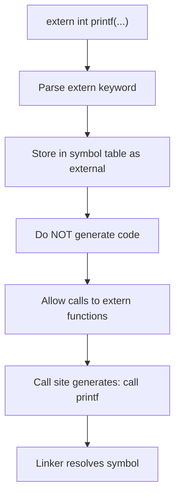

# Lesson 0021: Extern Declarations

## Status: 📋 Planned | Phase: String & Memory | Effort: Easy (2-3h)

## Objective

Allow calling external library functions via declarations.

## Extern Declaration Flow

## Implementation Checklist

- [ ] Parse `extern int printf(const char *, ...);`
- [ ] Store extern declarations in symbol table
- [ ] Do NOT generate code for extern declarations
- [ ] Allow calls to extern functions
- [ ] Test: declare extern, call, link with gcc

## Implementation Details

| File | Lines | Description |
|------|-------|-------------|
| `src/token.h` | 33 | `KW_EXTERN` token type definition |
| `src/lexer.cpp` | 106 | Keyword table entry: `"extern"` → `KW_EXTERN` |
| `src/parser.cpp` | 75 | `is_type_specifier()` recognizes `KW_EXTERN` as part of type specifiers |
| `src/parser.cpp` | 98–99 | `parse_type_specifier()` consumes `extern` and adds to type string |
| `src/parser.cpp` | 219–249 | `parse_declaration()` — extern handling: parses type, name, params, sets `body = nullptr` |
| `src/codegen.cpp` | 257–259 | `visit(FunctionDeclNode&)` — skips forward declarations (no body) |

## Source Code References

- **Token definition**: `src/token.h:33` — `KW_EXTERN` enum value
- **Lexer keyword**: `src/lexer.cpp:106` — `"extern"` maps to `KW_EXTERN`
- **Parser extern handling**: `src/parser.cpp:219-249` — parses `extern int printf(...)` as `FunctionDeclNode` with null body
- **Codegen skip**: `src/codegen.cpp:257-259` — `visit(FunctionDeclNode&)` returns early when `body` is null
- **Type specifier**: `src/parser.cpp:98-99` — `extern` consumed as qualifier in `parse_type_specifier()`

## Status

- **Lexer**: ✅ `extern` recognized as keyword
- **Parser**: ✅ Parses `extern` declarations, creates `FunctionDeclNode` with no body
- **Codegen**: ✅ Skips code generation for bodyless declarations (linker resolves symbols)
