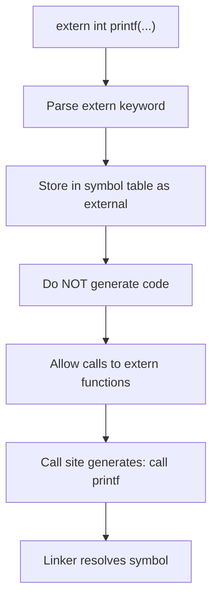

# Lesson 0021: Extern Declarations

## Status: 📋 Planned | Phase: String & Memory | Effort: Easy (2-3h)

## Objective

Allow calling external library functions via declarations.

## Extern Declaration Flow

## Implementation Checklist

- [ ] Parse `extern int printf(const char *, ...);`
- [ ] Store extern declarations in symbol table
- [ ] Do NOT generate code for extern declarations
- [ ] Allow calls to extern functions
- [ ] Test: declare extern, call, link with gcc
