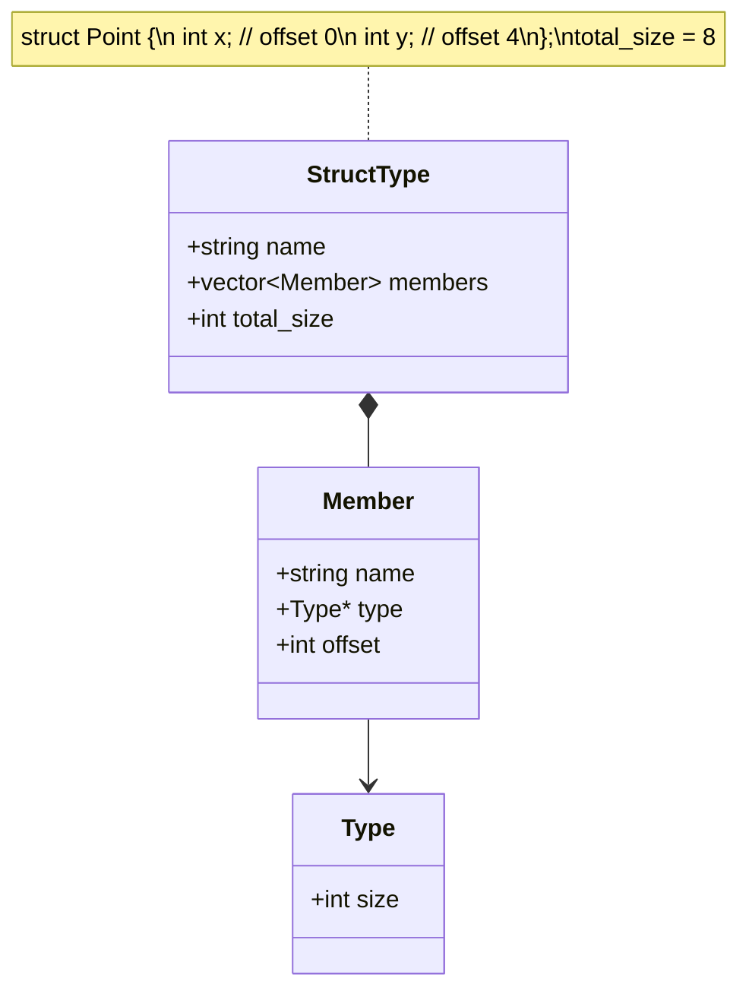

# Lesson 0022: Struct Declarations

## Status: 📋 Planned | Phase: Data Structures | Effort: Hard (8-12h)

## Objective

Parse and store struct type definitions.

## Struct Declaration and Layout

## Implementation Checklist

- [ ] Parse `struct Name { type member; ... }`
- [ ] Calculate member offsets with alignment
- [ ] Calculate total struct size with padding
- [ ] Register struct types in type system
- [ ] Support nested structs
- [ ] Support forward struct declarations
- [ ] Test: `struct Point { int x; int y; }; sizeof(struct Point)` → 8
